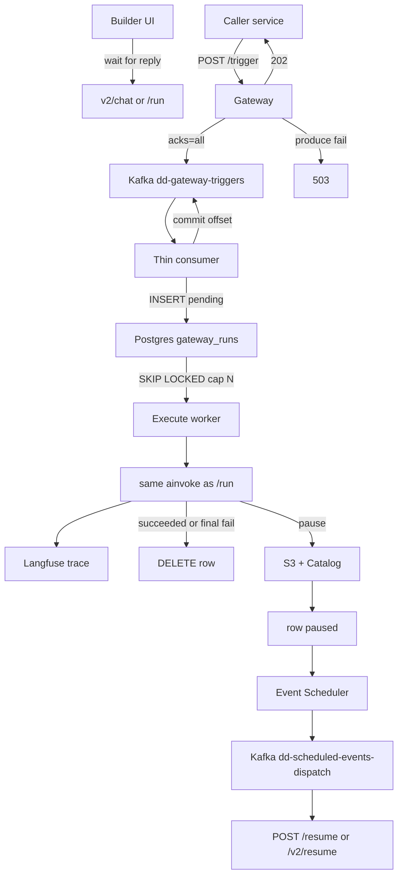
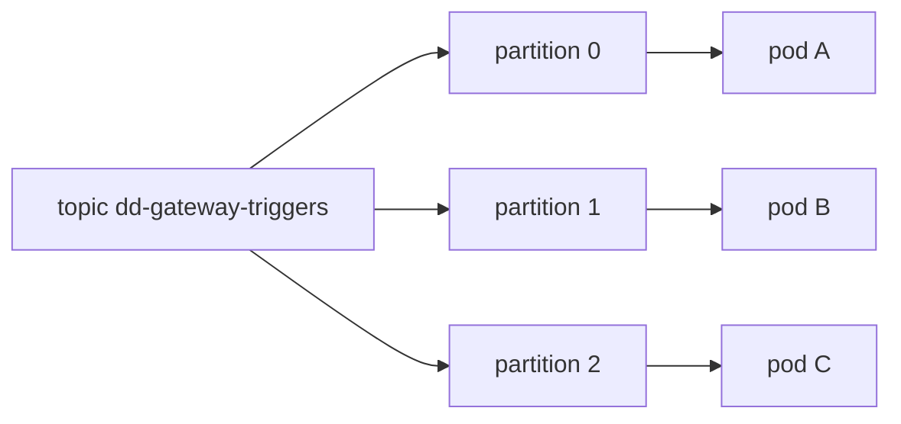
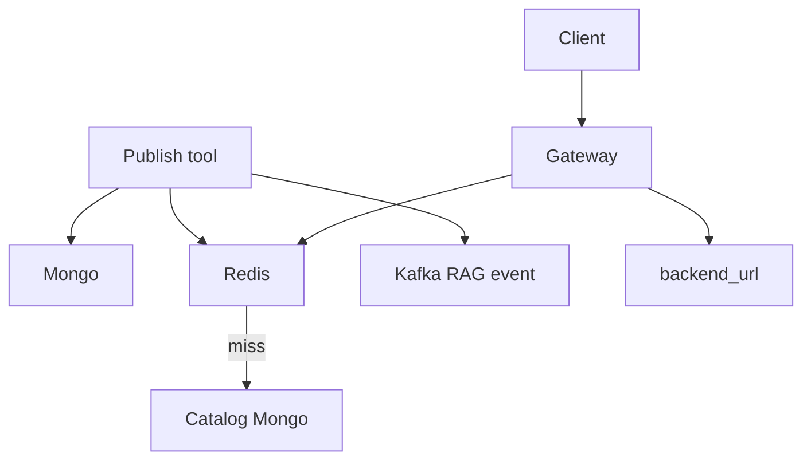
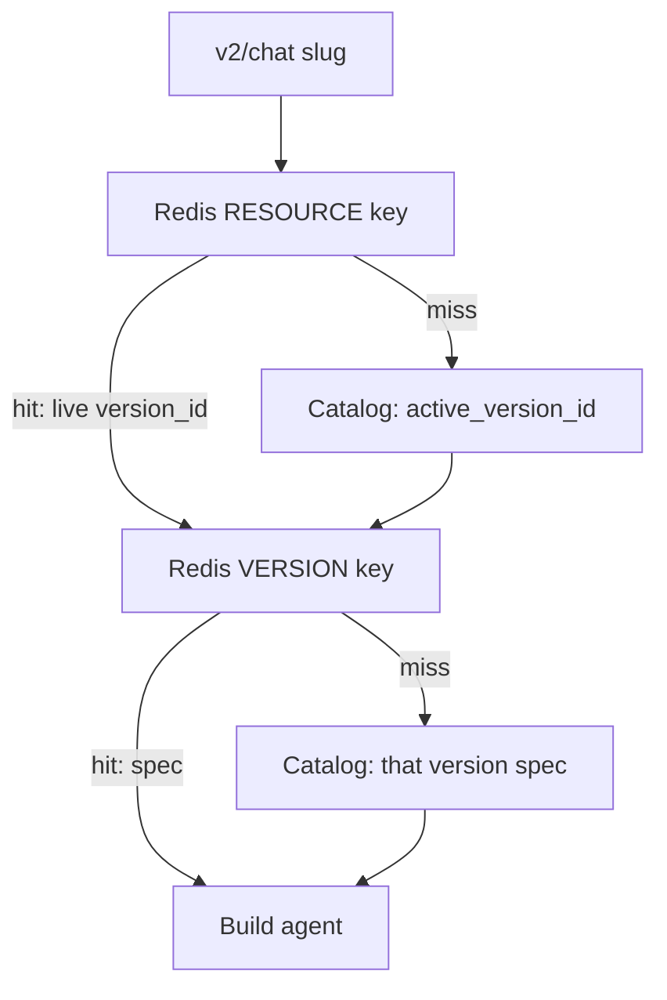
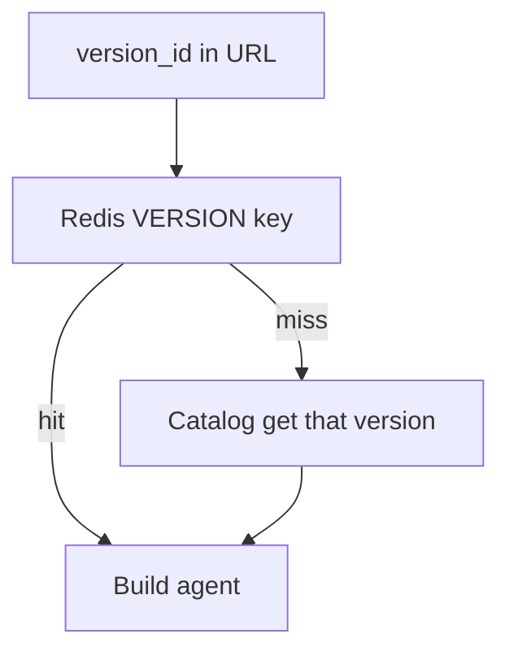

# Catalog and Gateway

> [!abstract]
> - `resume:catalog-gateway`
> - Control plane (Catalog) stores OpenAPI tools and versions
> - Data plane (Gateway) flattens the spec and hits the backend
> - 600+ / 11+ / 72k — see number hygiene in [[00 - Ownership and How to Talk]]
> - Docs: [[02-tool-registry]] · [[06-mcp-gateway]]

## Resume line

Catalog API registry, 600+ tools, 11+ domains. Gateway translates OpenAPI → executable tools for UI and chat. 72,000+ daily requests.

> [!warning] PDF says **"MCP Gateway (LangChain)"**. Runtime is FastAPI + FastMCP + LangGraph (`langchain-core` for LLM bits). Say FastMCP/LangGraph. Do not defend "we built it in LangChain."

---

## The pieces

- Need: hand-built FastMCP does not scale past a hundred endpoints
- An **agent** needed tools from a registry, not another `server.py`

| Piece | Job | Not its job |
|---|---|---|
| **Catalog** | System of record. FastAPI. Mongo. OpenAPI tools, versions, MCP-server bundles, agent definitions | Execute a business API. Own reads **never hit Redis** |
| **Gateway** | Runtime. FastAPI + FastMCP (+ LangGraph for agents, not "we built it in LangChain") | Be the SoR |
| **A tool** | One OpenAPI operation. `namespace`. `backend_url` from `servers[0]`. Paths + methods | — |

- **Catalog**
    + FastAPI + Mongo
    + OpenAPI tools, versions, MCP-server bundles, agent definitions
    + **never** executes a business API
    + own reads **never hit Redis**
- **Gateway**
    + FastAPI + FastMCP
    + LangGraph for agents — not "we built it in LangChain"
    + resolves specs
    + flattens `$ref` → Pydantic / function-calling schema
    + `$ref` = a pointer in the OpenAPI JSON: “this field’s shape lives over there” (usually `#/components/schemas/Address`). Written once, reused. Flatten = chase those links and inline the real fields — the model / Pydantic cannot follow a pointer
    + in-memory FastMCP tool
    + `api_executor` HTTP
    + optional transformer
- **A tool**
    + one OpenAPI operation
    + OpenAPI **3.0.3**
    + `namespace`
    + `backend_url` from `servers[0]`
    + paths + methods
- **Enricher (no LLM)** on register
    + **domain** — keyword map into 14 `VALID_DOMAINS` (Express, Freight, Fulfillment, Sorting, Serviceability, Tracking, Billing, Customer Support, Employee, Address, Client, Hyperlocal, Fleet Management, Platform)
    + resume "11+" is this set
    + stored as an **array** for `$in`
    + **has_pii** — `x-pii: true` on params/schemas
    + **spec_fingerprint** — SHA-256 of `(base_url, METHOD, path)` for dupes
    + **token_count** — for budget
    + **tags** — spec + operation tags, plus `api` / `openapi`
- **Validator** (`ToolValidator`) — structural/security check before the spec lands
- **Versioning**
    + `draft → published`
    + set active version
    + rollback = point `active_version_id` at an older version
- **MCP server in Catalog**
    + named bundle of tool ids
    + paste-ready `mcp.json`
    + Gateway URL `{gateway}/{owner}/c/{slug}/mcp`
- **Auth**
    + inbound UMS bearer
- **Kafka on publish** — `tool` / `mcp_server` events → Ask AI ingest
- **Original product** — agent + tools from the registry
- Workflows came **later** (July) when deterministic multi-step work in an agent loop polluted context, hallucinated, and burned money
- **Why Kafka on `/trigger`** — durable accept + replay. 202 after `acks=all`. Graph cap is workers × N, not partitions. Publish Kafka is Ask AI ingest — different topic, different job
- **Why Postgres `gateway_runs`** — `pending` / `running` (lease) / `paused`. `SKIP LOCKED` one row, run outside the txn. Same claim machine as Event Scheduler
- **Why not Redis for the work list** — Redis here is the spec cache; TTL eviction deletes work. Slack’s Redis is a dedicated dispatch cluster, not a cache. `paused` is a hours-long lookup, not a list pop
- **Why not HTTP → INSERT only** — Kafka is the accept buffer; the HTTP call does not wait on a slot
- **Why claim-one, not bulk** — graph is seconds; 2–3 indexed queries are noise. Bulk is for tiny jobs at huge QPS
- **Why DELETE on success / final fail** — this table is not history. History = Langfuse. Pause keeps `paused` until resume finishes
- **Why token bucket on `/trigger`** — 10k is cluster capacity, not a per-caller cap. Three Redis buckets (slug, UMS uuid, global). 429 before produce. Kafka is the drip — not a leaky-bucket queue. Depth below

> [!tip] Split that saves the round
> - **Catalog is SoR. Gateway is runtime.**

---

## Timeline

- **Jan–Mar 2026** — standalone MCP only. Catalog does **not** start in March.
- **April → mid-May 2026** (~1.5 months) — **this bullet.** Catalog + Gateway **tool path**: register OpenAPI, enrich, publish, Gateway resolve → flatten → HTTP.
- **Mid-May → end Jun** — agents (LangGraph, children, Orion). Not this 1.5 months.
- **July** — workflow canvas, first cut. Not this 1.5 months.
- "Architected" on the PDF must match the ownership row. 1.5 months is a slice of a platform, not Netflix.

---

## Schema

### `registry_resources` (Mongo)

- One resource (a tool, later other kinds)
- Envelope, not the OpenAPI blob
- id
- name
- kind (`Tool`, …)
- `namespace`
- `status` / `active`
- `active_version_id` — live pointer
- `latest_version_id`
- metadata stamped by enricher
    + `domain[]`
    + `has_pii`
    + `spec_fingerprint`
    + `token_count`
    + `tags`
    + `backend_url`
    + `endpoints`
    + `methods`
    + title / description / summary

### `registry_versions` (Mongo)

- One **immutable-enough** payload per version
- resource id
- version number
- stage: `draft → published` (live = the parent's `active_version_id`)
- **payload** — the OpenAPI spec JSON (the schemaless tree)
- Same version machinery is reused later for workflows, agents, guardrails, transformers

### `mcp_servers` (Mongo)

- `name`
- `slug` (kebab(name) + 10 random chars)
- `description`
- `owner`
- `status` (`active` or not)
- `updated_at` / `updated_by`
- endpoint: `{MCP_GATEWAY_ORIGIN}/{owner}/c/{slug}/mcp`

### `mcp_server_tools` (Mongo)

- `server_id`
- `resource_id`
- `enabled`
- Gateway `get_tools_by_slug`
    + 404 if missing
    + validation error if server not `active`

### Redis (Gateway only — not a Mongo collection)

- `mcp_server_{slug}` — enabled tool **ids** for a bundle
    + write-through on mutation
    + not the live-vs-version dance
- **RESOURCE key** — `tool_resource_{resource_id}` — live pointer → `version_id`
    + env: `CACHE_TTL_RESOURCE`
- **VERSION key** — `tool_version_{version_id}` — spec blob for that `version_id`
    + env: `CACHE_TTL_VERSION`

**TTL numbers to set / to say (vault docs name the vars, not the integers — confirm in `mcp-gateway/config.py` / `staging-config.md`):**

| Env | Meaning | Default to ship | Why that number |
|---|---|---|---|
| `CACHE_TTL_RESOURCE` | live pointer | **300s (5 min)** | Write-through is the real refresh. TTL is a **safety net** if invalidation is missed — max time Gateway can serve a stale live. 60s is also fine (more Catalog on expiry). Don't set 24h on the pointer. |
| `CACHE_TTL_VERSION` | spec blob | **3600s (1 h)** | Version JSON does not change. 86400s (24h) is OK if unpublish **deletes** the VERSION key. Don't set 30s — you'll stampede Catalog for no reason. |

- If they ask "what's in prod right now?" — those two env vars
- Don't invent a third number you didn't grep
- Catalog collections Catalog **does** also own later (`agents`, `agent_links`, `workflow_versions`, …) — hydrate path for `v2/chat`
- The April slice is the four above

---

## Endpoints

- Agent **v1** `/chat` — do not talk about it
- Production is **v2**

### Gateway

- `POST /{team}/custom-agent/{slug}/v2/chat`
    + **live** agent, builder UI
    + no `version_id` in the URL
    + two Redis steps
    + human waits
    + **not the 72k**
- `POST /{team}/custom-agent/{slug}/v2/trigger`
    + production intake
    + 202 after Kafka
    + worker runs the same graph
    + **this is the 72k URL**
- `POST /{team}/custom-agent/{slug}/versions/{version_id}/v2/chat` (same live-vs-pinned idea)
    + **pinned** version
    + one Redis step
    + preview / debug / don't pick up a new live by accident
- `{owner}/c/{slug}/mcp` — streamable-http MCP server built in memory from the Catalog bundle

### Catalog (control plane)

- Register / update tool (spec in → validator + enricher → `registry_resources` + `registry_versions`)
- Publish / rollback
    + `draft → published` — tools have **no extra `live` stage** (workflows do)
    + set `active_version_id` — which **published** spec Gateway should use
    + not the same as `latest_version_id` — that is the newest row, often a **draft** you are still editing
    + after a clean publish they match; after rollback, or while a new draft exists, they do not
    + `refresh_upstream_cache` — write `tool_resource_{resource_id}` so Redis points at that active version
    + Kafka RAG event
- MCP server CRUD + bind/toggle tools → `_sync_redis_cache` on `mcp_server_{slug}`
- `get_agent_detail_by_slug` — Gateway hydrate for `v2/chat` (prompts with content+tokens, default prompts appended, linked tools / MCP servers)
- Workflow `/run` and `/resume` exist on the Gateway but are the **July** bullet, not this pointer's traffic story

---

## Playground — request / response

- `v2/chat` and `/run` are a **simple request–response**
- Client calls → Gateway runs the graph on **this** HTTP call → responds with the answer
- If the graph hits a **pause** node: **return immediately** (`paused`)
    + do not hold the socket for hours
    + progress is already on S3 + Catalog
    + later `/resume` continues
- Same `ainvoke` as the `/trigger` **execute** worker (the one that claimed the Postgres row)
- `/trigger` does **not** “return paused” to the caller
    + caller already got **202** and hung up
    + Kafka offset is already committed after the `pending` row exists
    + execute worker on pause: S3 + Catalog, row → `paused`, slot free
    + nobody is waiting on that HTTP call

| URL | Who | What they get |
|---|---|---|
| `POST .../v2/chat` | Human on the builder | Answer, or **paused** if it hit a pause node |
| `POST .../workflows/{slug}/run` | Human on the canvas | Same — this chunk’s result, or **paused** |

---

## Production `/trigger`

### Who hits it

- Playground (`v2/chat`, `/run`) is request–response — answer, or **paused** if it hit a pause node
- Anything else (another service, a cron, an event) hits **`/trigger`**

### URLs and body

- `POST /{team}/custom-agent/{slug}/v2/trigger`
- `POST /{team}/workflows/{slug}/trigger`
- Body: same payload as chat/run, plus `Idempotency-Key` (or `request_id`)
- No callback URL
- Don't invent one

### This HTTP call

- That handler does **not** run the graph
- It validates, produces to Kafka, and returns
    + **429** — token bucket empty. Not accepted. Do not produce
    + **202** — produce was **acked**. Accepted. Graph has not run yet. Caller must **not** retry
    + **503** — produce failed after producer retries. Caller retries with the **same** idempotency key
- No GET

### After accept (not this request)

- Postgres `gateway_runs` is a **work list** only (`pending` / `running` / `paused`)
- **DELETE** the row on success or final fail — not a history table
- You watch the execution on **Langfuse** (same UI as `/chat` and `/run`)
- Pause: S3 + Catalog + row `paused` — resume state, not a run history

### Counters

- 72k stays on **`/v2/trigger`**
- Playground `v2/chat` is not that counter
- Don't mix with 124k

### Same execute, different door

- `v2/chat` / `/run` and the trigger worker call **one** function (`build` + `ainvoke` + `format_response`)
- That function always *has* a body (`{session_id, contents, meta}` or workflow `status` / outputs)
- The HTTP adapter is what changes
    + Playground: `return` that body on the request (200)
    + Execute worker: nobody is on the socket. `format_response` still builds the same dict; it is written into the **Langfuse trace**. Then **DELETE** the `gateway_runs` row (or set `paused`)
- Not two engines
- The worker just does not `return` that dict to the service that got the 202

### What "the work already happened" means

- The graph called real APIs (create/update something in Express, FMS, …)
- Those systems now have the new data
- That *is* the product of a trigger
- The chat JSON is for a human staring at the builder
- Production does not need that JSON sent back
- Debug = open Langfuse

---

## How `/trigger` was built

- We already ran Kafka in this platform
    + Catalog → `catalog.resources.events` (Ask AI ingest)
    + Event Scheduler → `dd-scheduled-events-dispatch` (pause resume)
- Trigger is the same broker, a new topic `dd-gateway-triggers`
- **Kafka = accept only.** Graph concurrency is **not** partition count
- Thin consumer group `dd-gateway-trigger-workers`: write Postgres `gateway_runs`, then **commit**
- Execute workers: **same Gateway image**, claim rows (`SKIP LOCKED`), cap **N** per pod, same `ainvoke` as `/run`
- Agents and workflows share this path (`kind` on the row)

### Why Kafka, not something else

| Option | Why not (or why yes) |
|---|---|
| **Kafka** | Already operated. Durable **accept**. Key → partition (retries for the same id stay ordered). Thin consumer commits after the row exists. Same broker as resume + RAG. Execute scale = workers × N, not partition count. |
| Redis list / Streams | Redis here is the **spec cache**. Mixing a job backlog with cache TTLs is how you evict work. No replay like a log. |
| Rabbit / SQS | New broker to page on. We didn't have it. SQS is a fair "if we were on AWS-only" answer — we were not starting from zero, we had Kafka. |
| Celery | Scheduler docs already picked Postgres+Kafka over Celery. Don't add Celery just for intake. |
| FastAPI `BackgroundTasks` | Dies with the pod. 202 would be a lie — work is not durable. |
| Only S3 + Catalog | That is **pause**, not intake. S3 does not wake a worker. Nothing *starts* the graph. |
| Kafka delayed topics for "6 hours later" | Kafka is a bad timer. That is why Event Scheduler is Postgres + `SKIP LOCKED`, then Kafka. `/trigger` is **now**; pause is **later**. |

- **202 means durable on the log**, so the produce must wait for a real ack
- That is `acks=all` (leader + in-sync replicas)
- `acks=1` is faster and can lose the message if the leader dies — then you returned 202 and the work vanished
- Don't

### Producer (inside `POST /trigger`)

- Order: **auth → validate body → rate limit → produce → then status code**
- Never enqueue a 400
- Never 202 before the ack
- Never 202 if the bucket was empty

| Setting | Value we use | Why |
|---|---|---|
| `acks` | `all` | 202 ⇒ it's on the log |
| `enable.idempotence` | `true` | Producer retry must not double-write the same produce |
| Producer `retries` | `5` | Transient broker blip — don't 503 on the first hiccup |
| `flush` / delivery timeout | **10s** (same as scheduler producer) | Then give up → 503 |
| `linger.ms` | `0` | Caller is waiting on 202, not a batch |
| Message **key** | idempotency key | Same key ⇒ same partition ⇒ retries ordered |
| Topic | `dd-gateway-triggers` | Payload says agent vs workflow, slug, body |

- **One string:** `Idempotency-Key` = `request_id` = Kafka **partition key** = `gateway_runs.run_id`
- That is how a retry of the **same start** does not run twice
- **`POST /trigger` does not ask Kafka** “is this id already on the log?” Kafka is not a lookup
- Dedup is **Postgres**: thin consumer `INSERT` / “same `run_id` already there → skip”
- Unique on `run_id`. Second consume (redeliver or client retry that produced again) hits the row, no second graph
- HTTP handler only **produces**. It does not `SELECT` the work list first

HTTP from this handler:

| Code | Meaning | Caller |
|---|---|---|
| 401 / 403 | Auth | Don't retry |
| 400 | Bad body | Don't retry |
| **429** | Token bucket empty | Back off. Not on the log |
| **202** | Kafka acked | **Don't retry** — already accepted. Retry = at-least-once duplicate (same key, worker must tolerate it) |
| **503** | Produce failed / timeout | Retry with **same** key. `Retry-After` a few seconds |

- The graph is not in this request
- A 30-second LLM call cannot make `/trigger` slow
- If Kafka is slow, 503, not a hung HTTP

### Rate limit on `/trigger`

- Same Gateway middleware on **both** URLs
    + `POST .../custom-agent/{slug}/v2/trigger`
    + `POST .../workflows/{slug}/trigger`
- Not Catalog
- Not cap **N** (that is in-flight graphs on a pod)
- Not agent Langfuse `max_cost` (budget 429 after hydrate)
- **Token bucket** in Redis — all pods share the counters
- Atomic update (same reason `INCR` exists: no `GET`+`SET` race across 20 pods)
- **Before** `acks=all`. Empty → **429**, never 202
- **Not leaky bucket.** Kafka already holds the accepted work; the thin consumer drips at its own rate. Don't queue HTTP in the limiter
- Live ~50–100 RPM is **not** R. Don't set R to today's traffic
- **10k per slug** is wrong — one workflow would eat the cluster
- Three buckets. **All three** must have a token
- Principal = UMS **uuid**, not email, not token hash (hash resets on rotate; 10 tokens → 10× quota)
- Design numbers (not a dashboard). Say that

| Bucket | Redis key | Refill **R** | Burst **B** |
|---|---|---|---|
| Workflow / agent slug | `tb:wf:{team}:{slug}` | **500 / min** | **20** |
| Caller | `tb:user:{team}:{uuid}` | **300 / min** | **20** |
| Global `/trigger` | `tb:global` | **10 000 / min** | **200** |

- Slug bucket: A going hot does not spend B's budget
- UUID bucket: one caller cannot open 20 slugs and get 20×
- Global: the 10k ceiling
- Burst **B** = retry storm, not a second rate

### Thin consumer (Kafka → Postgres)

- `enable.auto.commit = false`
- Does **not** run `ainvoke`
- `INSERT` Postgres `gateway_runs`
    + `run_id` = idempotency key
    + `kind` = `agent` | `workflow`
    + `status` = `pending`
    + payload / slug / team
- Same `run_id` already there → skip insert (no second graph). **This** is the “already present” check — PG, not Kafka
- **Then commit** the Kafka offset
- Intake is milliseconds. Partition is free for the next start
- Insert fail → do **not** commit → Kafka redelivers
- `max.poll.interval.ms` only needs to cover this write, **not** the graph
- Poison on insert: DLQ `dd-gateway-triggers-dlq`, then commit

### `gateway_runs` (Postgres — work list, not history)

| `status` | Meaning |
|---|---|
| `pending` | Row exists. Nobody is running the graph |
| `running` | Execute worker claimed it (`SKIP LOCKED`). Lease / heartbeat on the row |
| `paused` | Checkpoint on S3 + Catalog. Slot free. Waiting for `/resume` |

- **Succeeded or final fail:** **DELETE** the row immediately. Langfuse is the history
- Worker dies while `running`: lease expires → `pending` again
- Do not keep `succeeded` / `failed` rows. No cron

### Execute worker (claim + graph)

- Same Gateway image. Not the Kafka poll loop
- `SELECT … FOR UPDATE SKIP LOCKED` where `status = pending`, up to **N** per pod
- `UPDATE status = running`
- Same `ainvoke` as `/run` / `v2/chat`
- Body goes to **Langfuse**, not to the 202 caller
- **Succeeded / final fail** → Langfuse has the body → **DELETE** row
- **Paused**
    + S3 + Catalog checkpoint
    + `status = paused`
    + slot free
    + resume: timer → Event Scheduler → `dd-scheduled-events-dispatch` → `POST /resume` (workflows) or `POST /v2/resume` (agents)
    + event pause: something calls `/resume` directly
    + do **not** put resume back on `dd-gateway-triggers`
- Second pause: same checkpoint + `paused`. Nothing to commit on `dd-gateway-triggers` (already committed)
- After a continue that finishes: **DELETE**
- Graph poison: retry on the **row**; then DLQ + **DELETE**. Do not block a Kafka partition
- **N** (in-flight per pod): `needed ≈ (RPM/60) × hold_seconds`, then `N ≈ needed / pod_count`. At 10k RPM / ~20s hold / ~30 pods → **N ≈ 80–130**. 72k/day (~50 RPM) needs a small N

### Three pods, how Kafka commit actually works

- This is the Q they will ask
- Kafka is **not** one shared queue that three workers pop from
- The topic is split into **partitions**
- The consumer group (`dd-gateway-trigger-workers`) assigns **whole partitions** to pods
- One partition → one pod at a time
- Offset commits are **per partition**, not global

- Message **key** = idempotency key → hash → partition
- Same key always lands on the same partition (retries stay ordered)
- Different keys can be on different partitions and run **in parallel**
- There is **no company-wide order**
- The story: "pod A took event 1, pod B took event 2 which is later, event 1 fails, event 2 succeeds — how does commit work?"
- **Different keys / different partitions**
    + they never shared a commit
    + pod B commits partition 1 (event 2 done)
    + pod A does **not** commit partition 0
    + offset on 0 stays at event 1
    + when A restarts (or the group rebalances), event 1 is delivered again
    + event 2 is already done
    + that is fine — they were unrelated
- **Same key**
    + both messages are on **one** partition, so **one** thin consumer owns them
    + that pod inserts/commits **in offset order**: row for 5, **then** commit 5, **then** take 6
    + if insert of 5 fails, do not commit, do not start 6
    + after poison/DLQ you commit 5 so 6 can move
    + the **graph** for 5 and 6 can run in parallel on execute workers — they are different `run_id`s unless it is the same key (then one row)
- `enable.auto.commit = false` means: Kafka must not mark a start done just because we **polled** it
- We commit after the **`pending` row exists**, not after `ainvoke`
- `auto.commit = true` is how you "ack" a start you then failed to persist

### Commit footgun

- Poll a batch, insert 5 and 6, commit 6, insert 5 failed → **5 is skipped forever**
- Never commit an offset past an unfinished **insert** on that partition
- One in-flight **intake** per partition (or commit only the contiguous prefix)

### Pod dies

- **Thin consumer dies:** group rebalances. Partitions go to another pod from last **committed** offset. Uncommitted start is inserted again (same `run_id` → no second graph)
- **Execute worker dies:** row stays `running` until lease expires → `pending` → another worker claims it
- 3 thin consumers and 2 partitions ⇒ one intake pod idle. Execute pods scale on their own (SKIP LOCKED)

### Why no history table / no GET

- `gateway_runs` is **not** “list my jobs.” Only `pending` / `running` / `paused`. Terminal → **DELETE**
- Langfuse already traces **every** execution
    + playground `/chat` `/run`
    + production `/trigger`
    + pause/resume **reuses `trace_id`** so it is one timeline
- CubeAPM + New Relic for the process
- Catalog is SoR for **specs**, not executions
- A Mongo `runs` collection would be a second, worse Langfuse
- Pause docs in Catalog are **resume bytes**
- If they ask "where do I poll status?"
    + you don't
    + open the Langfuse trace
    + or look at the system the tools wrote to

### Interview, six sentences

- `v2/chat` and `/run` are request–response; pause → return immediately
- Production is `POST /trigger`: validate, produce to Kafka with `acks=all`, 202 only after the ack, 503 if produce fails
- Thin consumer writes `gateway_runs` `pending` and commits Kafka; execute workers claim rows (cap N) and run the same graph
- Terminal → **DELETE** the row. Langfuse is the UI
- Pause → S3 + Catalog, row `paused`, not another trigger produce
- We already had Kafka for RAG and scheduler resume — we did not add SQS

---

## Architecture

### How it works

- Author registers an OpenAPI operation once
- Enricher stamps domain / PII / fingerprint / tokens
- Validator runs
- Publish writes Mongo, **then** write-through Redis, **then** Kafka for search
- Client hits Gateway (live `v2/chat`, or MCP `{slug}/mcp`, or a pinned version URL)
- Gateway: Redis (Catalog fallback) → flatten `$ref` → in-memory FastMCP tool → `api_executor` to `backend_url` → optional transformer
- Gateway is **stateless** per request (horizontal)
- Pause bytes are S3 — later pointer, not April
- Dual-write order: Mongo first, then Redis, then Kafka
- Brand-new publish is in Redis only after Catalog write succeeded

### Why Redis

- Catalog is Mongo, SoR, **never reads Redis** — authors never see a stale cache
- Gateway is the hot path — **production `/trigger` at ~50 RPM** hydrates a fat agent spec (prompt, links, tools) every run
- Hitting Mongo on every run couples the control plane to production QPS
- Playground `v2/chat` is the same hydrate, much less traffic
- Redis = **hybrid: write-through on publish + cache-aside on miss** (Gateway only)
- Publish/rollback → `refresh_upstream_cache`
- Redis down → Gateway degrades to Catalog (docs)
    + slower
    + still correct
- `mcp_server_{slug}` = enabled tool ids
- Separate from RESOURCE/VERSION keys

### Caching strategies — what we could have used, why write-through + cache-aside

- **Cache-aside (lazy):** Gateway miss → Catalog → fill Redis
    + simple
    + problem: first request after publish still serves **old** live until TTL
    + bad when "what is live" must move now
- **Write-through:** Catalog publish writes Mongo **and** Redis in the same mutation path (`refresh_upstream_cache`, `_sync_redis_cache`)
    + next `v2/chat` sees the new pointer
- **What we shipped:** hybrid — write-through on publish + cache-aside on miss
- **Write-back:** write Redis first, flush Mongo later
    + faster writes
    + lie if Redis dies before flush
    + wrong for a **system of record**
- **Write-around:** write Mongo only; Redis fills on next read
    + same staleness as aside after publish
- **Read path is still aside-on-miss**
    + Redis hit → go
    + miss → Catalog → populate
    + write-through is the **publish** side
- Two TTLs: `CACHE_TTL_RESOURCE` **300s** (pointer) vs `CACHE_TTL_VERSION` **3600s** (blob)
    + see schema table
    + write-through is freshness
    + TTL is the backstop
- Stampede / hot key: at **~50 RPM it does not matter**
- Numbers below

### Stampede and hot key

- Two different problems
- Don't mix them

#### Stampede (TTL fires → herd to Catalog)

- Window is **one Catalog hydrate**, not "after N hours"
- If hydrate is ~200ms, only the requests that land in that 200ms (plus one miss per Gateway pod if there is no singleflight) hit Mongo
- Concurrent Catalog fetches ≈ `(RPM / 60) × hydrate_seconds` + (pod count if every replica misses on its own)
- **~50 RPM:** 50/60 × 0.2 ≈ **0.2 extra requests**
    + even 10 pods → ~10 Catalog gets once
    + nothing
- **~500–1,000 RPM:** 2–3 extras in 200ms, or ~10 if hydrate is 500ms
    + start talking **singleflight / lock around miss**
    + still not an outage
- **~3,000 RPM (~50 RPS) on one slug:** ~10 concurrent hydrates in 200ms, worse with many pods
    + **this is where stampede is a real Catalog spike**
    + fix: singleflight, serve-stale-while-revalidate, jitter TTL so not every key dies together

#### Redis hot key (one key eats GET bandwidth)

- Redis is happy at tens of thousands of GET/s
- 50 RPM is noise
- Pain is **bytes**, not GET count: fat spec (say ~200KB) × RPM / 60
    + 50 RPM → ~0.2 MB/s. Ignore
    + **~10,000 RPM** on one slug → ~**33 MB/s** off one key. NIC / one Redis hash slot starts to matter
    + **~50,000 RPM** → ~167 MB/s. Local in-memory L1 on the Gateway, or split

> [!tip] Say in one breath
> - Today ~50 RPM
> - Stampede is a story at a few thousand RPM on one live slug
> - Redis hot-key is a story around 10k RPM if the spec is fat
> - I would not design Kafka for this

### Why Mongo, not Postgres

- Unit of data = **one version of a blob**: OpenAPI spec, later agent config, later workflow `{nodes[], edges[]}`
- That JSON **is** the schema
- Paths, `$ref`s, parameters, `x-pii` — every tool looks different
- Postgres = fat `JSONB` (you didn't gain SQL) **or** explode paths/params into tables you migrate when OpenAPI shape drifts
- Reads: **get this resource / this version id**, not "join invoices to line items"
- Versions: **new document + move `active_version_id`**, not ALTER TABLE
- We **did** use Postgres where the data is rows: SOP prefix routing, scheduler `scheduled_events` (time, claim, `SKIP LOCKED`)

> [!warning] Do not say "Mongo scales" or "NoSQL for microservices." They will eat you. The answer is **shape of the payload**, not "we like flexible columns."

### Envelope vs payload

- There are two parts of a Catalog document
- Keep this
- Drop `isActive` as the example

| Part | Examples | Flexibility story |
|---|---|---|
| **Envelope** | `slug`, `status`, `active_version_id`, `isActive` | These are **fixed fields**. Adding `isActive` is a migration in any store. Do **not** justify Mongo with this. A boolean column is what Postgres is *for*. |
| **Payload** | OpenAPI spec, DAG `nodes[]`, agent links, `x-pii`, `$ref` trees | **This** is what stays schemaless. Tool A's spec has different keys from tool B. Next month a new OpenAPI vendor dumps a new `x-foo`. You store the document; you don't add 40 columns. |

- Say: schema flexibility on the **spec body**, because every registered API is a different JSON tree
- The envelope is versioned and validated like any service
- Validators/enricher (`ToolValidator`, `ToolEnricher`) are how you didn't let "flexible" mean "garbage"
- If they hear only "we kept adding keys," they think you skipped migrations
- If they hear "the OpenAPI document itself has no stable columns," they nod
- **What you give up**
    + no FK from version → resource the way PG would
    + uniqueness is fingerprint + validators, not a unique constraint on `(method, path)` unless you added one
    + fine for a registry
    + would be wrong for money
- **JSONB in Postgres?**
    + honest: would have worked for "store a blob"
    + team already had Mongo/DocumentDB for this service
    + Redis still sits in front of Gateway either way
    + don't pretend Mongo was the only possible blob store

### Live vs version-specific — one Redis step vs two

- Same idea for agents and later for workflows
- Specs live under a **version id**
- "What is live" is a **pointer**, not a second copy of the blob
- Gateway cache (`spec_resolver` / `agent_resolver`): `CACHE_TTL_RESOURCE` (the live pointer) vs `CACHE_TTL_VERSION` (the immutable spec)

#### Live — v2/chat on the slug

- `POST /{team}/custom-agent/{slug}/v2/chat`
- "Whatever is live right now"
- Gateway does **not** get `version_id` in the URL

- **Two steps**
    + (1) resource/live pointer → `version_id`
    + (2) version key → spec
- Publish is a **pointer swap**
- Old version blobs stay in Redis so in-flight pinned calls and rollbacks still work

#### Version-specific

- `.../versions/{version_id}/...`
- URL already has `version_id`
- Skip the pointer

- **One step:** version key → spec
- Preview, debug, "run this draft/published graph," don't accidentally pick up a new live

> [!tip] Do not cache the fat spec only under `slug:live`. Then every publish rewrites a huge blob and you still need the old blob for the version URL. Pointer + immutable version cache is the whole trick.

- **Why two TTLs?**
    + live pointer: `CACHE_TTL_RESOURCE` **300s** + write-through
    + version blob: `CACHE_TTL_VERSION` **3600s** — that JSON does not change
    + don't invert them (short blob TTL = fake stampedes)

### Other architecture facts

- **Draft never in prod** — active version pointer; Gateway `get_tools_by_slug` 404s if server not `active`
- **Duplicates** — fingerprint `(base_url, METHOD, path)`
- **Hallucinated tool in an SOP** — `tool_resolver` vs `domains.yaml`. Unknown `operationId` dropped. Fail-open on parser errors (input unchanged)
- **Catalog down mid-call** — cached spec may still run; resolve miss fails the call
- **Redis down** — degrade to Catalog
- **Rollback** — point `active_version_id` at older version; refresh Redis pointer. Spec blob already there
- **PII** — `has_pii` on spec. Don't log bodies. Transformers redact
- **Multi-tenant** — `namespace` + RBAC/OPA. Don't serve team A's tools to B
- **Timeouts / retries** — time out tool HTTP. Don't blindly retry POST. Idempotent GETs ok
- **SPOF** — Mongo, Redis, Catalog, UMS, OS1. Gateway replicas are not SPOF
- **CAP** — Catalog/Mongo: prefer consistent live pointer (CP-ish). Redis cache: may lag a second (AP-ish). Write-through is how you avoid "Gateway thinks old live"
- **Why not one service** — authors vs 72k runtime. Scale independently

---

## Metrics (Temple PDF — do not rewrite the tex)

- **72k/day** — lock for Temple
    + **`POST /{team}/custom-agent/{slug}/v2/trigger`**
    + production agent runs
    + not Catalog
    + not playground `v2/chat`
    + not workflow `/run`
    + not every inner tool HTTP
- Original Catalog+Gateway product = **agent + tools from the registry**
- ~**50 RPM** over 24h (~120 RPM in a 10h workday)
- Resume number stays; we are not rewriting the PDF
- After interviews: move 72k onto multi-agent — [[After Interviews - Resume Fixes]]
- **11+ domains** — say **14** `VALID_DOMAINS`
- Name Express, Freight, Fulfillment, Fleet
- **600+ tools** — OpenAPI operations in the registry
- Don't invent the count query unless you can re-run it
- **124k** lives on the **workflows** bullet
    + different counter
    + different era
    + don't mix
- 50 RPM is **not** a scale problem
- Don't invent Kafka+shard for this QPS
- Peak = workday

---

## HLD grill (backend — any company)

- 50 RPM is **not** a scale problem
- If they start sharding Mongo for 600 tools, you stop them
- HLD here is **control vs data plane, cache, versioning, failure**
- Don't over-build

1. How long?
    + April → mid-May, ~1.5 months, Catalog + Gateway **tool path**
    + Agents start after
    + Workflows are July
2. Draw Catalog vs Gateway
    + Catalog = SoR, never executes
    + Gateway = runtime
3. Walk `v2/chat`
    + Live: 2 Redis hops → build graph → tools HTTP
4. v2/chat / `/run` — request / response?
    + Playground = call, get the answer on this HTTP call
    + Pause node → return **immediately** (`paused`)
    + Same `ainvoke` as the **execute** worker
    + `/trigger` already returned 202 — Kafka committed after `pending` row; pause sets `paused`, does not “return paused” to the caller
    + Production = `POST /trigger` 202 after `acks=all`
5. Mongo vs Postgres? / SQL vs NoSQL?
    + Payload is a JSON tree (OpenAPI / DAG)
    + Envelope (`status`, live pointer) is boring and would be columns anywhere
    + Don't cite `isActive` as why Mongo
    + JSONB-in-PG is a fair pushback — blob + this service was on Mongo
6. Why Redis?
    + Gateway must not Mongo-hydrate a full agent spec 72k times/day on `/trigger`
    + Don't Mongo-hydrate a fat spec on every chat
    + Hybrid: write-through on publish + cache-aside on miss
    + Live = two Redis GETs (pointer then spec)
    + Pinned version = one GET
    + Catalog never reads Redis
7. Cache-aside vs write-through?
    + **Hybrid — write-through on publish + cache-aside on miss**
    + Read: Redis then Catalog (aside on miss)
8. Redis down?
    + Degrade to Catalog
    + Slower, still correct
9. Catalog down mid-call?
    + Cached spec may still run
    + Resolve miss fails the call
    + Write-through means a brand-new publish is in Redis only after Catalog write succeeded
10. Live vs pinned / version URL?
    + Live: slug only, extra hop to `active_version_id`
    + Version in path: skip hop
    + Publish = move the pointer, don't mutate the old spec
    + Pointer + immutable version blob
11. How do you not serve a draft?
    + Active version pointer
    + Gateway `get_tools_by_slug` 404s if server not `active`
12. Duplicate tools / APIs?
    + Fingerprint `(url, METHOD, path)`
    + Same server+method+path
13. Kafka on publish? / Publish and search?
    + `tool` / `mcp_server` events → Ask AI ingest ([[05 - Ask AI Search]])
    + Dual-write: Mongo first, then Redis, then Kafka
14. Why Kafka not SQS / Redis / Celery?
    + We already run Kafka (RAG + scheduler resume)
    + Redis is the spec cache — don't put a job backlog there
    + Celery was already rejected for the scheduler
    + 202 requires `acks=all` or you can lose the message
15. 202 vs 503?
    + 202 = produce acked, do not retry
    + 503 = produce failed, retry same idempotency key
    + 429 = bucket empty, not on the log
    + 400/401 do not retry
    + Graph is not on this HTTP call
16. Worker crash?
    + Thin consumer: crash before Kafka commit → redelivery → same `run_id`, no second graph
    + Execute: lease expires, row → `pending`, another worker
    + Graph already ran some tools → at-least-once on those APIs
17. Why no GET / runs table?
    + `gateway_runs` is a work list; terminal → **DELETE**
    + Langfuse shows `/chat`, `/run`, `/trigger` (pause reuses `trace_id`)
18. Gateway stateful?
    + Per-request build
    + Horizontal
    + Pause state is S3, not the pod ([[05 - Pause Resume]])
19. Auth?
    + Inbound UMS
20. Multi-tenant?
    + `namespace` + RBAC/OPA
    + Don't serve team A's tools to B
21. Timeouts / retries to Express?
    + Time out tool HTTP
    + Don't blindly retry POST
    + Idempotent GETs ok
22. Cache stampede?
    + Popular agent, RESOURCE TTL ends, thundering herd to Catalog
    + Singleflight / lock around miss
23. Hot key?
    + One slug = one Redis key
    + 50 RPM is fine
    + If 10k RPM, split or local cache
24. 72k — which URL? / QPS design?
    + **`/{team}/custom-agent/{slug}/v2/trigger`**
    + Production
    + `v2/chat` is the builder
    + Workflows are a later bullet (124k is not this counter)
    + ~50 RPM
    + Don't invent Kafka+shard
    + Peak = workday
    + Don't open a dashboard you don't have
25. SPOF?
    + Mongo, Redis, Catalog, UMS, OS1
    + Gateway replicas are not SPOF
26. CAP?
    + Catalog/Mongo: prefer consistent live pointer (CP-ish)
    + Redis cache: may lag a second (AP-ish)
    + Live pointer write-through is how you avoid "Gateway thinks old live"
27. How do you rollback?
    + Point `active_version_id` at older version
    + Refresh Redis pointer
    + Spec blob already there
28. Rate limit?
    + Token bucket on Gateway `/trigger`, **before** produce
    + Three Redis buckets: `team+slug` (500/min, B=20), `team+UMS uuid` (300/min, B=20), global (10k/min, B=200)
    + 429 if any is empty
    + Not Catalog
    + Not email / not cap N
    + Kafka is the drip — not leaky-bucket HTTP
29. PII?
    + Flag on spec (`has_pii`)
    + Don't log bodies
    + Transformers redact
30. Why not one service?
    + Authors vs 72k runtime
    + Scale independently

---

## Agentic grill (this bullet — any company, not only backend)

- This pointer is **registry + tool execution + v2/chat as the product**
- Full child-agent / Orion / LangGraph routing is [[03 - Agents and Orion]]
- They will still jump
- One sentence here, depth there
- If the round is **GenAI-heavy** (any company): they live on how the model calls an API, tools-in-prompt, hallucination, MCP, LangChain vs LangGraph, why workflows, guardrails, LLM vs tool retries
- If it's **classic backend**: the HLD grill
- Same system

1. Why Catalog+Gateway at all?
    + Agent needs tools from a registry, not 130 `server.py` files
2. How does the model call an API?
    + Flatten OpenAPI `$ref` → function-calling / Pydantic schema → FastMCP tool → HTTP
3. Why not dump 600 tools in the prompt?
    + Token budget (`token_count`)
    + Domain filter
    + MCP server = **subset** of tool ids
    + Ask AI search for discovery
4. Tool hallucination? / Hallucinated tool in an SOP?
    + `tool_resolver` vs `domains.yaml`
    + Unknown `operationId` dropped
    + Fail-open on parser errors (input unchanged) — say that tradeoff
5. MCP vs "just REST from the agent"?
    + MCP is how the IDE/runtime sees tools
    + Gateway **is** the MCP server built in memory
6. LangChain vs LangGraph?
    + PDF says LangChain
    + Say FastMCP + LangGraph
    + Don't defend LangChain
7. Why workflows after agents?
    + Deterministic multi-step in an agent loop → context pollution, hallucination, cost
    + Canvas in July
8. Guardrails / prompt injection?
    + Input/output chain
    + Secrets, URLs, grounding
    + Don't claim you solved injection
    + Depth: [[06 - Supporting Modules]]
9. PII to the LLM?
    + Flag (`has_pii`)
    + Transformers shrink/redact before the model
10. Observability?
    + Langfuse / `trace_id`
    + One trace = one chat turn + tool calls
11. Cost?
    + `cost_handling` = tokens
    + ₹/indent is business
    + Split them
    + Depth: [[03 - Agents and Orion]]
12. Retries: LLM vs tool?
    + LLM timeout ≠ retry Express POST
    + Tool errors return to the model; model may retry
    + Idempotency on the API
13. Human in the loop?
    + Not this 1.5 months
    + Pause node later
    + Don't invent HITL on April Gateway
14. Eval / tool quality?
    + Periodic LLM-as-judge on specs
    + Name it if you owned it
    + Docs `audit/`
15. Multi-agent / children?
    + Park on [[03 - Agents and Orion]]
    + Agent-as-tool
    + This bullet: tools from registry
    + Hierarchy = next pointer
16. Context window?
    + `token_count` on specs + transformers
    + Don't load unused tools

---

## Related Notes

- [[00 - Ownership and How to Talk]]
- [[01 - MCP Servers]]
- [[03 - Agents and Orion]]
- [[05 - Ask AI Search]]
- [[06 - Supporting Modules]]
- [[07 - Langfuse]]
- [[After Interviews - Resume Fixes]]
- [[02-tool-registry]]
- [[06-mcp-gateway]]
- [[13 - Question Bank]]
