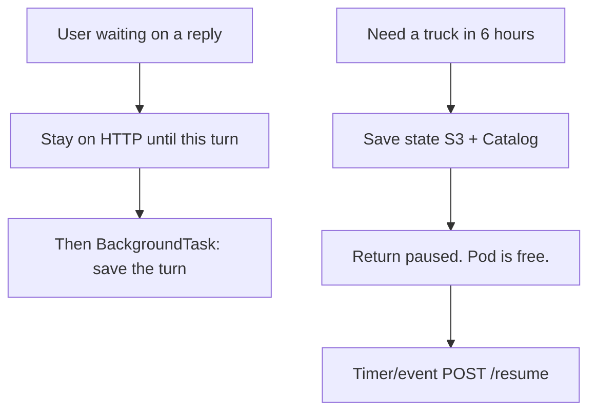
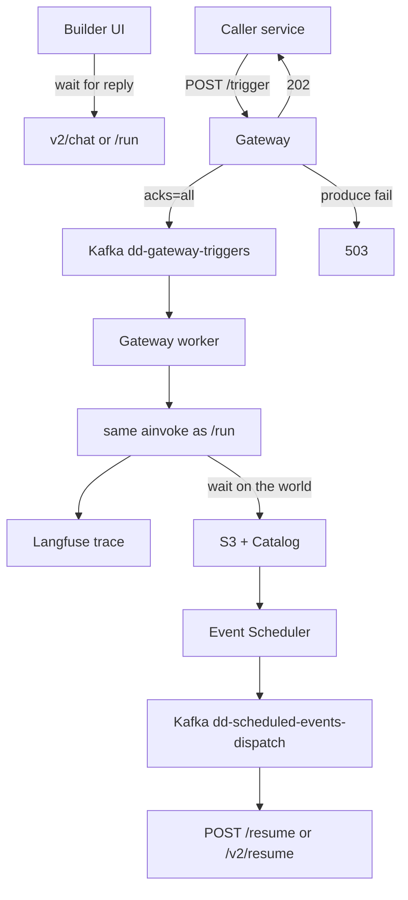
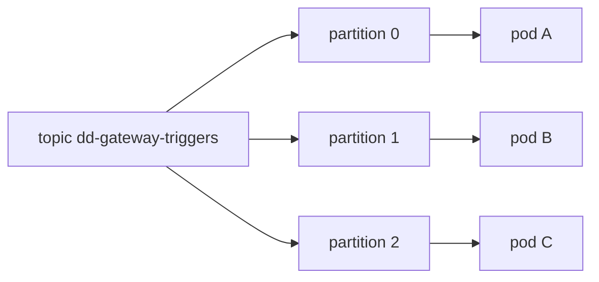
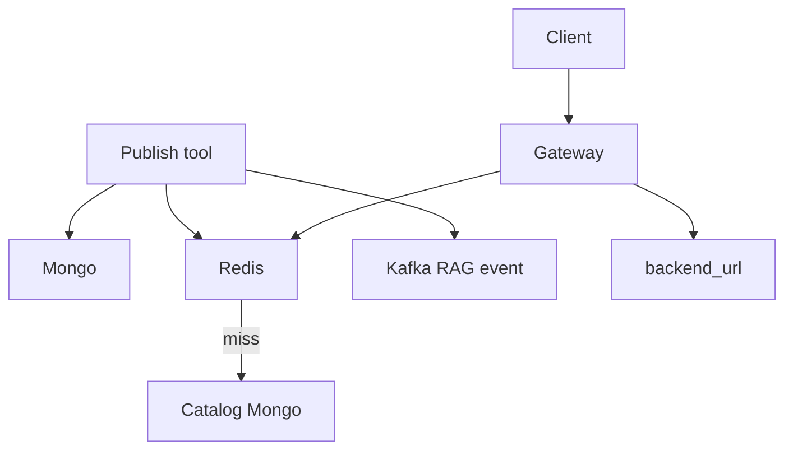
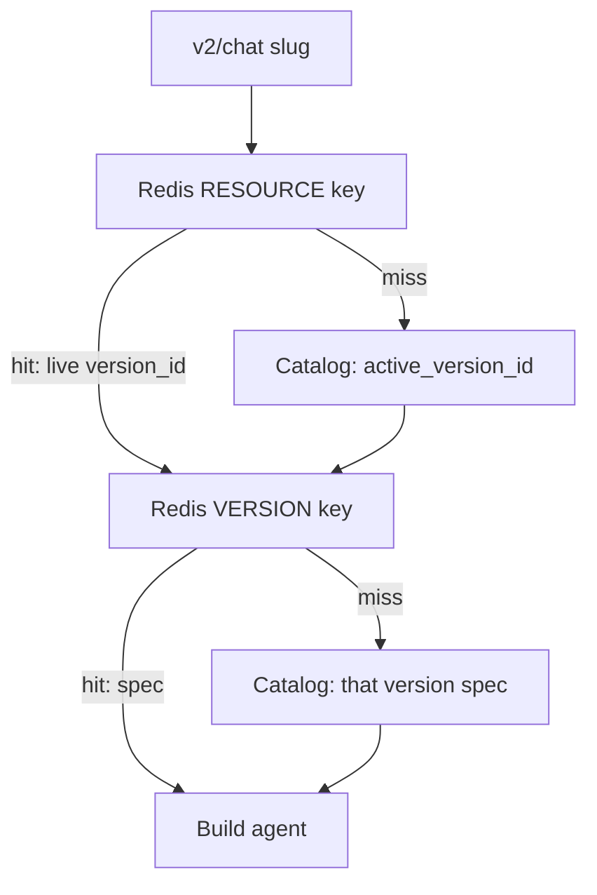
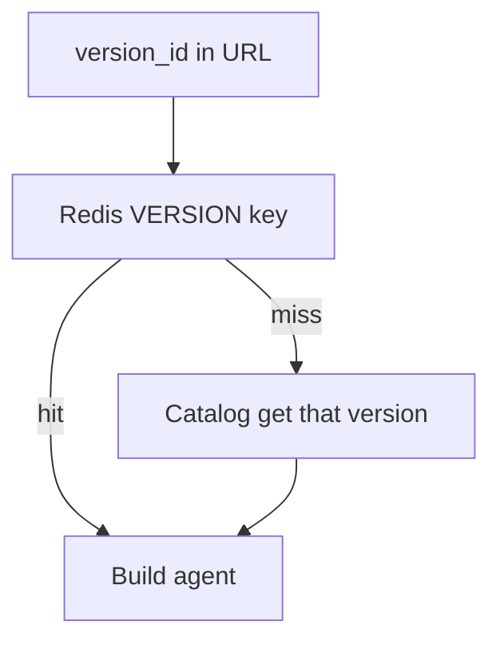

# Catalog and Gateway

> [!abstract] `resume:catalog-gateway`. Control plane (Catalog) stores OpenAPI tools and versions. Data plane (Gateway) flattens the spec and hits the backend. 600+ / 11+ / 72k — see number hygiene in [[00 - Ownership and How to Talk]]. Docs: [[02-tool-registry]] · [[06-mcp-gateway]].

## Resume line

Catalog API registry, 600+ tools, 11+ domains. Gateway translates OpenAPI → executable tools for UI and chat. 72,000+ daily requests.

> [!warning] PDF says **"MCP Gateway (LangChain)"**. Runtime is Starlette + FastMCP + LangGraph (`langchain-core` for LLM bits). Say FastMCP/LangGraph. Do not defend "we built it in LangChain."

## Overview

Need: hand-built FastMCP does not scale past a hundred endpoints. An **agent** needed tools from a registry, not another `server.py`.

What we built:

- **Catalog** — system of record. FastAPI. Mongo. OpenAPI tools, versions, MCP-server bundles, agent definitions. **Never executes a business API.** Own reads **never hit Redis**.
- **Gateway** — runtime. Starlette + FastMCP (+ LangGraph for agents, not "we built it in LangChain"). Resolves specs, flattens `$ref` → Pydantic / function-calling schema, in-memory FastMCP tool, `api_executor` HTTP, optional transformer.
- **A tool** — one OpenAPI operation. `namespace`. `backend_url` from `servers[0]`. Paths + methods.
- **Enricher (no LLM)** on register:
  - **domain** — keyword map into 14 `VALID_DOMAINS` (Express, Freight, Fulfillment, Sorting, Serviceability, Tracking, Billing, Customer Support, Employee, Address, Client, Hyperlocal, Fleet Management, Platform). Resume "11+" is this set. Stored as an **array** for `$in`.
  - **has_pii** — `x-pii: true` on params/schemas.
  - **spec_fingerprint** — SHA-256 of `(base_url, METHOD, path)` for dupes.
  - **token_count** — for budget.
  - **tags** — spec + operation tags, plus `api` / `openapi`.
- **Validator** (`ToolValidator`) — structural/security check before the spec lands.
- **Versioning** — `draft → published`, set active version, rollback = point `active_version_id` at an older version.
- **MCP server in Catalog** — named bundle of tool ids. Paste-ready `mcp.json`. Gateway URL `{gateway}/{owner}/c/{slug}/mcp`.
- **Auth** — inbound UMS bearer. Outbound OS1 client-credentials or forwarded headers.
- **Kafka on publish** — `tool` / `mcp_server` events → Ask AI ingest.
- **Original product** — agent + tools from the registry. Workflows came **later** (July) when deterministic multi-step work in an agent loop polluted context, hallucinated, and burned money.

Split that saves the round: **Catalog is SoR. Gateway is runtime.**

## Timeline

- **Jan–Mar 2026** — standalone MCP only. Catalog does **not** start in March.
- **April → mid-May 2026** (~1.5 months) — **this bullet.** Catalog + Gateway **tool path**: register OpenAPI, enrich, publish, Gateway resolve → flatten → HTTP.
- **Mid-May → end Jun** — agents (LangGraph, children, Orion). Not this 1.5 months.
- **July** — workflow canvas, first cut. Not this 1.5 months.
- "Architected" on the PDF must match the ownership row. 1.5 months is a slice of a platform, not Netflix.

## Schema

### `registry_resources` (Mongo)

One resource (a tool, later other kinds). Envelope, not the OpenAPI blob.

- id, name, kind (`Tool`, …)
- `namespace`
- `status` / `active`
- `active_version_id` — live pointer
- `latest_version_id`
- metadata stamped by enricher: `domain[]`, `has_pii`, `spec_fingerprint`, `token_count`, `tags`, `backend_url`, `endpoints`, `methods`, title/description/summary

### `registry_versions` (Mongo)

One **immutable-enough** payload per version.

- resource id, version number
- stage: `draft` → `published` (live = the parent's `active_version_id`)
- **payload** — the OpenAPI spec JSON (the schemaless tree)

Same version machinery is reused later for workflows, agents, guardrails, transformers.

### `mcp_servers` (Mongo)

- `name`, `slug` (kebab(name) + 10 random chars), `description`, `owner`
- `status` (`active` or not)
- `updated_at` / `updated_by`
- endpoint: `{MCP_GATEWAY_ORIGIN}/{owner}/c/{slug}/mcp`

### `mcp_server_tools` (Mongo)

- `server_id`, `resource_id`, `enabled`
- Gateway `get_tools_by_slug`: 404 if missing; validation error if server not `active`

### Redis (Gateway only — not a Mongo collection)

- `mcp_server_{slug}` — enabled tool **ids** for a bundle. Write-through on mutation. Not the live-vs-version dance.
- **RESOURCE key** — live pointer → `version_id`. Env: `CACHE_TTL_RESOURCE`.
- **VERSION key** — spec blob for that `version_id`. Env: `CACHE_TTL_VERSION`.

**TTL numbers to set / to say (vault docs name the vars, not the integers — confirm in `mcp-gateway/config.py` / `staging-config.md`):**

| Env | Meaning | Default to ship | Why that number |
|---|---|---|---|
| `CACHE_TTL_RESOURCE` | live pointer | **300s (5 min)** | Write-through is the real refresh. TTL is a **safety net** if invalidation is missed — max time Gateway can serve a stale live. 60s is also fine (more Catalog on expiry). Don't set 24h on the pointer. |
| `CACHE_TTL_VERSION` | spec blob | **3600s (1 h)** | Version JSON does not change. 86400s (24h) is OK if unpublish **deletes** the VERSION key. Don't set 30s — you'll stampede Catalog for no reason. |

If they ask "what's in prod right now?" — those two env vars. Don't invent a third number you didn't grep.

Catalog collections Catalog **does** also own later (`agents`, `agent_links`, `workflow_versions`, …) — hydrate path for `v2/chat`, but the April slice is the four above.

## Endpoints

Agent **v1** `/chat` — do not talk about it. Production is **v2**.

**Gateway**

- `POST /{team}/custom-agent/{slug}/v2/chat` — **live** agent, builder UI. No `version_id` in the URL. Two Redis steps. Human waits. **Not the 72k.**
- `POST /{team}/custom-agent/{slug}/v2/trigger` — production intake. 202 after Kafka. Worker runs the same graph. **This is the 72k URL.**
- `POST /{team}/custom-agent/{slug}/versions/{version_id}/v2/chat` (same live-vs-pinned idea) — **pinned** version. One Redis step. Preview / debug / don't pick up a new live by accident.
- `{owner}/c/{slug}/mcp` — streamable-http MCP server built in memory from the Catalog bundle.

**Catalog (control plane)**

- Register / update tool (spec in → validator + enricher → `registry_resources` + `registry_versions`).
- Publish / rollback — `draft → published`, set `active_version_id`, `refresh_upstream_cache`, Kafka RAG event.
- MCP server CRUD + bind/toggle tools → `_sync_redis_cache` on `mcp_server_{slug}`.
- `get_agent_detail_by_slug` — Gateway hydrate for `v2/chat` (prompts with content+tokens, default prompts appended, linked tools / MCP servers).

Workflow `/run` and `/resume` exist on the Gateway but are the **July** bullet, not this pointer's traffic story.

### Chat / `/run` — wait on the line, or hang up? (plain English)

Forget "async." Three different designs. Only one of them is a **background task**, and it is the wrong one for running the agent.

**1. User is sitting there (chat)**

You sent a message. You want the reply on screen.

Right design: **stay on this HTTP call until this reply is ready** (or stream tokens). 5–30 seconds. Like a phone call for this one sentence.

Wrong design: return immediately and run the agent as a background task. Then the UI has nothing to show unless you also build poll/websocket. Extra machinery for a chat box.

**2. Work might take hours (workflow, or an agent waiting on a truck)**

You cannot stay on the phone for six hours. Right design: **save progress, hang up, continue later.**

That is pause / hibernate — **not** a background task. A background task still sits in the same process. If the pod dies, the wait dies. You want **zero** compute until the truck event / timer fires.

**3. Starlette `BackgroundTask` (the only actual "background task" in this stack)**

Means: **already sent the HTTP response**, then do a small leftover in the same process — e.g. write the conversation turn. Fine. If that write fails, the user already got the answer.

**Do not** put `ainvoke` (the graph) on a `BackgroundTask`. No status, no retry, dies with the pod. That is not a job system.

**What we actually do today (playground — this is real)**

| URL | Who | Client waits? |
|---|---|---|
| `POST .../v2/chat` | Human on the agent builder, iterating | Yes — this turn |
| `POST .../workflows/{slug}/run` | Human on the canvas, hitting Run | Yes — until this chunk finishes or pauses |
| Conversation write | leftover | `BackgroundTask` after the reply |

### Production `/trigger`

Playground (`v2/chat`, `/run`) stays sync — a human is iterating and waiting.

Anything else (another service, a cron, an event) hits **`/trigger`**. That handler does **not** run the graph. It validates, produces to Kafka, and returns:

- **202** — produce was **acked**. Accepted. Graph has not run yet. Caller must **not** retry.
- **503** — produce failed after producer retries. Caller retries with the **same** idempotency key.

No GET. We never stored runs. You watch the execution on **Langfuse** (same UI as `/chat` and `/run`). Pause still uses S3 + Catalog so a worker can die while waiting on the world — that is resume state, not a run history.

- `POST /{team}/custom-agent/{slug}/v2/trigger`
- `POST /{team}/workflows/{slug}/trigger`

Body: same payload as chat/run, plus `Idempotency-Key` (or `request_id`). No callback URL. Don't invent one.

72k stays on **`/v2/trigger`**. Playground `v2/chat` is not that counter. Don't mix with 124k.

**Same execute, different door.** `v2/chat` / `/run` and the trigger worker call **one** function (`build` + `ainvoke` + `format_response`). That function always *has* a body (`{session_id, contents, meta}` or workflow `status` / outputs). The HTTP adapter is what changes:

- Playground: `return` that body on the request (200).
- Worker: nobody is on the socket. `format_response` still builds the same dict; it is written into the **Langfuse trace**. Then commit Kafka.

Not two engines. The worker just does not `return` that dict to the service that got the 202.

**What "the work already happened" means:** the graph called real APIs (create/update something in Express, FMS, …). Those systems now have the new data. That *is* the product of a trigger. The chat JSON is for a human staring at the builder. Production does not need that JSON sent back. Debug = open Langfuse.

### How `/trigger` was built

We already ran Kafka in this platform: Catalog → `catalog.resources.events` (Ask AI ingest), Event Scheduler → `dd-scheduled-events-dispatch` (pause resume). Trigger is the same broker, a new topic `dd-gateway-triggers`. Worker is the **same Gateway image**, consumer group `dd-gateway-trigger-workers`, calling the same `ainvoke` as `/run`.

#### Why Kafka, not something else

| Option | Why not (or why yes) |
|---|---|
| **Kafka** | Already operated. Durable log. Consumer groups (scale workers). Key → partition (retries for the same id stay ordered). Replay if a worker bug eats a batch. Same broker as resume + RAG. |
| Redis list / Streams | Redis here is the **spec cache**. Mixing a job backlog with cache TTLs is how you evict work. No replay like a log. |
| Rabbit / SQS | New broker to page on. We didn't have it. SQS is a fair "if we were on AWS-only" answer — we were not starting from zero, we had Kafka. |
| Celery | Scheduler docs already picked Postgres+Kafka over Celery. Don't add Celery just for intake. |
| Starlette `BackgroundTask` | Dies with the pod. 202 would be a lie — work is not durable. |
| Only S3 + Catalog | That is **pause**, not intake. S3 does not wake a worker. Nothing *starts* the graph. |
| Kafka delayed topics for "6 hours later" | Kafka is a bad timer. That is why Event Scheduler is Postgres + `SKIP LOCKED`, then Kafka. `/trigger` is **now**; pause is **later**. |

**202 means durable on the log**, so the produce must wait for a real ack. That is `acks=all` (leader + in-sync replicas). `acks=1` is faster and can lose the message if the leader dies — then you returned 202 and the work vanished. Don't.

#### Producer (inside `POST /trigger`)

Order: **auth → validate body → produce → then status code.** Never enqueue a 400. Never 202 before the ack.

| Setting | Value we use | Why |
|---|---|---|
| `acks` | `all` | 202 ⇒ it's on the log |
| `enable.idempotence` | `true` | Producer retry must not double-write the same produce |
| Producer `retries` | `5` | Transient broker blip — don't 503 on the first hiccup |
| `flush` / delivery timeout | **10s** (same as scheduler producer) | Then give up → 503 |
| `linger.ms` | `0` | Caller is waiting on 202, not a batch |
| Message **key** | idempotency key | Same key ⇒ same partition ⇒ retries ordered |
| Topic | `dd-gateway-triggers` | Payload says agent vs workflow, slug, body |

HTTP from this handler:

| Code | Meaning | Caller |
|---|---|---|
| 401 / 403 | Auth | Don't retry |
| 400 | Bad body | Don't retry |
| **202** | Kafka acked | **Don't retry** — already accepted. Retry = at-least-once duplicate (same key, worker must tolerate it) |
| **503** | Produce failed / timeout | Retry with **same** key. `Retry-After` a few seconds |

The graph is not in this request. A 30-second LLM call cannot make `/trigger` slow. If Kafka is slow, 503, not a hung HTTP.

#### Consumer (Gateway worker)

- `enable.auto.commit = false`. Commit only when this message is **finished or safely paused**.
- **Succeeded / failed** → Langfuse has the body → **commit**.
- **Paused** (need the world) → S3 + Catalog checkpoint → **commit** the **trigger** offset (that intake message is done). Worker is free. Resume is a **different** path: timer → Event Scheduler → `dd-scheduled-events-dispatch` → consumer **`POST /resume`** (workflows) or **`POST /v2/resume`** (agents). Event pause: something calls `/resume` directly. Do **not** put resume back on `dd-gateway-triggers` — that would start a new run, not continue `thread_id`.
- Crash after work, before commit → Kafka redelivers → graph may run twice. At-least-once. Downstream tools must be safe to retry; Langfuse will show two traces. Say that.
- **`max.poll.interval.ms`** must be **longer than the slowest graph** (we set 10 minutes). If `ainvoke` runs longer than this, Kafka kicks the consumer out of the group and redelivers while the first worker is still running — double execution. Classic Kafka footgun. Don't "tune it later."
- Poison: fail the graph 3 times (Catalog 500, LLM 429) without commit; then produce to `dd-gateway-triggers-dlq`, commit the original, Langfuse error. Don't block the partition forever.

**Three pods, how commit actually works** (this is the Q they will ask)

Kafka is **not** one shared queue that three workers pop from. The topic is split into **partitions**. The consumer group (`dd-gateway-trigger-workers`) assigns **whole partitions** to pods. One partition → one pod at a time. Offset commits are **per partition**, not global.

Message **key** = idempotency key → hash → partition. Same key always lands on the same partition (retries stay ordered). Different keys can be on different partitions and run **in parallel**. There is **no company-wide order**.

So the story "pod A took event 1, pod B took event 2 which is later, event 1 fails, event 2 succeeds — how does commit work?"

- **Different keys / different partitions:** they never shared a commit. Pod B commits partition 1 (event 2 done). Pod A does **not** commit partition 0. Offset on 0 stays at event 1. When A restarts (or the group rebalances), event 1 is delivered again. Event 2 is already done. That is fine — they were unrelated.
- **Same key:** both messages are on **one** partition, so **one** pod owns them. Pod B cannot steal "the next" one. That pod processes **in offset order**: finish (or pause) offset 5, **then** commit 5, **then** take 6. If 5 fails, do not commit, do not start 6. After poison/DLQ you commit 5 so 6 can move.

`enable.auto.commit = false` means: Kafka must not mark a message done just because we **polled** it. We commit after `ainvoke` (or checkpoint). `auto.commit = true` is how you "ack" work you then crash in the middle of.

**The footgun if you get clever:** poll a batch, process 5 and 6 in parallel on one partition, 6 succeeds, you commit 6, 5 failed → **5 is skipped forever**. Never commit an offset past an unfinished message on that partition. One in-flight message per partition (or commit only the contiguous prefix).

**Pod dies:** group rebalances. Its partitions go to another pod, which starts from the last **committed** offset. Uncommitted message runs again (at-least-once). 3 pods and 2 partitions ⇒ one pod sits idle. Partitions ≥ pods if you want every replica busy.

#### Why no run table / no GET

Langfuse (Gateway `observability/langfuse_client.py`) already traces **every** execution: playground `/chat` `/run`, production `/trigger`, and pause/resume **reuses `trace_id`** so it is one timeline. CubeAPM + New Relic for the process. Catalog is SoR for **specs**, not executions. A `runs` collection would be a second, worse Langfuse. Pause docs in Catalog are **resume bytes**, not "list my jobs."

**If they ask "where do I poll status?"** You don't. Open the Langfuse trace. Or look at the system the tools wrote to (the record now exists there).

#### Interview, six sentences

"`v2/chat` and `/run` stay synchronous because a human is iterating. Production is `POST /trigger`: validate, produce to Kafka with `acks=all`, 202 only after the ack, 503 if produce fails. We already had Kafka for RAG events and scheduler resume — we did not add SQS. A Gateway worker runs the same graph; we commit the offset when the graph finished or paused. We don't store runs — Langfuse is the UI for `/chat`, `/run`, and `/trigger`. Pause is still S3 + Catalog so we are not holding a consumer for hours."

## Architecture

### How it works

- Author registers an OpenAPI operation once. Enricher stamps domain / PII / fingerprint / tokens. Validator runs.
- Publish writes Mongo, **then** write-through Redis, **then** Kafka for search.
- Client hits Gateway (live `v2/chat`, or MCP `{slug}/mcp`, or a pinned version URL).
- Gateway: Redis (Catalog fallback) → flatten `$ref` → in-memory FastMCP tool → `api_executor` to `backend_url` → optional transformer.
- Gateway is **stateless** per request (horizontal). Pause bytes are S3 — later pointer, not April.
- Dual-write order: Mongo first, then Redis, then Kafka. Brand-new publish is in Redis only after Catalog write succeeded.

### Why Redis

- Catalog is Mongo, SoR, **never reads Redis** — authors never see a stale cache.
- Gateway is the hot path — **production `/trigger` at ~50 RPM** hydrates a fat agent spec (prompt, links, tools) every run. Hitting Mongo on every run couples the control plane to production QPS. Playground `v2/chat` is the same hydrate, much less traffic.
- Redis = **write-through cache for the Gateway only**. Publish/rollback → `refresh_upstream_cache`.
- Redis down → Gateway degrades to Catalog (docs). Slower, still correct.
- `mcp_server_{slug}` = enabled tool ids. Separate from RESOURCE/VERSION keys.

### Caching strategies — what we could have used, why write-through

- **Cache-aside (lazy):** Gateway miss → Catalog → fill Redis. Simple. Problem: first request after publish still serves **old** live until TTL. Bad when "what is live" must move now.
- **Write-through:** Catalog publish writes Mongo **and** Redis in the same mutation path (`refresh_upstream_cache`, `_sync_redis_cache`). Next `v2/chat` sees the new pointer. **This is what we shipped.**
- **Write-back:** write Redis first, flush Mongo later. Faster writes, lie if Redis dies before flush. Wrong for a **system of record**.
- **Write-around:** write Mongo only; Redis fills on next read. Same staleness as aside after publish.
- **Read path is still aside-on-miss:** Redis hit → go. Miss → Catalog → populate. Write-through is the **publish** side.
- Two TTLs: `CACHE_TTL_RESOURCE` **300s** (pointer) vs `CACHE_TTL_VERSION` **3600s** (blob). See schema table. Write-through is freshness; TTL is the backstop.
- Stampede / hot key: at **~50 RPM it does not matter.** Numbers below.

### Stampede and hot key — when it actually starts

Two different problems. Don't mix them.

**A. Stampede (TTL fires → herd to Catalog)**

- Window is **one Catalog hydrate**, not "after N hours." If hydrate is ~200ms, only the requests that land in that 200ms (plus one miss per Gateway pod if there is no singleflight) hit Mongo.
- Concurrent Catalog fetches ≈ `(RPM / 60) × hydrate_seconds` + (pod count if every replica misses on its own).
- **~50 RPM:** 50/60 × 0.2 ≈ **0.2 extra requests**. Even 10 pods → ~10 Catalog gets once. Nothing.
- **~500–1,000 RPM:** 2–3 extras in 200ms, or ~10 if hydrate is 500ms. Start talking **singleflight / lock around miss**. Still not an outage.
- **~3,000 RPM (~50 RPS) on one slug:** ~10 concurrent hydrates in 200ms, worse with many pods. **This is where stampede is a real Catalog spike.** Fix: singleflight, serve-stale-while-revalidate, jitter TTL so not every key dies together.

**B. Redis hot key (one key eats GET bandwidth)**

- Redis is happy at tens of thousands of GET/s. 50 RPM is noise.
- Pain is **bytes**, not GET count: fat spec (say ~200KB) × RPM / 60.
  - 50 RPM → ~0.2 MB/s. Ignore.
  - **~10,000 RPM** on one slug → ~**33 MB/s** off one key. NIC / one Redis hash slot starts to matter.
  - **~50,000 RPM** → ~167 MB/s. Local in-memory L1 on the Gateway, or split.

**Say in one breath:** *Today ~50 RPM. Stampede is a story at a few thousand RPM on one live slug. Redis hot-key is a story around 10k RPM if the spec is fat. I would not design Kafka for this.*

### Why Mongo, not Postgres

- Unit of data = **one version of a blob**: OpenAPI spec, later agent config, later workflow `{nodes[], edges[]}`. That JSON **is** the schema.
- Paths, `$ref`s, parameters, `x-pii` — every tool looks different. Postgres = fat `JSONB` (you didn't gain SQL) **or** explode paths/params into tables you migrate when OpenAPI shape drifts.
- Reads: **get this resource / this version id**, not "join invoices to line items."
- Versions: **new document + move `active_version_id`**, not ALTER TABLE.
- We **did** use Postgres where the data is rows: SOP prefix routing, scheduler `scheduled_events` (time, claim, `SKIP LOCKED`).

> [!warning] Do not say "Mongo scales" or "NoSQL for microservices." They will eat you. The answer is **shape of the payload**, not "we like flexible columns."

**Flexible schema — keep this, drop `isActive` as the example.**

There are two parts of a Catalog document:

| Part | Examples | Flexibility story |
|---|---|---|
| **Envelope** | `slug`, `status`, `active_version_id`, `isActive` | These are **fixed fields**. Adding `isActive` is a migration in any store. Do **not** justify Mongo with this. A boolean column is what Postgres is *for*. |
| **Payload** | OpenAPI spec, DAG `nodes[]`, agent links, `x-pii`, `$ref` trees | **This** is what stays schemaless. Tool A's spec has different keys from tool B. Next month a new OpenAPI vendor dumps a new `x-foo`. You store the document; you don't add 40 columns. |

- Say: schema flexibility on the **spec body**, because every registered API is a different JSON tree. The envelope is versioned and validated like any service.
- Validators/enricher (`ToolValidator`, `ToolEnricher`) are how you didn't let "flexible" mean "garbage."
- If they hear only "we kept adding keys," they think you skipped migrations. If they hear "the OpenAPI document itself has no stable columns," they nod.
- **What you give up:** no FK from version → resource the way PG would; uniqueness is fingerprint + validators, not a unique constraint on `(method, path)` unless you added one. Fine for a registry. Would be wrong for money.
- **JSONB in Postgres?** Honest: would have worked for "store a blob." Team already had Mongo/DocumentDB for this service; Redis still sits in front of Gateway either way. Don't pretend Mongo was the only possible blob store.

### Live vs version-specific — one Redis step vs two

Same idea for agents and later for workflows. Specs live under a **version id**. "What is live" is a **pointer**, not a second copy of the blob.

Gateway cache (`spec_resolver` / `agent_resolver`): `CACHE_TTL_RESOURCE` (the live pointer) vs `CACHE_TTL_VERSION` (the immutable spec).

**A. Generic / live — v2/chat on the slug** (`POST /{team}/custom-agent/{slug}/v2/chat`)

- "Whatever is live right now." Gateway does **not** get `version_id` in the URL.

- **Two steps:** (1) resource/live pointer → `version_id` (2) version key → spec.
- Publish is a **pointer swap**. Old version blobs stay in Redis so in-flight pinned calls and rollbacks still work.

**B. Version-specific** (`.../versions/{version_id}/...`)

- URL already has `version_id`. Skip the pointer.

- **One step:** version key → spec. Preview, debug, "run this draft/published graph," don't accidentally pick up a new live.

> [!tip] Do not cache the fat spec only under `slug:live`. Then every publish rewrites a huge blob and you still need the old blob for the version URL. Pointer + immutable version cache is the whole trick.

**Why two TTLs?** Live pointer: `CACHE_TTL_RESOURCE` **300s** + write-through. Version blob: `CACHE_TTL_VERSION` **3600s** — that JSON does not change. Don't invert them (short blob TTL = fake stampedes).

### Other architecture facts

- **Draft never in prod** — active version pointer; Gateway `get_tools_by_slug` 404s if server not `active`.
- **Duplicates** — fingerprint `(base_url, METHOD, path)`.
- **Hallucinated tool in an SOP** — `tool_resolver` vs `domains.yaml`. Unknown `operationId` dropped. Fail-open on parser errors (input unchanged).
- **Catalog down mid-call** — cached spec may still run; resolve miss fails the call.
- **Redis down** — degrade to Catalog.
- **Rollback** — point `active_version_id` at older version; refresh Redis pointer. Spec blob already there.
- **PII** — `has_pii` on spec. Don't log bodies. Transformers redact.
- **Multi-tenant** — `namespace` + RBAC/OPA. Don't serve team A's tools to B.
- **Timeouts / retries** — time out tool HTTP. Don't blindly retry POST. Idempotent GETs ok.
- **SPOF** — Mongo, Redis, Catalog, UMS, OS1. Gateway replicas are not SPOF.
- **CAP** — Catalog/Mongo: prefer consistent live pointer (CP-ish). Redis cache: may lag a second (AP-ish). Write-through is how you avoid "Gateway thinks old live."
- **Why not one service** — authors vs 72k runtime. Scale independently.

## Metrics (Temple PDF — do not rewrite the tex)

- **72k/day** — lock for Temple. **`POST /{team}/custom-agent/{slug}/v2/trigger`**. Production agent runs. Not Catalog. Not playground `v2/chat`. Not workflow `/run`. Not every inner tool HTTP.
- Original Catalog+Gateway product = **agent + tools from the registry**. ~**50 RPM** over 24h (~120 RPM in a 10h workday).
- Resume number stays; we are not rewriting the PDF. After interviews: move 72k onto multi-agent — [[After Interviews - Resume Fixes]].
- **11+ domains** — say **14** `VALID_DOMAINS`. Name Express, Freight, Fulfillment, Fleet.
- **600+ tools** — OpenAPI operations in the registry. Don't invent the count query unless you can re-run it.
- **124k** lives on the **workflows** bullet. Different counter, different era. Don't mix.
- 50 RPM is **not** a scale problem. Don't invent Kafka+shard for this QPS. Peak = workday.

## Ugly questions

**How long?** April → mid-May, ~1.5 months, Catalog + Gateway **tool path**. Agents start after. Workflows are July.

**SQL vs NoSQL?** Payload is a JSON tree (OpenAPI / DAG). Envelope (`status`, live pointer) is boring and would be columns anywhere. Don't cite `isActive` as why Mongo. JSONB-in-PG is a fair pushback — blob + this service was on Mongo.

**How do you not serve a draft?** Active version pointer; Gateway `get_tools_by_slug` 404s if server not `active`.

**Duplicate APIs?** Fingerprint. Same server+method+path.

**Hallucinated tool in an SOP?** `tool_resolver` checks `domains.yaml`. Unknown `operationId` dropped. Fail-open on parser errors (input unchanged) — say that tradeoff.

**Publish and search?** Kafka `tool` / `mcp_server` events → Ask AI ingest ([[05 - Ask AI Search]]).

**72k — which URL?** **`/{team}/custom-agent/{slug}/v2/trigger`**. Production. `v2/chat` is the builder. Workflows are a later bullet (124k is not this counter). ~50 RPM. Don't open a dashboard you don't have.

**Why Redis?** Gateway must not Mongo-hydrate a full agent spec 72k times/day on `/trigger`. Live = two Redis GETs (pointer then spec). Pinned version = one GET. Catalog never reads Redis.

**Live vs version URL?** Live: slug only, extra hop to `active_version_id`. Version in path: skip hop. Publish = move the pointer, don't mutate the old spec.

**Gateway stateful?** Per-request build. Horizontal. Pause state is S3, not the pod ([[05 - Pause Resume]]).

**v2/chat / `/run` — background tasks?** Playground = stay on HTTP. Production = `POST /trigger` 202 after `acks=all`. No GET — Langfuse. Graph is never a BackgroundTask. Hours = S3+Catalog pause.

**Why Kafka not SQS / Redis / Celery?** We already run Kafka (RAG + scheduler resume). Redis is the spec cache — don't put a job backlog there. Celery was already rejected for the scheduler. 202 requires `acks=all` or you can lose the message.

**202 vs 503?** 202 = produce acked, do not retry. 503 = produce failed, retry same idempotency key. 400/401 do not retry. Graph is not on this HTTP call.

**Why no GET / runs table?** Langfuse already shows `/chat`, `/run`, `/trigger` (pause reuses `trace_id`). A runs table is a second, worse Langfuse.

**Worker crash?** At-least-once. Commit after success/fail/paused-checkpoint. Crash before commit → redelivery → maybe two traces. `max.poll.interval.ms` > slowest graph or Kafka rebalances mid-`ainvoke`.

**What if Catalog is down mid-call?** Cached spec may still run; resolve miss fails the call. Write-through means a brand-new publish is in Redis only after Catalog write succeeded.

## HLD grill (backend — any company)

50 RPM is **not** a scale problem. If they start sharding Mongo for 600 tools, you stop them. HLD here is **control vs data plane, cache, versioning, failure**.

| # | They ask | In this note already? | One-line |
|---|---|---|---|
| 1 | Draw Catalog vs Gateway | Boxes + 00 | Catalog = SoR, never executes. Gateway = runtime. |
| 2 | Walk `v2/chat` | Redis live vs version | Live: 2 Redis hops → build graph → tools HTTP. |
| 3 | Mongo vs Postgres | Why Mongo | Payload is a JSON spec tree. Envelope is columns anywhere. Not `isActive`. |
| 4 | Why Redis | Why Redis | Don't Mongo-hydrate a fat spec on every chat. Write-through. Catalog never reads Redis. |
| 5 | Cache-aside vs write-through | Partial | **Write-through on publish.** Read: Redis then Catalog (aside on miss). |
| 6 | Redis down | Ugly Q | Degrade to Catalog. Slower, still correct. |
| 7 | Catalog down | Ugly Q | Cached version still runs. Miss → fail that call. |
| 8 | Live vs pinned URL | Live vs version | Pointer + immutable version blob. |
| 9 | Draft in prod | Ugly Q | Active pointer; inactive MCP server 404s. |
| 10 | Duplicate tools | Ugly Q | Fingerprint `(url, METHOD, path)`. |
| 11 | Kafka on publish | Ugly Q | RAG/search index. Dual-write: Mongo first, then Redis, then Kafka. |
| 12 | Stateless Gateway | Ugly Q | Per-request build. Horizontal. Pause bytes = S3, later. |
| 13 | Auth | Truth | Inbound UMS. Outbound OS1 / forwarded headers. |
| 14 | Multi-tenant | Weak | `namespace` + RBAC/OPA. Don't serve team A's tools to B. |
| 15 | Timeouts / retries to Express | **No — add below** | Time out tool HTTP. Don't blindly retry POST. Idempotent GETs ok. |
| 16 | Cache stampede | **No** | Popular agent, RESOURCE TTL ends, thundering herd to Catalog. Singleflight / lock around miss. |
| 17 | Hot key | **No** | One slug = one Redis key. 50 RPM is fine. If 10k RPM, split or local cache. |
| 18 | 72k → QPS design | Ugly Q (URL) | ~50 RPM. Don't invent Kafka+shard. Peak = workday. |
| 19 | SPOF | **No** | Mongo, Redis, Catalog, UMS, OS1. Gateway replicas are not SPOF. |
| 20 | CAP | **No** | Catalog/Mongo: prefer consistent live pointer (CP-ish). Redis cache: may lag a second (AP-ish). Live pointer write-through is how you avoid "Gateway thinks old live." |
| 21 | How do you rollback | Partial (republish in docs) | Point `active_version_id` at older version; refresh Redis pointer. Spec blob already there. |
| 22 | Rate limit | **No** | Gateway, per tenant/token, Redis counter. 429. Not Catalog. |
| 23 | PII | Truth `has_pii` | Flag on spec. Don't log bodies. Transformers redact. |
| 24 | Why not one service | Pitch | Authors vs 72k runtime. Scale independently. |

**Stampede / hot key / SPOF / CAP / rate limit / retry** were missing as named Qs. Cues above. Don't over-build.

## Agentic grill (this bullet — any company, not only backend)

This pointer is **registry + tool execution + v2/chat as the product**. Full child-agent / Orion / LangGraph routing is [[03 - Agents and Orion]]. They will still jump. One sentence here, depth there.

| # | They ask | In this note already? | One-line |
|---|---|---|---|
| 1 | Why Catalog+Gateway at all? | Pitch | Agent needs tools from a registry, not 130 `server.py` files. |
| 2 | How does the model call an API? | Truth | Flatten OpenAPI `$ref` → function-calling / Pydantic schema → FastMCP tool → HTTP. |
| 3 | Why not dump 600 tools in the prompt? | **No** | Token budget (`token_count`). Domain filter. MCP server = **subset** of tool ids. Ask AI search for discovery. |
| 4 | Tool hallucination | Ugly Q (SOP) | `tool_resolver` vs `domains.yaml`. Unknown `operationId` dropped. |
| 5 | MCP vs "just REST from the agent" | Pointer 1 + this | MCP is how the IDE/runtime sees tools. Gateway **is** the MCP server built in memory. |
| 6 | LangChain vs LangGraph | Warning | PDF says LangChain. Say FastMCP + LangGraph. Don't defend LangChain. |
| 7 | Why workflows after agents? | 72k paragraph | Deterministic multi-step in an agent loop → context pollution, hallucination, cost. Canvas in July. |
| 8 | Guardrails / prompt injection | 06 Supporting | Input/output chain. Secrets, URLs, grounding. Don't claim you solved injection. |
| 9 | PII to the LLM | `has_pii` | Flag + transformers shrink/redact before the model. |
| 10 | Observability | Weak | Langfuse / trace_id. One trace = one chat turn + tool calls. |
| 11 | Cost | Agents note | `cost_handling` = tokens. ₹/indent is business. Split them. |
| 12 | Retries: LLM vs tool | **No** | LLM timeout ≠ retry Express POST. Tool errors return to the model; model may retry. Idempotency on the API. |
| 13 | Human in the loop | Workflows | Not this 1.5 months. Pause node later. Don't invent HITL on April Gateway. |
| 14 | Eval / tool quality | Docs `audit/` | Periodic LLM-as-judge on specs. Name it if you owned it. |
| 15 | Multi-agent / children | **Park on 03** | Agent-as-tool. This bullet: tools from registry. Hierarchy = next pointer. |
| 16 | Context window | **No** | `token_count` on specs + transformers. Don't load unused tools. |

If the round is **GenAI-heavy** (any company): they live on rows 2–8 and 12. If it's **classic backend**: rows in the HLD table. Same system.

## Related Notes

- [[00 - Ownership and How to Talk]]
- [[01 - MCP Servers]]
- [[03 - Agents and Orion]]
- [[05 - Ask AI Search]]
- [[06 - Supporting Modules]]
- [[07 - Langfuse]]
- [[After Interviews - Resume Fixes]]
- [[02-tool-registry]]
- [[06-mcp-gateway]]
- [[HLD/CrashCourse/13 - Question Bank]]
