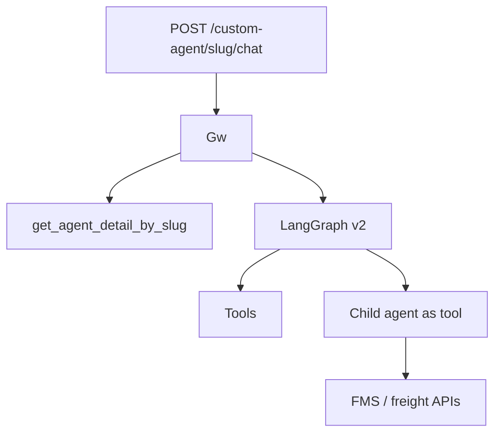

# Agents and Orion

> [!abstract] `resume:multi-agent` + `resume:orion`. An agent is a Catalog document plus links (tools, MCP servers, prompts, contexts). Runtime is LangGraph on the Gateway. Child agent = agent exposed as a tool. Orion indent is the story they will pick if they want "business impact." Doc: [[03-agents]].

## Resume lines

- Hierarchical LangGraph agents, event-driven, child agents, 20+ workflows.
- Indent Creation Agent, 1,000+ indents/day, ₹28 → ₹4, enrichment subagent for dirty data.

Later the same 20+ automations moved onto the **workflow canvas**; cost cited as ₹1.5 on that bullet. Say the **timeline**: agent first, then DAG.

## Truth

**Catalog `agents`:** name, slug, owner, system prompt, model, temp, links. `get_agent_detail_by_slug` is the Gateway hydrate (prompts include content+tokens, default prompts appended).

**Child agents:** `agent_tool_generator` makes an agent callable like a tool. Parent routes to it. Workflow `Agent` node does the same by `agent_slug`.

**v2 Gateway:** hooks (sandboxed), routing (tools vs child vs answer), cost (`v2/cost_handling.py`). Hibernation ≠ workflow pause — long agent run, scheduler webhook.

**Orion:** root `owner`/team `orion`. Indent agent on FMS/freight tools. Enrichment **child** fills vendor/route/contract gaps so a human/system can assign a truck. Run URL shape: `/{team}/workflows/{slug}/run` after migration.

₹28/₹4/₹1.5: accounting code exists; **the rupees are a business metric**. 1,000+/day same. 20+ = "these automations," name the ones you lived in.

## One-minute pitch

Parent agent should not do enrichment and indent create in one giant prompt. Parent creates the indent; if the record is dirty it **calls a child agent** that only looks up missing fields. Same idea later as a Tool node + Agent node on a canvas. Cost dropped because a person stopped clicking FMS for every indent — I can talk the graph; I will only quote rupees if I know the formula (tokens vs ops vs vendor).

## Boxes

## Ugly questions

**What is event-driven?** Triggered by a chat/workflow/event; can **hibernate** or **pause** waiting. Workflow `pause-resume` `sub_type: event` has no timer.

**How is it hierarchical?** Agent-as-tool, not a free-for-all swarm. Bounded child, own prompt, own tools.

**20+ workflows vs the workflow bullet?** Same business list, two runtimes. Don't double-count impact.

**Indent — what if enrichment is wrong?** Dirty truck assignment. Guardrails / human? Fill what you actually had.

**LangGraph vs own loop?** Checkpointing, state channels, later the same runtime as canvas workflows. One stack.

**v1 vs v2?** v1 `execution/chat_runner`. v2 `v2/` routing + cost + children. Say which you shipped.

**Cost tracking vs ₹4?** `cost_handling` is tokens/cost per run. ₹/indent may include LLM + ops savings. Split them.

## Related Notes

- [[00 - Ownership and How to Talk]]
- [[04 - Workflows and Pause Resume]]
- [[03-agents]]
