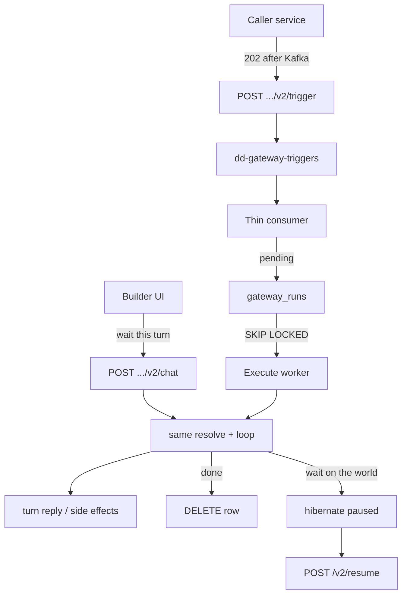
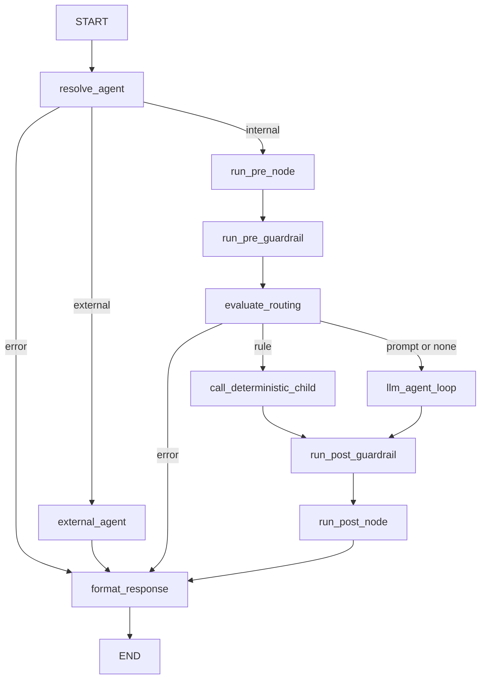
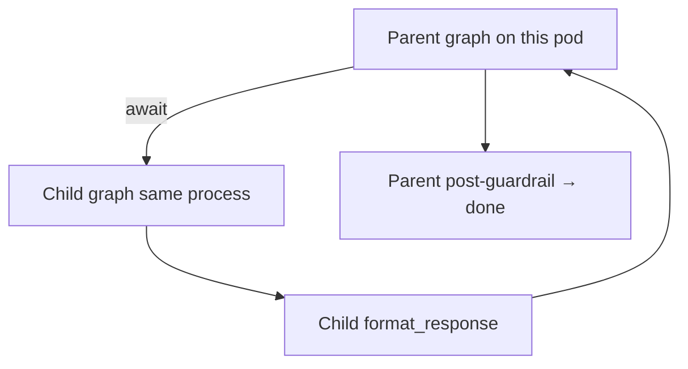

# Agents and Orion

> [!abstract]
> - `resume:multi-agent` + `resume:orion`
> - An agent is a Catalog document plus links (tools, MCP servers, prompts, contexts)
> - Runtime is LangGraph on the Gateway
> - Child agent = recursive sub-graph
> - Deep dive: [[11-v2-agent-orchestration]] · [[12-observability-langfuse]]
> - Also [[03-agents]] · [[06-mcp-gateway]]

## Resume lines

- Hierarchical LangGraph agents, event-driven, child agents, 20+ workflows.
- Indent Creation Agent, 1,000+ indents/day, ₹28 → ₹4, enrichment subagent for dirty data.
- Later the same 20+ automations moved onto the **workflow canvas** in **July**
    + cost cited as ₹1.5 on that bullet
    + Say the **timeline**: agents mid-May–June, then DAG in July

---

## Overview

- Catalog + Gateway **tool path** already exists (April → mid-May)
- This 1.5 months is: an **agent** is a composed config, and Gateway **runs a loop** — model, tools, maybe a child agent, until this turn has a reply
- What an agent is
    + **Catalog document** — name, slug, owner, `internal` | `external`, system prompt, model, temperature, max tokens, optional `llm_gateway_virtual_key`, optional `ext_agent_link` if imported
    + **Links** (`agent_links`) — `tool`, `mcp_server`, `context`, `prompt`. That is the composition. Not a 4k-line `server.py`
    + **Runtime resolve** — `get_agent_detail_by_slug`: prompts/contexts come with `content` + `tokens`, default prompts appended (`DEFAULT_AGENT_PROMPTS`), tools/MCP servers as ids+names. One call, Gateway can build
    + **Child** — `agent_tool_generator` exposes an agent as a tool. Parent routes to it. Same idea later as a workflow `Agent` node (`agent_slug`)
    + **v2 engine** (`mcp-gateway/v2/`) — LangGraph: hooks, routing (tools vs child vs done), cost, guardrails. **Do not talk v1** (`execution/chat_runner`)
    + **LLM** — Gemini / Bedrock / Bifrost. Agent carries `llm_gateway_virtual_key` for routing/attribution
    + **Hibernation** — agent-side suspend (not the July workflow pause node). `POST /v2/resume`
    + **Event-driven** — a chat, a `/trigger`, or an external event starts it; it can hibernate waiting. Workflow `pause-resume` `sub_type: event` is the July version of "wait on the world."
- Why not one giant prompt
    + parent should not do a bounded specialist job (enrich this dirty record) in the same breath as the main task
    + Child has its own prompt and its own tools
- Why workflows exist **later** (July, not this bullet)
    + stuffing deterministic multi-step work into this loop **polluted context, hallucinated, and cost money**
    + Same business list, two runtimes
    + Don't double-count
- **72k/day on the Catalog+Gateway resume line is production `POST .../v2/trigger`**
    + Keep the number on the PDF for Temple
    + in your mouth it is live agent runs, not the builder
    + `v2/chat` is a human iterating
    + This pointer is *why* that graph exists
    + Kafka `/trigger`, Redis live-vs-pinned: [[02 - Catalog and Gateway]]
- Orion indent is **one** agent (first freight one, cost story ₹28 → ₹4)
    + It is not a special architecture
    + Don't design the loop around it

---

## Timeline

- **Jan–Mar 2026** — standalone MCP only.
- **April → mid-May** — Catalog + Gateway **tool path**. Agents are *not* this window.
- **Mid-May → end of June 2026** (~1.5 months) — **this bullet.** LangGraph **agents**: parent + child (agent-as-tool).
- **July** — canvas, first cut. Do not say you shipped workflows in June.
- "Spearheaded" on the PDF must match the ownership row.

---

## Schema

### `agents` (Mongo)

- Envelope for one agent
- `name`, `slug` (kebab(name) + 10 random chars)
- `type`: `internal` | `external`
- `owner`, `description`
- `status` — starts `inactive`, activated after configuration
- `system_prompt`, `model`, `temperature`, `max_tokens`
- defaults if unset: `DEFAULT_TEMPERATURE = 0.7`, `DEFAULT_MAX_TOKENS = 4096`
- `ext_agent_link` — imported/external only
- `llm_gateway_virtual_key` — optional Bifrost/routing key
- `updated_at`, `updated_by`
- Validation on update
    + unique name
    + `0.0 ≤ temperature ≤ 2.0`
    + `max_tokens ≥ 1`
- Chat URL from `_build_agent_link`
    + `{MCP_GATEWAY_ORIGIN}/{owner}/custom-agent/{slug}` + `/v2/chat`

### `agent_links` (Mongo)

- One row: `{agent_id, resource_type, resource_id, linked_at, linked_by}`
- `resource_type` ∈ `tool` | `mcp_server` | `context` | `prompt`
- Validate the id exists in that repo
- `add_link` dedupes
- `replace_links_by_type` is a diff
- Delete agent cascades links
- UI list uses grouped counts: `prompts_count`, `contexts_count`, `tools_count`, `mcp_servers_count`

### `agent_versions` (Mongo)

- Versioned agent configs
- Same live-vs-pinned idea as tools
    + slug URL = live pointer
    + `.../versions/{version_id}/v2/chat` = that blob
- Redis hops: [[02 - Catalog and Gateway]]

### Two reads (do not mix)

| Call | Who | What |
|---|---|---|
| `get_agent` / `get_agent_by_slug` | Catalog UI | Agent + links grouped, names/domains. No fat prompt bodies required. |
| `get_agent_detail_by_slug` | Gateway runtime | Full build kit: prompt/context **content + tokens**, default prompts appended, tool/MCP ids, `llm_gateway_virtual_key`. |

### Not a run history store

- No Mongo `agent_runs`
- Production `/trigger` uses Postgres `gateway_runs` as a **work list** (`pending` / `running` / `paused`)
- **DELETE** on success or final fail
- Langfuse is the UI
- Hibernation bytes are resume state
- [[02 - Catalog and Gateway]]

---

## Endpoints

- **Gateway — this pointer**
    + `POST /{team}/custom-agent/{slug}/v2/chat` — builder / human turn. **Stays on HTTP until this turn's loop finishes.** Not the 72k
    + `POST /{team}/custom-agent/{slug}/versions/{version_id}/v2/chat` — pinned. Same loop, one Redis step
    + `POST /{team}/custom-agent/{slug}/v2/trigger` — production intake. Token bucket (02) → **202 after Kafka `acks=all`**. Thin consumer → `gateway_runs` `pending` → execute worker, same graph, cap N. **72k URL.** Depth: [[02 - Catalog and Gateway]]
    + `POST /v2/resume` — hibernation wake. Not a new chat. Continues `thread_id`
- **Catalog (authoring)**
    + CRUD agent, `update_agent` (prompt/model/temp)
    + `add_link` / `replace_links_by_type` / `remove_link`
    + `get_connection_config` — paste-ready endpoint
    + `get_agent_detail_by_slug` — hydrate for Gateway
    + `agent_tool_generator` — publish this agent as a callable tool (child)
- v1 `POST .../chat` — do not discuss
- Workflow `/run` is July

---

## Architecture

### How a turn starts — `/chat` vs `/trigger`

- Same graph after intake
- Different who waits

- **`/v2/chat`**
    + auth → resolve → build → **loop on this HTTP call** → reply → `BackgroundTask` save conversation
    + No `gateway_runs` row
- **`/v2/trigger`**
    + auth → validate → Kafka `acks=all` → **202**
    + Thin consumer inserts `gateway_runs` (`kind=agent`, `pending`) and commits Kafka
    + Execute worker claims the row (cap N) and runs the **same** `build` + `ainvoke` + `format_response`
    + Body is **not** returned to the caller — Langfuse
    + Then **DELETE** (or `paused` if hibernate)
    + No callback URL
    + Depth: [[02 - Catalog and Gateway]]
- Do not put hibernation wake on `dd-gateway-triggers`
    + That starts a new run
    + Wake is `/v2/resume`

### Flow 1 — resolve (what is this agent?)

1. UMS bearer on Gateway.
2. Live slug: Redis RESOURCE → `version_id` → Redis VERSION → spec. Miss: Catalog. Pinned URL: skip the pointer. **Two hops vs one — already 02.**
3. Runtime hydrate: `agent_resolver` → Catalog `get_agent_detail_by_slug`.
    + System prompt, model, temp, max tokens
    + Linked prompts/contexts **with text + token counts**
    + Default prompts appended if not already linked
    + Linked tool ids + MCP server slugs
    + `llm_gateway_virtual_key`
4. Each tool / each tool inside an MCP bundle: OpenAPI resolve → flatten `$ref` → in-memory FastMCP tool → HTTP via `api_executor`. That flatten is **02**. Don't re-teach it.
5. Each child: `agent_tool_generator` already made a tool-shaped interface (name, description, params). To the parent it looks like any other tool. Invoke = nested v2 run of that slug (own prompt, own tools).

- If the agent is `inactive` / not found: fail the call
- Don't run a draft you didn't publish

### Flow 2 — the graph (`GraphBuilder.build`)

- `GraphBuilder` is constructed **once at startup** (shared clients)
- `build(slug, …, depth)` wires a `StateGraph(AgentGraphState)` **per request**
- Not a stored compiled artifact
- Full node list: [[11-v2-agent-orchestration]]
- **Nodes:** `resolve_agent` → (`external_agent` | `run_pre_node`) → `run_pre_guardrail` → `evaluate_routing` → (`call_deterministic_child` | `llm_agent_loop`) → `run_post_guardrail` → `run_post_node` → `format_response`

- Your earlier guess was right: **the LLM loop is one node** (`LLMAgentLoopNode`)
    + The cycle (model → tools → model) lives **inside** that node, not as extra graph edges
    + Pre-hook and pre-guardrail are **before** it
    + Post-guardrail and post-hook are **after**
    + Error / timeout on any node short-circuits to `format_response`
- **`resolve_agent`** — `get_agent_detail_by_slug`, tool specs, children, hooks, `execution_config` (`max_iteration`, `timeout`, `max_depth`). Also **budget check** (Langfuse metrics by `agent_id`) — over budget → 429
- **`external_agent`** — imported agent: HTTP forward, skip the rest
- **`run_pre_node` / `run_post_node`** — sandboxed hooks. Bulk: first pre-hook is the **splitter**
- **`run_pre_guardrail` / `run_post_guardrail`** — guardrail **graph nodes**, not just middleware. Block → HTTP 200 `meta.status = "blocked"`
- **`evaluate_routing`** — `RuleEngine`. Each child is `rule` or `prompt`. First matching **rule** wins → `call_deterministic_child`. Else prompt children become tools in the LLM node. That's the "event-driven" routing (request shape picks a child)
- **`call_deterministic_child`** — full recursive `build(child_slug, depth+1)`. Own session_id, shared request_id. Tokens roll up
- **`llm_agent_loop`** — see Flow 3
- **`format_response`** — `{session_id, contents, meta}`
- **`build_slim`** — starts at pre-guardrail (skip resolve + pre-hooks). Bulk items
- Langfuse: `OptimizedLangfuseCallbackHandler` on `ainvoke` callbacks — every node/LLM/tool. [[12-observability-langfuse]]

### Flow 3 — inside `llm_agent_loop` (the chain)

- One graph node
- Internally: up to `execution_config.max_iteration` times
    + LLM → tool calls? execute (HTTP via `api_executor`, or **prompt-mode child** as a nested `build`) → append → again
- Stop on final text, or cap (`"Max iterations (N) reached"` → HTTP **200 degraded**), or the **hibernate** system tool (`meta.status = "hibernating"`)
- Wall-clock `timeout` on `AgentGraphState` (`check_timeout`) — 504 if exceeded
- Don't steal workflow `max_execution_steps=50`
- **Why LangGraph for the outer pipeline:** resolve / hooks / routing / child vs loop / format as real nodes
- The inner while is still a while — that's fine

### Flow 4 — child agent (how the recursive call actually runs)

- Forget Kafka
- Forget another `/trigger`
- Forget a new pod
- The parent graph is already running on **this worker** (or on the `/v2/chat` request)
- When it needs a child, it **builds a second graph in the same process** and **`await`s `ainvoke`**
- The parent **sits there** until the child hits `format_response` (or errors)
- Then the parent takes the child's text as `llm_output` / a tool result and continues
- Same asyncio event loop
- Not a second OS thread you scheduled
- Not "split the work and merge later" unless you are in **bulk** (that is many *items*, not parent vs child)
- Lock these three

1. **`build` then `await ainvoke`** — that is the whole child call. Parent waits.
2. **`session_id` is new** (`uuid4`). **`request_id` and auth are the parent's** — do not say a new request id.
3. **`trace_id` stays the same** — child observations nest under the parent Langfuse trace.

- Two ways to get into that `await`

1. **Rule** — `evaluate_routing` already picked the child. Node `call_deterministic_child` does `graph_builder.build(child_slug, depth=current_depth+1)` and invokes that full pipeline (resolve → hooks → … → maybe *its* own child). Parent node does not move until that returns.
2. **Prompt** — no rule matched. Children are registered as **tools** inside `llm_agent_loop`. The model emits a tool call. The loop runs that tool by doing the same nested `build` + `await`. Same wait: the parent's LLM loop does not call the model again until the child comes back — exactly like waiting on `api_executor` for Express.

- Tokens **add into the parent**
- IDs again: new session, same request, same trace
- If the child itself routes to another child
    + `depth+1` again
    + still `await` on the same stack of coroutines
    + `current_depth >= max_depth` → stop, HTTP **422**
    + Don't invent the default int
- **What it is not**
    + Not a background task / fire-and-forget. Parent **waits**
    + Not a Kafka message to another consumer (that's only `/trigger` *intake*)
    + Not threads you manage. `asyncio` wait. The event loop can still run *other* requests on this pod; **this** parent is paused at the `await`
    + Bulk `execute_bulk` *is* parallel (many slim graphs, `BATCH_MAX_CONCURRENT`). That is fan-out of a batch body, not "parent and child race."
- Workflow July `Agent` node is the canvas version of the same idea
- Don't mix calendars
- **Not a swarm**
    + Rule = the graph picked the child
    + Prompt = the model picked the child-as-tool

### Flow 5 — hibernation (hours, not this HTTP call)

- `mcp-gateway/hibernation/` (`manager`, `interceptor`, `reconstruct`, `resume_handler`, `resume_state`, `scheduler_client`)
- Agent analogue of workflow pause
- Different code path
- Don't say `interrupt()` lives in Catalog
- Save enough to reconstruct (S3 + Catalog)
- Hang up. `/chat` should not sit for six hours
- `/trigger`: Kafka already committed after the `pending` row
    + Execute worker sets `paused` and **frees the slot**
    + Not a new produce on `dd-gateway-triggers`
- Scheduler / event → **`POST /v2/resume`**
    + Rebuild, refresh auth if needed, continue the loop
    + Row → `pending` / `running` again
- Finish after resume → **DELETE** the row
- Pause again → `paused` again
- Langfuse: same `trace_id`
- Workflow pause (S3 + Catalog + `dd-scheduled-events-dispatch` + `/resume`) is **July / Aug**
- This pointer: hibernation exists
- depth of S3 layout is [[05 - Pause Resume]]

### After the reply

- Chat: HTTP 200 with this turn. Conversation persist off the request path
- Trigger: no body back to the 202 caller. Trace in Langfuse. Hibernated ≠ done. Row `paused` until resume finishes, then **DELETE**
- Tokens/cost on the run via `cost_handling`. **₹/indent is a business number**, not that file

---

## One-minute pitch

- An agent is links + a prompt, not a new microservice
- **Mid-May through June** we ran that as a LangGraph loop on the Gateway: model, tools from the registry, child agent when the job is a specialist
- `/v2/chat` is the builder sitting on that loop
- production is `/trigger` then the same loop
- July we moved deterministic chains onto a canvas because the loop was a bad place for a 12-step SOP
- Orion indent is the cost example (₹28 → ₹4, then ₹1.5 on the canvas) — one agent among many
- I will only quote rupees if I know the formula (tokens vs ops vs vendor)

---

## Metrics (Temple PDF — do not rewrite the tex)

- **72k/day** — defend as **`/v2/trigger`**. PDF still has it on Catalog+Gateway — don't rewrite Temple. ~50 RPM. Not playground chat. Not Orion-only. Not 124k.
- **20+** — business automations that ran as agents, later the same list on the canvas. Name two you touched. Don't add 20 + 20.
- **1,000+ /day** and **₹28 → ₹4** (then ₹1.5 on workflows) — Orion indent **example**. `cost_handling` is tokens. The rupees are business. Split them if they press.
- **124k** — workflows bullet. Not this sentence.

---

## HLD grill (new for this pointer)

- Cache, Mongo vs PG, hybrid write-through + cache-aside, Kafka 202/503, partitions, Catalog vs Gateway, stampede — **02**
- If they start there, one sentence and point back
- This grill is **agent-runtime** only

1. How long?
    + Mid-May → end of June, ~1.5 months
    + Catalog already there
    + Canvas is July
2. 72k on the Gateway bullet?
    + Production **`/v2/trigger`**
    + Builder is `v2/chat`
    + Workflows are the later fix for deterministic chains
    + Don't mix the 124k into this sentence
3. Draw the chat/trigger path
    + Chat waits on the loop
    + Trigger = 202 + `gateway_runs` + execute worker + same loop
4. What do you resolve?
    + `get_agent_detail_by_slug` + tool specs
    + Live = 2 Redis hops (02)
5. Where does the graph live?
    + Built in memory per request/worker
    + Stateless replica
6. How do 3 workers not steal the same trigger?
    + Kafka: one partition → one thin consumer
    + Execute: `SKIP LOCKED` on `run_id`
7. Is v2/chat synchronous? Latency?
    + Builder UI yes — this turn (the loop, 5–30s typical)
    + Production = `POST .../v2/trigger` (`acks=all` → 202 / 503) → `gateway_runs` → execute worker
    + Langfuse, no GET
    + Hours → hibernate (`paused`)
    + Depth: 02
8. Pod dies mid-loop (chat)
    + Chat HTTP dies; client retries
    + Trigger: lease → `pending` again (02)
    + Hibernate: resume from saved state
9. Why not store agent runs?
    + `gateway_runs` work list, **DELETE** on end
    + History = Langfuse (02)
10. Rate limit the model
    + Gateway / Bifrost / provider quotas
    + Don't hammer Gemini because the loop retried tools
11. Rate limit `/v2/trigger`?
    + Same three token buckets as workflow `/trigger`
    + Depth: 02
    + Not this Gemini quota
12. Fan-out: parent + 3 children
    + Nested calls on the same pod unless you queued children
    + Don't claim a child job queue you didn't build
13. Auth on tool HTTP inside the loop
    + Outbound OS1 or forwarded headers
    + Hibernate/resume may refresh token
14. Multi-tenant agent
    + Agent `owner`/`team` in the URL
    + Don't load team B's links

---

## Agentic grill (this bullet)

- 02 already has "why Catalog," "how the model calls an API," "don't dump 600 tools," "LangChain vs LangGraph," "workflows after agents"
- Don't repeat those essays
- Depth that **starts here**
- If the round is **GenAI-heavy**: 1–12 and 15
- If **backend**: HLD 3, 5, 8 + 02

1. Walk one turn / Walk the loop?
    + Guard → LLM → tools/child → LLM → … → reply
    + Resolve → build → guardrail → LLM → router → tools or child or done → back to LLM
    + Section above
2. Why parent + child?
    + Specialist job, own prompt/tools
    + Not one giant prompt
3. Hierarchical vs swarm / How is it hierarchical?
    + Agent-as-tool, not a free-for-all swarm
    + Bounded child, own prompt, own tools
    + Parent routes
    + Not AutoGen
4. What does the router choose?
    + Tools, child, final text, or hibernate
5. Tool error in the loop
    + Error body back to the model
    + Model may retry
    + Don't retry Express POST blindly
6. Child fails
    + Result is an error tool message
    + Parent decides
    + No 2PC
7. Child vs tool?
    + Child *is* a tool at the parent boundary
    + Inside, it is another v2 loop
8. Infinite tool loop?
    + `execution_config.max_iteration` inside `llm_agent_loop`
    + Hit cap → 200 degraded, not a hang
    + Don't invent N
    + Don't use workflow `50`
9. Max child depth?
    + `current_depth >= max_depth` → 422
    + The field exists, the default int is not in these notes
10. Hooks / arbitrary code
    + Sandboxed
    + `hook-sandbox-security.md`
11. Guardrails / injection
    + Input/output chain
    + Don't claim you solved injection
    + Depth: 06 + Flow 3
12. Context window on a long loop
    + Linked subset + `token_count` + transformers
    + Long tool traces pollute — that's why canvas exists in July
13. Hibernation vs HITL / Hibernate vs workflow pause?
    + We wait on the **world**, not necessarily a human
    + Don't invent an approval UI
    + Same idea (don't hold the pod)
    + Different modules
    + Pause/S3/scheduler depth = 04
    + Agent wake = `POST /v2/resume`
14. Event-driven
    + Started by a chat, `/trigger`, or an external event
    + can **hibernate** (agents) or **pause** (workflows, July) waiting
    + Workflow `pause-resume` `sub_type: event` has no timer
    + Trigger/chat/event in; hibernate/pause to wait
15. Cost / Cost tracking vs ₹4?
    + `cost_handling` = tokens / tokens/cost per run
    + ₹ = business
    + ₹/indent may include LLM + ops savings
    + Split them
16. Which model?
    + Gemini / Bedrock / Bifrost + virtual key
17. Eval of the agent
    + Don't invent an eval set
    + Name it if you ran one
    + 02 parked
18. 20+ vs canvas / 20+ workflows vs the workflow bullet?
    + Same business list, two runtimes / two eras
    + Agents = May–June
    + Canvas = July
    + Don't double-count impact or the calendar
19. External agent
    + `type=external` + `ext_agent_link`
    + Imported, not authored here
20. v1 vs v2
    + v1 `execution/chat_runner`
    + v2 `v2/` routing + cost + children
    + This pointer is v2
21. Why LangGraph / LangGraph vs own loop?
    + Checkpointing, state channels, later the same runtime as canvas workflows
    + State, children, later workflows
    + One stack
22. Indent — what if enrichment is wrong?
    + Dirty downstream record (for Orion: dirty truck assignment)
    + Guardrails / human? Fill what you actually had
    + Don't invent a HITL you didn't ship

---

## Related Notes

- [[00 - Ownership and How to Talk]]
- [[02 - Catalog and Gateway]]
- [[04 - Workflows]]
- [[05 - Pause Resume]]
- [[05 - Ask AI Search]]
- [[06 - Supporting Modules]]
- [[07 - Langfuse]]
- [[03-agents]]
- [[11-v2-agent-orchestration]]
- [[12-observability-langfuse]]
- [[06-mcp-gateway]]
