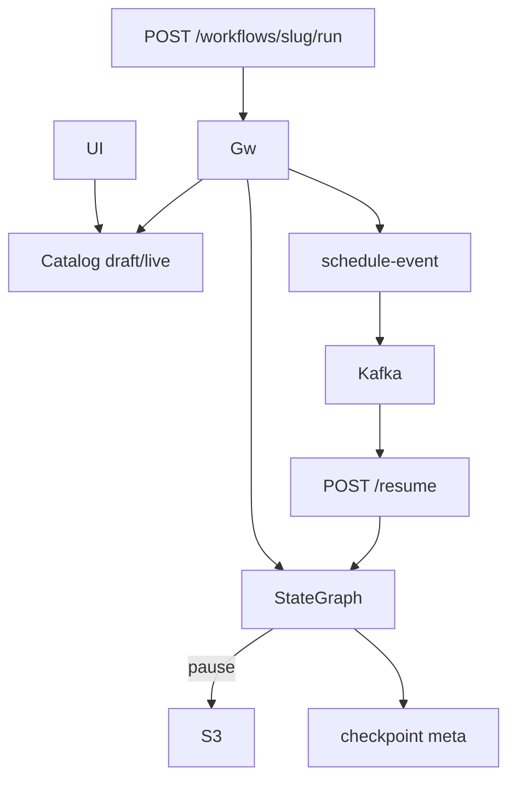

# Workflows and Pause Resume

> [!abstract] `resume:workflows`. UI DAG → flat `nodes[]/edges[]` in Catalog → Gateway compiles a LangGraph `StateGraph`. Pause is `interrupt()`, bytes in S3, pointer in Mongo, timer via Postgres+Kafka scheduler. This is the 40-minute hole if they can read. Docs: [[04-workflows]] · [[05-pause-resume]].

## Resume line

Drag-and-drop on LangGraph, visual DAG → deterministic pipeline, durable resume. Migrated 20+ workflows. 124,000+ req/day. Orion ₹1.5/indent.

## Truth

**Authoring:** parent in `registry_sops` with `engine="canvas"`. Versions in `workflow_versions`: `draft → published → live`. Live promotion demotes the old live. Validator: one start, ≥1 output, **acyclic**, reachable, tool ids exist, pause node well-formed.

**Flat DSL:** type-specific fields on the node (no nested `config`) so UI JSON **is** the Gateway DSL. `position` is canvas only.

**Compile:** parse → `StateGraph` with a channel per node → edges / if-else routers / parallel / loops as cycles → `compile(checkpointer=...)` **only if** a pause node exists.

**Deterministic:** same `version_id` → same graph. Each node writes only its channel.

**Pause planes:**

| Plane | What |
|---|---|
| LangGraph | `interrupt()`, `Command(resume=...)` |
| S3 | `snapshot.bin` + `writes.json` |
| Catalog Mongo | `workflow_checkpoints` — `s3_key`, status, TTL ~6 days |
| Event Scheduler | `scheduled_events`, poll + Kafka → `POST .../resume` |

**Persist only on interrupt.** `aput` buffers; `aput_writes` flushes **iff** `__interrupt__`. Intermediate steps never hit S3. S3 first, then Catalog; Catalog fail → delete S3 (no orphan bytes).

**Timer vs event:** timer → scheduler (delay clamped to retention). Event → wait, no Kafka.

**Resume:** restore tuple from Catalog+S3; long pause **rewrites** `system.auth_token` in the snapshot (token service) so tools still auth.

**SOP dialect:** prose SOP compiled (LLM) in Catalog to the same graph contract. Canvas is the resume claim.

124k/day and ₹1.5: resume echoed in docs. `cost_config` on the workflow is real.

## One-minute pitch

The UI is not executing anything. It saves a DAG. I validate it is a DAG. At run, Gateway compiles LangGraph. If we need to wait six hours for a truck event, we do not hold a pod: interrupt, snapshot to S3, metadata in Catalog, scheduler calls resume. Same indent automation as the agent, now a versioned graph.

## Boxes

## Ugly questions

**Why not Celery / sleep in the worker?** Sleep dies with the pod. Celery is another platform. Scheduler is Postgres + `SKIP LOCKED`-style pollers (docs: chosen over APScheduler/Celery/delayed Kafka for ACID + crash recovery).

**Two resumes?** `get_status` / completed mark. Idempotent `event_id` on the scheduler.

**Clock / delay 0?** Delay floored at 0, capped at `MAX_PAUSE_DURATION`.

**Loop in a loop?** Rejected in validator and compiler.

**Failed node?** `error_strategy`, timeout, retry on the node. HTTP run API still **200** with `status: failed|paused|succeeded`.

**Catalog execute?** Never. Grep `interrupt` in catalog = no runtime.

**124k — run vs tool vs chat?** Resume says platform requests. Split if you can. Else don't invent.

**Memory / conversation?** Optional `memory_session_id`; turns written off the response path as a background task.

## Related Notes

- [[00 - Ownership and How to Talk]]
- [[03 - Agents and Orion]]
- [[04-workflows]]
- [[05-pause-resume]]
