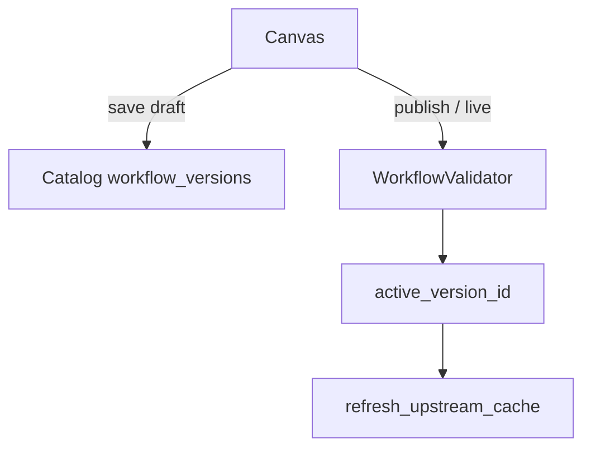
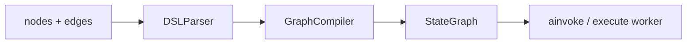

# Workflows

> [!abstract]
> - `resume:workflows` — the **canvas + compile + run** half
> - UI DAG → flat `nodes[]/edges[]` in Catalog → Gateway `convert_dsl` → LangGraph `StateGraph`
> - Pause/resume is a **different note**: [[05 - Pause Resume]]
> - Docs: [[04-workflows]] · [[13-code-node-lambda-sandbox]] · [[14-node-timeout-retry-errors]]

## Resume line

- Drag-and-drop on LangGraph, visual DAG → deterministic pipeline, durable resume. Migrated 20+ workflows. 124,000+ req/day. Orion ₹1.5/indent.
- Say **timeline** on the durable clause
    + July = first cut (compile/run)
    + Aug–Sep = harden pause
    + Don't sell July as S3+Kafka finished
    + Depth of interrupt/S3/scheduler: [[05 - Pause Resume]]

---

## Overview

- May–June agents ran the same business list as a **model loop**
    + That polluted context, hallucinated, and cost money
- July: author a **DAG**
    + The model does not pick the next step
    + Edges do
- What we built
    + **Catalog** — SoR for the DAG. Parent in `registry_sops` with `engine="canvas"`. Versions in `workflow_versions`. **Never executes.** Grep `interrupt` in Catalog = no runtime
    + **Gateway** — `convert_dsl` → `StateGraph`. Each node is a `BaseNode.run`. Same OpenAPI tools as 02 via `tool_resource_id`
    + **Flat DSL** — type-specific fields live **on the node** (no nested `config`). UI JSON **is** the Gateway DSL. `position` is canvas only. Edge `source_handle` / `target_handle` = which if-else branch
    + **Deterministic** — validator says it's a DAG. Each node writes **only its channel**. Same `version_id` → same compiled graph (needed so resume in 05 recompiles bit-for-bit)
    + **Two dialects** — canvas is the resume claim. SOP = prose → LLM compile in Catalog to a **different** contract (`graph_schema.py`, must stay byte-identical with Gateway). SOP compile failure is **non-fatal** (docs): SOP can still run the LLM-loop path
- Catalog vs Gateway still saves the round
- Kafka `/trigger`, Redis live pointer: [[02 - Catalog and Gateway]]
- Don't re-walk them
- ₹1.5 / Orion is **one** workflow's business cost, not a special runtime

---

## Timeline

- **Mid-May → June** — agents. Not this bullet.
- **July 2026** (1 month) — **this bullet, first cut.** Canvas → validate → compile → `/run`.
- **Aug–Sep** — pause/scheduler harden. [[05 - Pause Resume]]. Not "I shipped durable workflows in 30 days, done."
- "Built" on the PDF must match the ownership row.

---

## Schema

### Parent (`registry_sops`, `engine="canvas"`)

- Shared listing with SOP parents
- Fields that matter
    + name
    + slug (`kebab` + hex)
    + team
    + `enabled`
    + `active_version_id`
    + `cost_config`
- `_require_canvas_workflow` — SOP-engine parent is **not found** on this API

### `workflow_versions` (Mongo)

- `workflow_id`, `version_number`, `api_version = "agent.delhivery.io/v1alpha1"`
- `stage`: `draft → published → live` (`VALID_TRANSITIONS`: draft only to published; published only to live)
- `spec: GraphDefinition` — `{ id, name, nodes[], edges[] }`
- `execution_config`: `max_execution_time=300`, `max_execution_steps=50`, `retry_on_failure=False` — **stored on the version. Gateway does not read these.** Caps that run are per-node — [[14-node-timeout-retry-errors]]
- `source_version_id` — branch/rollback copy
- Live promotion **demotes** the old live to published and points `active_version_id`
- Rollback = republish an older version + `refresh_upstream_cache`

### Node / edge (flat)

- `NodeDefinition`: `id`, `type`, `title`, `error_strategy`, `timeout`, `retry_config`, then **type fields at the top level** (`tool_resource_id`, `prompt_template`, `cases`, `sub_type`, …)
- `Config.extra = "allow"`
- `EdgeDefinition`: `source`, `target`, `source_handle`, `target_handle`
- `ALLOWED_NODE_TYPES` = start, code, if-else, tool, llm, output, agent, guardrail, iteration (+ start/end), loop (+ start/end), pause-resume

### `WorkflowState` (compiled, not a Mongo collection)

- One `Dict` **channel per node id**, plus `request`, `system`, `final_output`, `metadata`
- Node writes only its id
- That is the isolation story

---

## Endpoints

- **Catalog (authoring)**
    + `create_workflow` — parent + draft v1 empty spec
    + `create_version` — new draft from a published/live source. One draft unless `replace_existing_draft` (delete old draft only after source validates)
    + `update_draft` — spec / execution_config only, draft only. Canvas autosave
    + `transition_stage` — validator runs; live = demote + pointer
    + `resolve_live` / `resolve_version` — what Gateway compiles
    + `validate_version` / `validate_live` — validate without promote
    + Run URL helper: `{MCP_GATEWAY_ORIGIN}/{team}/workflows/{slug}/run`
- **Gateway**
    + `POST /{team}/workflows/{slug}/run` — **live**, canvas **Run**. Human waits. HTTP **200** with `status ∈ {succeeded, failed, paused}`
    + `POST /{team}/workflows/{slug}/versions/{version_id}/run` — pinned / sandbox
    + `POST /{team}/workflows/{slug}/trigger` — production. Token bucket (02) then **202 after Kafka `acks=all`**. Thin consumer → `gateway_runs` (`kind=workflow`, `pending`) → execute worker, same `_execute_workflow`, cap N. No GET. No callback URL. Body lands in Langfuse. Terminal → **DELETE** row. 72k is **agent** trigger; **124k** is this platform. Depth: 02
    + `POST /{team}/workflows/{slug}/resume` — **05**, not this note
- `/run` body: `input_variables`, optional `session_id`, `memory_session_id` (UUID4), `system_variable`
- 400/404 on bad JSON, bad UUID, validation, not found

---

## Architecture

### Flow 1 — author (UI does not run)

- Validator (`workflow_validator.py`)
    + unique ids
    + edges exist
    + **exactly one start**
    + **≥1 output**
    + **acyclic** (DFS)
    + **reachable** from start (BFS) and at least one output reachable
- Per-node
    + start needs object `json_schema` with ≥1 property
    + tool `tool_resource_id` exists
    + selectors point **upstream** or `system.*` (`request_id`, `workflow_slug`, `teamname`, `auth_token`)
    + loop-in-loop rejected
    + pause shape in 05
- `is_live_promotion` can be stricter
- A bad DAG never reaches Gateway as live

### Flow 2 — compile (`convert_dsl`)

- `DSLParser.parse` → dataclasses
- Then `GraphCompiler.compile`

1. State schema (channels).
2. `StateGraph`.
3. Wrap each node: `resolve_variables` then `await node.run`. Timeout/retry/`error_strategy` in `BaseNode.run`.
4. Detect parallel groups.
5. Sequential `add_edge` (skip edges owned by routers / parallel / loop).
6. If-else: node writes `__branch`; `add_conditional_edges` reads it via `source_handle`.
7. Parallel fan-out / fan-in.
8. **Loop** lowered to a **cycle** on the parent graph (seed, entry guard, end router, `{loop_id}__loop_exit`). Body inlined. Loop-in-loop already rejected.
9. Pause must be reachable (05).
10. Entry = start; finish = each output.
11. **Checkpointer only if a pause-resume exists** (top-level or inlined in a loop). Else `compile()` with none.
12. Loop graphs raise LangGraph `recursion_limit` = `25 + Σ max(1,loop_count)*(body_size+1) + 10`. Don't steal this as the **agent** `max_iteration`.

- Iteration = **child sub-graph per item** (`parallel_nums` default 10), not the same lowering as loop

### Flow 3 — `/run` (`_execute_workflow`)

1. Resolve spec from Catalog (live or version).
2. Catalog validate + local `input_variables` vs start `json_schema`.
3. Langfuse `trace_id` + `OptimizedLangfuseCallbackHandler`.
4. `convert_dsl` (checkpointer object passed; compiler wires it only if pause exists).
5. `initial_state`: `request.payload` = inputs; `system_variables` = auth, request_id, slug, team, headers, conversation, `memory_session_id`.
6. If pause-capable: `configurable.thread_id = run_id` (+ session, trace, version, …).
7. `await compiled_graph.ainvoke(...)`.
8. Outcomes — always HTTP **200** on the run API:
    + `__interrupt__` → `paused` (05 does S3 + schedule)
    + else extract outputs, sum tokens, `sanitize_state` (redact JWTs), conversation **BackgroundTask** → `succeeded`
    + exception → `failed`

- `/trigger` execute worker: **same function**, after the row is claimed
    + No socket to return to
    + APIs the tool nodes called already changed the real systems
    + Trace in Langfuse
    + Success / final fail → **DELETE** `gateway_runs`
    + Pause → `paused` + S3 (05)
    + No callback URL
    + 02

### Flow 4 — what each node does (runtime)

- Every type subclasses `BaseNode` (`mcp-gateway/workflow/nodes/`)
- Compiler wrap: `resolve_variables` then `await node.run`
- Timeout / retry / `error_strategy` sit in `BaseNode.run`
- Node writes **only its channel**
- Traversal is **the DAG you drew** (plus loop cycles the compiler added)
- Not "LLM decides next node" unless you put an Agent/LLM node there

#### Start

- Validates inputs against `json_schema`
- Copies auth / `request_id` / slug / team / headers / conversation / `memory_session_id` into `state.system`

#### Tool

- `tool_resource_id` → flatten / HTTP like 02
- `input_mapping` from upstream channels
- Auth: `client_headers` then `auth_token`
- Writes the HTTP response into its channel

#### LLM

- Jinja `prompt_template` over state
- Model factory
- Optional `structured_output`
- **One** model call — not the agent loop

#### If-else

- Evaluates `cases` (`condition_eval`)
- Writes `__branch` into its channel
- Conditional router reads `__branch` via edge `source_handle`

#### Code

- Canvas stores only a `resource_id` — not the source on the node
- `code_resolver` fetches the code: Redis, then Catalog
- Declared inputs pulled from workflow state
- Sent to AWS Lambda `data-transformer-executor-{stage}-execute` (same executor as transformers)
    + boto3 ARN in real env
    + HTTP POST locally
    + `handler.py` / `executor.py` / `serverless.yml` under `data_transformer_executor/`
- Payload: `spec.code`, `entrypoint` (`main`), `sandbox` `{timeout_sec, memory_limit_mb}`, `input_data`, `mode: "workflow"`
- Lambda `exec`s the text in a namespace, looks up the function, calls `func(**input_data)` (e.g. `main(wbn=..., city=...)`)
- Dotted `entrypoint` (`handler.transform`) — only the last part is the function name
- Writes `data` into **this** node's channel
- `success: false` → node fails, `msg` up
- **Not** `eval` / `exec` on the Gateway process
- Four layers — depth [[13-code-node-lambda-sandbox]]
    + **Layer 1 (the wall):** own Lambda, Python 3.12, 512 MB, **30s hard timeout**. No Gateway memory or creds. IAM = CloudWatch logs only. No S3, no DB, no secrets
    + **Layer 2:** import allowlist (~40: `json`, `re`, `requests`, `httpx`, `bs4`, …). No `os`, `sys`, `subprocess`, `pathlib`, `pickle`, `ctypes`, `threading`
    + **Layer 3:** stripped builtins: `exec`, `eval`, `compile`, `open`, `__import__`, `globals`, `breakpoint`
    + **Layer 4:** `timeout_sec` alarm + memory cap around the run
- BeautifulSoup forced to stdlib HTML parser; `lxml` not in the package (file / network tricks via HTML)
- **Don't oversell 2–4.** `getattr` / `type` / `vars` can walk to blocked modules. Layer 1 is security; 2–4 are mistakes / casual misuse
- Network is **allowed** on purpose. Lambda in a VPC — hits whatever the SG allows. Not network-isolated
- Alarm cannot kill a hung HTTP with no client timeout. Lambda 30s is the backstop
- Timeout defaults disagree (node / `execute_code` **2s**, `handler.py` **120s**, Lambda **30s**). Node always sends a sandbox block today. Don't quote 120
- Don't claim seccomp or a perfect CPython jail

#### Agent

- `agent_slug` (+ optional version) + Jinja `content_mapping`
- Workflow calling v2 — [[03 - Agents and Orion]]
- Parent **workflow** waits on this node (`await`)
- Don't invent a second Kafka hop

#### Guardrail

- Check a variable on the DAG
- Same idea as agent pre/post guardrail nodes, one step on the canvas

#### Output

- Assembles declared output variables into `final_output`

#### Pause

- `interrupt()`
- **05** — S3 + Catalog + scheduler / event
- Not this compile note

#### Iteration

- Child **sub-graph per list item** (not loop-lowering)
- `iterator_selector`, `start_node_id`, mandatory `iteration-end`
- `parallel_nums` default 10
- `error_handle_mode` ∈ `{terminated, continue_on_error, remove_abnormal_output}`

#### Loop

- Condition-based
- Lowered to a **cycle on the parent graph** (seed, entry guard, end router, `{loop_id}__loop_exit`)
- Body inlined
- Until break / `loop_count`
- Loop-in-loop rejected; iteration inside a loop is allowed

### Timeouts, retries, error strategy (what makes a run robust)

- Depth: [[14-node-timeout-retry-errors]]
- Two places in the spec. Only the **node** ones run today

#### Workflow `execution_config` (on the version)

- `max_execution_time=300` — intended whole-graph seconds
- `max_execution_steps=50` — intended LangGraph steps. **Not** agent `max_iteration`
- `retry_on_failure=False` — intended: do not replay the whole DAG
- **Saved. Gateway does not read them.** Do not sell 300/50 as runtime caps

#### Per-node (on `NodeDefinition`, `BaseNode.run` wraps `_run`)

- `timeout` — this step, seconds. Gateway default **60** if missing
- `retry_config`
    + `retry_enabled` — on / off. Off → one attempt, ignore `max_retries`
    + `max_retries` — extras after the first. UI **0–3**. On + 3 = **4** tries
    + `retry_interval` — UI **0–10**, labeled seconds. No backoff / jitter. Default **0**
- `error_strategy`: `none` | `abort` | `skip` (default `none`)
- Defaults: retries **off**, `none`. One attempt, fail → fail the run
- Each attempt: `_run()` under `timeout`. Over = fail
- **Pause is not a fail.** No retry, no strategy
- Fail + attempts left → wait interval → `_run()` from the **start**
- Attempts gone → `{__error, message, error_type, attempts}` on this channel → strategy
- `none` / `abort` — both fail the run today (`status: failed`)
- `skip` — continue with `__error`. Not on the canvas. Downstream does not read `__error`
- UI: retry + strategy. **Timeout not editable.** Create defaults 30s / 60s (loop child) / 5s (starter output)
- UI interval = seconds; Gateway `/ 1000` as ms. Set 10 → **0.01s**. Unit bug
- Catalog validator does **not** check timeout / retry / strategy

#### Tool HTTP — what we retry (only if `retry_enabled`)

- Retry
    + no status (connect reset, DNS, node timeout)
    + **408**
    + **429**
    + **500 / 502 / 503 / 504**
- Do **not** retry
    + **400**
    + **401 / 403**
    + **404**
    + **409 / 422**
    + **2xx**
- **GET / idempotent PUT** — the retry list is fine
- **Tool POST** — even 503 can mean it committed. Prefer retries **off**, or only if the backend honors an idempotency key. Same as 02

- Code + Lambda-by-ARN: node timeout can fire while the thread still runs. Lambda **30s** is the real stop — 13
- Iteration `error_handle_mode` / loop `on_max_reached` are **other** knobs
- `/trigger` 429 / 503 / lease → `pending` are **not** this `retry_config`

### SOP (not the resume headline)

- Catalog `sop_compiler`: retrieve → enrich → draft → validate bindings → bake inputs from **validated edges**, not raw LLM strings
- `graph_status` compiling/ready
- failure does not kill the SOP
- Prefix router on `POST /chat`
- Canvas is what you walk unless they ask SOP

---

## One-minute pitch

- The UI saves a DAG
- I validate it is a DAG
- At run, Gateway compiles LangGraph and walks **those** edges
- **July** was that path
- Production is `/trigger` → Kafka → `gateway_runs` → execute worker + the same `_execute_workflow`
- If the DAG must wait on the world, that is pause — **05**, hardened after July
- 20+ is the same business list that used to be agents
- 124k is this platform
- I will not invent run vs inner-tool split
- Robustness = `BaseNode.run`: per-node timeout + optional retry + strategy. `execution_config` 300/50 is stored, unused. Don't retry a Tool POST. Depth: 14

---

## Metrics

- **124k/day** — workflows bullet. Not 72k (`/v2/trigger` agents). Don't add them.
- **20+** — migrated from agents. Name two. Don't 20+20.
- **₹1.5/indent** — `cost_config` is real; rupees are business. Split vs `cost_handling` tokens.
- `execution_config` 300s / 50 / `retry_on_failure` — on the version document. **Gateway ignores them.** Real knobs are per-node. 14

---

## HLD grill (new for this pointer)

- Redis, Mongo vs PG, Kafka 202, Catalog vs Gateway as a *platform* — **02**
- This grill is **DAG compile + run**

1. How long?
    + July = compile/run first cut
    + Pause finish = Aug–Sep
2. Catalog execute?
    + Never
3. SQL vs NoSQL?
    + Spec is a JSON DAG
    + Same speech as 02
    + Not `isActive`
4. Draw author → run
    + UI saves
    + Catalog validates
    + Gateway compiles
    + `ainvoke`
5. How is it a DAG?
    + One start
    + acyclic DFS
    + reachable BFS
6. How do you compile?
    + Parse → channels → edges/routers/parallel/loop cycle
7. Why per-node channels?
    + Isolation
    + Deterministic writes
8. Same graph on resume?
    + Same `version_id` → same `convert_dsl`
    + 05
9. Draft in prod?
    + Live pointer
    + `resolve_live` is `/run`
10. `/run` vs `/trigger`
    + Wait vs 202 + `gateway_runs` + execute worker
    + same `_execute_workflow`
    + Token bucket on `/trigger` only — depth 02
11. Is `/run` a background task?
    + No
    + Canvas waits
    + Production = `/trigger` → `gateway_runs` (02)
    + Conversation write = BackgroundTask after success
12. Why 200 on failed? / Failed node?
    + Contract: status in body
    + 400 only bad request
    + `none` / `abort` both land here today
    + `/run` still 200 + `status: failed`
21. Timeouts / retries / what makes it robust?
    + Workflow `execution_config` 300/50/`retry_on_failure` — stored, unused
    + Per node: `timeout`, `retry_enabled` / `max_retries` 0–3 / `retry_interval` 0–10, `error_strategy`
    + `run()` wraps `_run()`
    + Tool HTTP retry: 408, 429, 5xx, transport. Not 400/401/403/404/409/422
    + Don't blindly retry Tool POST
    + Pause skipped. Depth: 14
13. Scale 124k / 124k — run vs tool vs trigger?
    + Don't invent shards
    + Same 02 hygiene
    + Resume says platform
    + Split if you know
    + Else don't invent
14. Loop in a loop?
    + Rejected in validator and compiler
    + Iteration inside a loop is allowed
    + loop in loop is not
15. Loop recursion_limit
    + Formula from loop_count × body
    + Not agent cap
16. Checkpointer always? / Why LangGraph?
    + Only if a pause node exists
    + Same stack as agents
    + Checkpointer when pause exists
    + Don't say "we built LangChain."
17. Parallel?
    + Detected at compile
    + fan-out/fan-in
    + Iteration `parallel_nums` (default 10)
18. Variable from a node that hasn't run?
    + Validator: selectors must be upstream
19. Multi-tenant
    + `team` in URL + Catalog scope
20. Code node safety
    + `code_resolver` → Lambda, not `eval` on Gateway
    + Layer 1 is the wall (own process, logs-only IAM, 30s)
    + Import allowlist + stripped builtins are guardrails, not a jail
    + Network allowed; VPC SG is the fence
    + Depth: [[13-code-node-lambda-sandbox]]

---

## Agentic grill (this bullet)

1. Why workflows after agents? / Why not keep it an agent?
    + Deterministic steps don't belong in a tool-calling loop
    + Loop = context pollution, hallucination, cost
    + DAG = next step is an edge
2. Walk a turn
    + Resolve → compile → `ainvoke` start→…→output
3. LLM node vs agent loop / Agent node vs v2/chat?
    + One prompt
    + Agent node = nested v2
    + Same v2 engine, invoked from a DAG node with mapped inputs
    + Parent **workflow** waits on that node (same idea as agent child `await ainvoke`)
4. Tool hallucination
    + Canvas: tool id must exist
    + SOP: drop unproven bindings
    + Validator + SOP
5. HITL
    + Pause event/timer — not this compile note
    + **05**
6. 20+ vs agent bullet
    + Same list, two eras
    + Calendar
7. Context window
    + Why we left the agent loop
8. Observability
    + Langfuse on `ainvoke`
    + Same `trace_id` into 05
    + 07
9. Cost
    + `cost_config` + analytics handler
    + ₹ = business
10. Guardrail node
    + Check a variable on the DAG
11. SOP vs canvas?
    + Canvas = resume
    + SOP = second dialect, same Gateway run if compiled

---

## Related Notes

- [[00 - Ownership and How to Talk]]
- [[02 - Catalog and Gateway]]
- [[03 - Agents and Orion]]
- [[05 - Pause Resume]]
- [[07 - Langfuse]]
- [[04-workflows]]
- [[13-code-node-lambda-sandbox]]
- [[14-node-timeout-retry-errors]]
