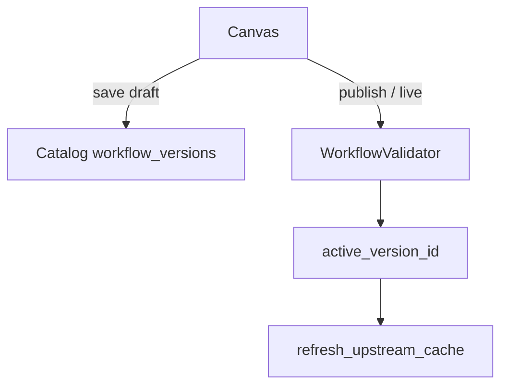
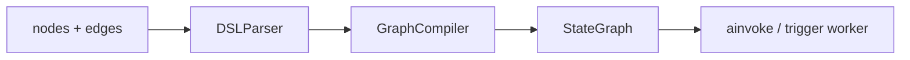

# Workflows

> [!abstract] `resume:workflows` — the **canvas + compile + run** half. UI DAG → flat `nodes[]/edges[]` in Catalog → Gateway `convert_dsl` → LangGraph `StateGraph`. Pause/resume is a **different note**: [[05 - Pause Resume]]. Docs: [[04-workflows]].

## Resume line

Drag-and-drop on LangGraph, visual DAG → deterministic pipeline, durable resume. Migrated 20+ workflows. 124,000+ req/day. Orion ₹1.5/indent.

Say **timeline** on the durable clause: July = first cut (compile/run). Aug–Sep = harden pause. Don't sell July as S3+Kafka finished. Depth of interrupt/S3/scheduler: [[05 - Pause Resume]].

## Overview

May–June agents ran the same business list as a **model loop**. That polluted context, hallucinated, and cost money. July: author a **DAG**. The model does not pick the next step. Edges do.

What we built:

- **Catalog** — SoR for the DAG. Parent in `registry_sops` with `engine="canvas"`. Versions in `workflow_versions`. **Never executes.** Grep `interrupt` in Catalog = no runtime.
- **Gateway** — `convert_dsl` → `StateGraph`. Each node is a `BaseNode.run`. Same OpenAPI tools as 02 via `tool_resource_id`.
- **Flat DSL** — type-specific fields live **on the node** (no nested `config`). UI JSON **is** the Gateway DSL. `position` is canvas only. Edge `source_handle` / `target_handle` = which if-else branch.
- **Deterministic** — validator says it's a DAG. Each node writes **only its channel**. Same `version_id` → same compiled graph (needed so resume in 05 recompiles bit-for-bit).
- **Two dialects** — canvas is the resume claim. SOP = prose → LLM compile in Catalog to a **different** contract (`graph_schema.py`, must stay byte-identical with Gateway). SOP compile failure is **non-fatal** (docs): SOP can still run the LLM-loop path.

Catalog vs Gateway still saves the round. Kafka `/trigger`, Redis live pointer: [[02 - Catalog and Gateway]]. Don't re-walk them.

₹1.5 / Orion is **one** workflow's business cost, not a special runtime.

## Timeline

- **Mid-May → June** — agents. Not this bullet.
- **July 2026** (1 month) — **this bullet, first cut.** Canvas → validate → compile → `/run`.
- **Aug–Sep** — pause/scheduler harden. [[05 - Pause Resume]]. Not "I shipped durable workflows in 30 days, done."
- "Built" on the PDF must match the ownership row.

## Schema

### Parent (`registry_sops`, `engine="canvas"`)

Shared listing with SOP parents. Fields that matter: name, slug (`kebab` + hex), team, `enabled`, `active_version_id`, `cost_config`.

`_require_canvas_workflow` — SOP-engine parent is **not found** on this API.

### `workflow_versions` (Mongo)

- `workflow_id`, `version_number`, `api_version = "agent.delhivery.io/v1alpha1"`
- `stage`: `draft → published → live` (`VALID_TRANSITIONS`: draft only to published; published only to live)
- `spec: GraphDefinition` — `{ id, name, nodes[], edges[] }`
- `execution_config`: `max_execution_time=300`, `max_execution_steps=50`, `retry_on_failure=False`
- `source_version_id` — branch/rollback copy

Live promotion **demotes** the old live to published and points `active_version_id`. Rollback = republish an older version + `refresh_upstream_cache`.

### Node / edge (flat)

`NodeDefinition`: `id`, `type`, `title`, `error_strategy`, `timeout`, `retry_config`, then **type fields at the top level** (`tool_resource_id`, `prompt_template`, `cases`, `sub_type`, …). `Config.extra = "allow"`.

`EdgeDefinition`: `source`, `target`, `source_handle`, `target_handle`.

`ALLOWED_NODE_TYPES` = start, code, if-else, tool, llm, output, agent, guardrail, iteration (+ start/end), loop (+ start/end), pause-resume.

### `WorkflowState` (compiled, not a Mongo collection)

One `Dict` **channel per node id**, plus `request`, `system`, `final_output`, `metadata`. Node writes only its id. That is the isolation story.

## Endpoints

**Catalog (authoring)**

- `create_workflow` — parent + draft v1 empty spec.
- `create_version` — new draft from a published/live source. One draft unless `replace_existing_draft` (delete old draft only after source validates).
- `update_draft` — spec / execution_config only, draft only. Canvas autosave.
- `transition_stage` — validator runs; live = demote + pointer.
- `resolve_live` / `resolve_version` — what Gateway compiles.
- `validate_version` / `validate_live` — validate without promote.
- Run URL helper: `{MCP_GATEWAY_ORIGIN}/{team}/workflows/{slug}/run`.

**Gateway**

- `POST /{team}/workflows/{slug}/run` — **live**, canvas **Run**. Human waits. HTTP **200** with `status ∈ {succeeded, failed, paused}`.
- `POST /{team}/workflows/{slug}/versions/{version_id}/run` — pinned / sandbox.
- `POST /{team}/workflows/{slug}/trigger` — production. **202 after Kafka `acks=all`**. Same `_execute_workflow`. No GET. No callback URL. Body of `format`/`outputs` lands in Langfuse. 72k is **agent** trigger; **124k** is this platform's number — don't merge. Kafka: 02.
- `POST /{team}/workflows/{slug}/resume` — **05**, not this note.

`/run` body: `input_variables`, optional `session_id`, `memory_session_id` (UUID4), `system_variable`. 400/404 on bad JSON, bad UUID, validation, not found.

## Architecture

### Flow 1 — author (UI does not run)

Validator (`workflow_validator.py`): unique ids; edges exist; **exactly one start**; **≥1 output**; **acyclic** (DFS); **reachable** from start (BFS) and at least one output reachable. Per-node: start needs object `json_schema` with ≥1 property; tool `tool_resource_id` exists; selectors point **upstream** or `system.*` (`request_id`, `workflow_slug`, `teamname`, `auth_token`); loop-in-loop rejected; pause shape in 05.

`is_live_promotion` can be stricter. A bad DAG never reaches Gateway as live.

### Flow 2 — compile (`convert_dsl`)

`DSLParser.parse` → dataclasses. Then `GraphCompiler.compile`:

1. State schema (channels).
2. `StateGraph`.
3. Wrap each node: `resolve_variables` then `await node.run`. Timeout/retry/`error_strategy` in `BaseNode.run`.
4. Detect parallel groups.
5. Sequential `add_edge` (skip edges owned by routers / parallel / loop).
6. If-else: node writes `__branch`; `add_conditional_edges` reads it via `source_handle`.
7. Parallel fan-out / fan-in.
8. **Loop** lowered to a **cycle** on the parent graph (seed, entry guard, end router, `{loop_id}__loop_exit`). Body inlined. Loop-in-loop already rejected.
9. Pause must be reachable (05).
10. Entry = start; finish = each output.
11. **Checkpointer only if a pause-resume exists** (top-level or inlined in a loop). Else `compile()` with none.
12. Loop graphs raise LangGraph `recursion_limit` = `25 + Σ max(1,loop_count)*(body_size+1) + 10`. Don't steal this as the **agent** `max_iteration`.

Iteration = **child sub-graph per item** (`parallel_nums` default 10), not the same lowering as loop.

### Flow 3 — `/run` (`_execute_workflow`)

1. Resolve spec from Catalog (live or version).
2. Catalog validate + local `input_variables` vs start `json_schema`.
3. Langfuse `trace_id` + `OptimizedLangfuseCallbackHandler`.
4. `convert_dsl` (checkpointer object passed; compiler wires it only if pause exists).
5. `initial_state`: `request.payload` = inputs; `system_variables` = auth, request_id, slug, team, headers, conversation, `memory_session_id`.
6. If pause-capable: `configurable.thread_id = run_id` (+ session, trace, version, …).
7. `await compiled_graph.ainvoke(...)`.
8. Outcomes — always HTTP **200** on the run API:
   - `__interrupt__` → `paused` (05 does S3 + schedule).
   - else extract outputs, sum tokens, `sanitize_state` (redact JWTs), conversation **BackgroundTask** → `succeeded`.
   - exception → `failed`.

`/trigger` worker: **same function**. No socket to return to. APIs the tool nodes called already changed the real systems. Trace in Langfuse. No callback URL. 02.

### Flow 4 — what each node does (runtime)

| Type | What you say |
|---|---|
| Start | Validate inputs; copy auth/request_id/… into `state.system`. |
| Tool | `tool_resource_id` → flatten/HTTP like 02. `input_mapping` from upstream channels. Auth: `client_headers` then `auth_token`. |
| LLM | Jinja `prompt_template` over state; model factory; optional structured output. **One** model call — not the agent loop. |
| If-else | Evaluate `cases`; write `__branch`. |
| Code | `code_resolver` + declared variables → outputs. |
| Agent | `agent_slug` (+ version) + Jinja `content_mapping`. Workflow calling v2 — [[03 - Agents and Orion]]. Don't invent a second Kafka hop. |
| Guardrail | Check a variable. |
| Output | Assemble `final_output`. |
| Pause | `interrupt()`. **05.** |
| Iteration | Sub-graph per list item. |
| Loop | Cycle on the parent graph until break / `loop_count`. |

Traversal is **the DAG you drew** (plus loop cycles the compiler added). Not "LLM decides next node" unless you put an Agent/LLM node there.

### SOP (not the resume headline)

Catalog `sop_compiler`: retrieve → enrich → draft → validate bindings → bake inputs from **validated edges**, not raw LLM strings. `graph_status` compiling/ready; failure does not kill the SOP. Prefix router on `POST /chat`. Canvas is what you walk unless they ask SOP.

## One-minute pitch

The UI saves a DAG. I validate it is a DAG. At run, Gateway compiles LangGraph and walks **those** edges. **July** was that path. Production is `/trigger` + the same `_execute_workflow`. If the DAG must wait on the world, that is pause — **05**, hardened after July. 20+ is the same business list that used to be agents. 124k is this platform; I will not invent run vs inner-tool split.

## Metrics

- **124k/day** — workflows bullet. Not 72k (`/v2/trigger` agents). Don't add them.
- **20+** — migrated from agents. Name two. Don't 20+20.
- **₹1.5/indent** — `cost_config` is real; rupees are business. Split vs `cost_handling` tokens.
- `execution_config` 300s / 50 steps — **workflow** caps. Not agent `max_iteration`.

## Ugly questions

**How long?** July = compile/run first cut. Pause finish = Aug–Sep.

**Why not keep it an agent?** Loop = context pollution, hallucination, cost. DAG = next step is an edge.

**Catalog execute?** Never.

**SQL vs NoSQL?** Spec is a JSON DAG. Same speech as 02. Not `isActive`.

**Draft in prod?** Live pointer. `resolve_live` is `/run`.

**Loop in a loop?** Rejected in validator and compiler. Iteration inside a loop is allowed; loop in loop is not.

**Failed node?** `error_strategy`, timeout, retry on the node. `/run` still 200 + `status: failed`.

**Is `/run` a background task?** No. Canvas waits. Production = `/trigger` (02). Conversation write = BackgroundTask after success.

**124k — run vs tool vs trigger?** Resume says platform. Split if you know. Else don't invent.

**Agent node vs v2/chat?** Same v2 engine, invoked from a DAG node with mapped inputs. Parent **workflow** waits on that node (same idea as agent child `await ainvoke`).

**Why LangGraph?** Same stack as agents. Checkpointer when pause exists. Don't say "we built LangChain."

**SOP vs canvas?** Canvas = resume. SOP = second dialect, same Gateway run if compiled.

**Parallel?** Detected at compile; fan-out/fan-in. Iteration `parallel_nums` (default 10).

**Variable from a node that hasn't run?** Validator: selectors must be upstream.

## HLD grill (new for this pointer)

Redis, Mongo vs PG, Kafka 202, Catalog vs Gateway as a *platform* — **02**. This table is **DAG compile + run**.

| # | They ask | In this note? | One-line |
|---|---|---|---|
| 1 | Draw author → run | Flow 1–3 | UI saves; Catalog validates; Gateway compiles; `ainvoke`. |
| 2 | How is it a DAG? | Validator | One start, acyclic DFS, reachable BFS. |
| 3 | How do you compile? | Flow 2 | Parse → channels → edges/routers/parallel/loop cycle. |
| 4 | Why per-node channels? | Schema | Isolation. Deterministic writes. |
| 5 | Same graph on resume? | Determinism | Same `version_id` → same `convert_dsl`. 05. |
| 6 | `/run` vs `/trigger` | Endpoints | Wait vs 202 + worker; same `_execute_workflow`. |
| 7 | Why 200 on failed? | Flow 3 | Contract: status in body. 400 only bad request. |
| 8 | Scale 124k | Metrics | Don't invent shards. Same 02 hygiene. |
| 9 | Loop recursion_limit | Flow 2 | Formula from loop_count × body. Not agent cap. |
| 10 | Checkpointer always? | Flow 2 | Only if a pause node exists. |
| 11 | Multi-tenant | 02 | `team` in URL + Catalog scope. |
| 12 | Code node safety | Code | `code_resolver` / sandbox. Don't claim eval(). |

## Agentic grill (this bullet)

| # | They ask | In this note? | One-line |
|---|---|---|---|
| 1 | Why workflows after agents? | Overview | Deterministic steps don't belong in a tool-calling loop. |
| 2 | Walk a turn | Flow 3 | Resolve → compile → `ainvoke` start→…→output. |
| 3 | LLM node vs agent loop | Flow 4 | One prompt. Agent node = nested v2. |
| 4 | Tool hallucination | Validator + SOP | Canvas: tool id must exist. SOP: drop unproven bindings. |
| 5 | HITL | **05** | Pause event/timer — not this compile note. |
| 6 | 20+ vs agent bullet | Metrics | Same list, two eras. Calendar. |
| 7 | Context window | Overview | Why we left the agent loop. |
| 8 | Observability | 07 | Langfuse on `ainvoke`. Same `trace_id` into 05. |
| 9 | Cost | Metrics | `cost_config` + analytics handler. ₹ = business. |
| 10 | Guardrail node | Flow 4 | Check a variable on the DAG. |

## Related Notes

- [[00 - Ownership and How to Talk]]
- [[02 - Catalog and Gateway]]
- [[03 - Agents and Orion]]
- [[05 - Pause Resume]]
- [[07 - Langfuse]]
- [[04-workflows]]
