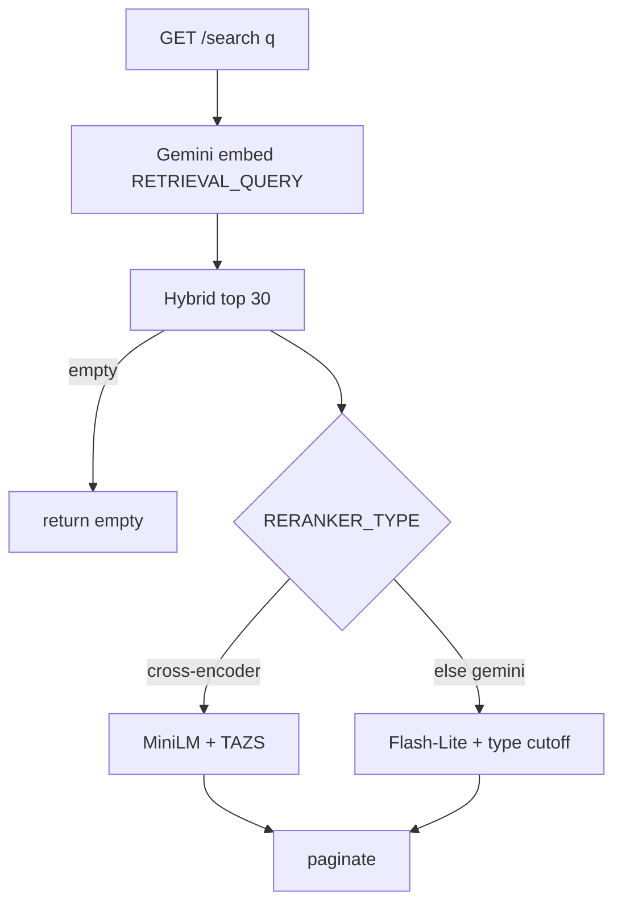
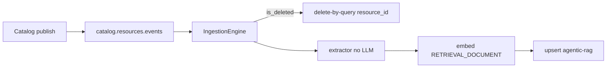

# Ask AI Search

> [!abstract] `resume:ask-ai`. Separate FastAPI + Kafka worker on branch `ask-ai`. Hybrid retrieve (kNN + BM25) then rerank. **"TAZS" is our nickname**, not a paper. Resume says **character-count routing**; this branch switches on **`RERANKER_TYPE`**. Reconcile before you say the PDF word. Doc: [[09-ask-ai-search]]. Catalog emit: [[02 - Catalog and Gateway]].

## Resume line

Hybrid tool-search: character-count routing, kNN, Cross-Encoder, adaptive tail thresholding, ~70% less noise, zero relevant-result dropout.

> [!warning] Do **not** say "if the query is short we use MiniLM, if long we use Gemini" unless you can point at **that** revision. On `ask-ai` the switch is **config**. Sibling branches (`ask-ai-dev`, `askai-vertex-migration`) are where query-length / budget routing *may* live — don't mix them in your mouth.

## Overview

Need: keyword search on 600 OpenAPI tools is either empty or a dump. An agent / builder needs "which tools / agents / MCP servers / transformers match this sentence?"

What we built (not inside Catalog, not inside Gateway):

- **Ask AI API** — FastAPI `main_api` ("BreakPoint Ask AI"). Query-time only. Embed → hybrid → rerank → page.
- **Ingest worker** — `main_worker`. Kafka `catalog.resources.events`, group `rag-ingestion-worker-v1`. Extract chunks **without an LLM**, embed, upsert OpenSearch.
- **Clean architecture** — `core/` engines (`SearchEngine`, `IngestionEngine`, `RagEngine`) sit on interfaces (`BaseEmbeddingModel`, `BaseVectorStore`, `BaseExtractor`, `BaseEventStream`). Adapters in `infrastructure/`: OpenSearch, Gemini embed, Kafka.
- **Index `agentic-rag`** — one OpenSearch index over registry kinds. Not Mongo. Catalog stays SoR for **specs**; this index is SoR for **search**.
- **Two rerankers** (`RERANKER_TYPE`):
  - `cross-encoder` — local MiniLM (etc.) + **TAZS** cutoff. The noise-reduction path.
  - else (`gemini`, default on this branch) — Flash-Lite scores 0–10 + **per-type cutoff**. Fail-open to hybrid.
- **Document RAG** (`/api/v1/rag/ask`) — sibling. Team-scoped docs, **other** index (`document-rag`). Same embed + Cross-Encoder. **Not** the resume headline.

Catalog **never searches**. It emits Kafka on publish. Gateway **never searches** — it already has linked tool ids. This is discovery for the UI / ecosystem.

## Timeline

- **Jan–Jun** — not this bullet. MCP, Catalog, agents.
- **July** — canvas. Not this.
- **Aug–Sep 2026** — locked calendar parks Ask AI in **fixes**. No dedicated quarter. Do not steal April from Catalog to invent an "I rebuilt search for 1.5 months" story.
- Branch is `ask-ai` (also `ask-ai-dev`, `askai-vertex-migration`, `agentic-rag`, `managed-rag`). Default Catalog branch does **not** have this app.

## Schema

### OpenSearch index `agentic-rag` (`ES_INDEX`)

Not a Mongo collection. Mapping that matters:

| Field | Role |
|---|---|
| `embedding` | `knn_vector`, **3072-d**, HNSW, `space_type=cosinesimil`, `engine=faiss` |
| `chunk_id` | document `_id` |
| `resource_id` / `resource_type` | tool / agent / `mcp_server` / `data_transformer` |
| `status` / `team` / `domain` / `tags` / `has_pii` | keyword filters |
| `version_number` / `lifecycle_rank` | live=3, published=2, draft/active=1 |
| `name` / `semantic_summary` / `semantic_text` | BM25 (`name^3`, `semantic_summary^2`, `semantic_text`) |
| `endpoint`, `endpoint_description`, `example_questions`, `raw_spec` | stored, **`index: False`** — reranker / response only |

Index setting `knn: true`. Auth: IAM or basic; SSL when `ES_PORT==443`.

### Kafka envelope (Catalog → worker)

Topic `catalog.resources.events`. Catalog `_emit_tool_rag_event` / `_emit_rag_event`: `resource_type` `tool` | `mcp_server`, payload from `rag_extractors`, `is_deleted`, key = resource id.

Worker: soft-delete → `handle_deletion(resource_id, resource_type)`. Else extractor by type → embed (`RETRIEVAL_DOCUMENT`) → `save_document`. Unsupported types ignored.

### Extractors (deterministic — no LLM)

| Extractor | Versioned? | `chunk_id` |
|---|---|---|
| `BreakPointToolExtractor` | yes | `tool_{rid}_v{n}_chunk_0` — name/team/summary + per-endpoint `METHOD /path` + `x-example-questions` |
| `BreakPointAgentExtractor` | yes | name/team/description |
| `BreakPointMcpExtractor` | **no** | `mcp_server_{rid}_chunk_0` — overwrite |
| `BreakPointDataTransformerExtractor` | **no** | overwrite |

**Ghost-chunk cleanup** only for **non-versioned** kinds (delete index chunks this payload no longer produces). **Skipped for tools/agents** — versions coexist on purpose.

### Sibling index `document-rag`

Team-scoped file RAG. `CHUNK_TARGET_CHARS=3500`, page-aware. Not the 600-tool engine.

## Endpoints

**Ask AI API** (`src/main_api.py`)

- `GET /api/v1/search?q=&resource_type=&page=&limit=` — the resume path. Default filter `get_active_only_filter()` = `status ∈ {live, published, draft, active}` + optional `resource_type` term.
- `GET /api/v1/rag/ask?query=&team_id=&doc_id=&mode=` — document RAG. `mode=search` or `generate` (default). **Sibling.**

**Worker** — no query HTTP. `RUN_MODE=worker` → `main_worker`.

**Catalog (emit only)** — publish / rollback / MCP-server bind/toggle → Kafka. Not a search API. [[02 - Catalog and Gateway]].

`entrypoint.py` picks API vs worker via `RUN_MODE`.

## Architecture

### Flow 1 — query (`SearchEngine.execute_search`)



1. Embed query — `gemini-embedding-2`, 3072-d, `task_type=RETRIEVAL_QUERY`.
2. Hybrid `db.search(..., limit=30)`. Empty → **`[]`**. No TAZS, no Gemini. This is **not** "zero dropout."
3. Rerank by `RERANKER_TYPE`.
4. Page `final_results[offset:offset+limit]`.
5. Timers logged: `embedding`, `hybrid`, `llm`, `total`.

### Flow 2 — hybrid (`ElasticsearchStore.search`)

1. **kNN** — `size=20`, `k=20` on `embedding`, same status / type filters.
2. **BM25** — `size=20`, `multi_match` `name^3`, `semantic_summary^2`, `semantic_text` (`best_fields`, `minimum_should_match=1`).
3. Concat kNN + BM25, **dedup `resource_id` (first wins)**, take 30.

Why both: ids / exact names like BM25. "track this shipment" likes cosine.

### Flow 3 — Cross-Encoder + TAZS

Model: lazy singleton `CrossEncoder`. Default `ms-marco-MiniLM-L-6-v2`. Also `mxbai-rerank-xsmall-v1`, `ms-marco-TinyBERT-L-2-v2`. `warmup()` on API startup. **Shared** with document-RAG reranker.

1. Doc text: `Name | Team | Summary | Description[:300] | Examples`.
2. One `model.predict(pairs)` batch.
3. Sort desc.
4. **TAZS** on **this** query's scores. Keep `score >= threshold`, cap 20.
5. If that set is **empty** → **top 20**. That line is "zero relevant-result dropout" **in code**.
6. Attach `llm_score` (name is leftover — it's the CE score).

**TAZS is not a paper.** One-sided z-score on the **tail**. Say that first.

```
sort high→low
tail = bottom 10   # assumed noise
threshold = tail_mean + 2.5 * max(σ, 0.5)
clamp to [-8.5, 0.0]
if n < 10: return -8.5  # not enough tail to estimate
```

Why not `keep score > 0.5`: CE scores are **not calibrated**. A good score on a hard query looks like a bad score on an easy one. Fixed cutoff is too strict or too loose. Tail = "what noise looks like **this** time."

Safety: `min_sigma=0.5` so a flat tail doesn't become a razor; `safety_cap=0.0` so we never reject a genuinely positive score; `absolute_floor=-8.5`.

> [!example] Tail mean `-3.0`, σ floored `0.5` → threshold `-1.75`. Scores `7.9 / 6.2 / 5.8` stay; the `-3` pile drops. Vague query whose top is `-1.9` correctly keeps almost nothing — then the **top-20 fallback** still returns something if hybrid had hits.

### Flow 4 — Gemini judge (default on this branch)

`gemini-2.5-flash-lite`, temperature 0, max 256 tokens. One `generate_content` → comma-separated scores. Prompts **per type**: tool / agent / `mcp_server` / `data_transformer`.

Cutoffs (`config.py`, env-overridable): tool **2**, agent **2**, MCP **5** (stricter), transformer **2**. Type taken from `results[0]`. Keep `score >= cutoff`.

**Any exception → return unfiltered hybrid.** Search never hard-fails. Say fail-open.

### Flow 5 — ingest (how the index stays honest)



Lag = Kafka + index refresh. Unpublish / delete = delete-by-query on `resource_id` (optional type). Republish **re-emits** so rollback is not a stale live chunk forever.

### Flow 6 — document RAG (one sentence if they wander)

Same embed + TAZS. Scoped `team_id`. `mode=generate` takes top `RAG_MAX_CONTEXT_CHUNKS=8` → `gemini-2.5-flash`. Generation fail → search results. **Don't sell this as the ~70% bullet.**

## One-minute pitch

Keyword search on 600 tools is empty or a dump. I embed the query, take dense + sparse hits, then either a cross-encoder that *sees query and document together* or a Gemini judge. I do not use a global score cutoff on the MiniLM path — I estimate noise from the bottom of **this** query's list and keep outliers. If that heuristic keeps nothing, I still return top-20 so the UI never goes blank when OpenSearch had hits. Catalog writes the spec; Kafka fills the index. I did not put search inside Catalog.

## Metrics

- **~70% less noise** — resume number. **No eval set in these notes.** Precision@k? human labels? same query set before/after? Fill or **drop the number**.
- **Zero dropout** — **code**: TAZS empty → top-20 **if hybrid returned candidates**. Empty hybrid → `[]`. Not an offline recall study unless you ran one.
- **3072-d** — Gemini embedding size. Cost/latency tradeoff vs a smaller model. Don't invent a cheaper dim you didn't ship.
- **k=20 + BM25 20 → 30** — retrieval budget before rerank. Not "we retrieve 600."

## Ugly questions

**How long?** Aug–Sep / fixes. Not a quarter. Catalog already existed so we had something to index.

**Character-count routing?** PDF word. **This branch = `RERANKER_TYPE`.** Sibling branches may have length/budget routing. If you didn't write that `if`, don't say it.

**TAZS paper?** No. Tail-anchored z-score. Mean/σ of the bottom 10 + 2.5σ. Nickname from the coding session. Standard stats, bespoke recipe.

**Why hybrid?** Names/ids like BM25. Paraphrase likes kNN. Merge + dedup.

**Why not only LLM rerank?** Cost/latency; Gemini path exists and **fail-opens**. Cross-encoder is the cheap workhorse.

**Dropout vs empty index?** Fallback only if hybrid had hits. Empty retrieve → empty page.

**70%?** Define noise. Show the sheet. Or walk back.

**PII in the index?** `has_pii` is a **field**. What you **filter at query time** — fill. Don't claim "we never index PII" if the extractor still embeds the spec text.

**Stale after unpublish?** Worker delete-by-query. Lag = Kafka + refresh. Republish re-emits.

**Why not search Mongo?** Catalog is SoR for specs, not a BM25/HNSW engine. OpenSearch is the search SoR.

**Why a second FastAPI?** Scale/deploy search + worker without putting HNSW in Catalog. Catalog still never executes APIs.

**Ghost chunks?** Cleaned for MCP/transformer. **Not** for versioned tools/agents.

**Why MCP cutoff 5?** Server names are generic; a loose cutoff dumps every bundle. Don't invent a paper.

**3072 dims / cost?** That's the Gemini model. Tradeoff vs e5-small etc. We used what Vertex gave us.

**Why draft in the default filter?** Docs: `live, published, draft, active`. Builder may need drafts. If they hate it: "I'd tighten prod to live/published" — don't claim you already did.

**Ask AI vs INTEGRATION_MCP?** Closed curated corpus + loader vs open registry search. Different problem. [[01 - MCP Servers]].

## HLD grill (new for this pointer)

Redis, Mongo vs PG, Catalog vs Gateway, Kafka 202 — **02**. This table is **search**.

| # | They ask | In this note? | One-line |
|---|---|---|---|
| 1 | Draw query | Flow 1 | Embed → hybrid 30 → rerank → page. |
| 2 | Draw ingest | Flow 5 | Catalog Kafka → extract → embed → upsert. |
| 3 | Why OpenSearch not Mongo | Schema | kNN + BM25. Catalog is spec SoR. |
| 4 | Why Kafka not Catalog HTTP | Flow 5 | Decouple publish from index. Worker can lag/retry. |
| 5 | Dual write Catalog + OS | Flow 5 | Mongo first (02), then Kafka. Index is eventually consistent. |
| 6 | Worker crash mid-batch | Ingest | Per-chunk skip; at-least-once Kafka. Dup upsert is idempotent on `chunk_id`. |
| 7 | Delete lag | Ugly | delete-by-query. Don't claim instant. |
| 8 | Hot query stampede | New | Same embed+OS every time. Don't invent a query cache unless you built one. |
| 9 | Why 3072 | Metrics | Model dim. Don't shard HNSW for 50 RPM of search. |
| 10 | Multi-tenant | Filters | `team` field exists. Default search filter is status, not "only my team" unless you pass it. Don't over-claim isolation. |
| 11 | Fail-open Gemini | Flow 4 | Hybrid still returns. Noisy, not down. |
| 12 | CAP | New | Catalog publish is the write you trust. Search can lag. Prefer stale-miss over blocking register. |
| 13 | Why two apps | Overview | API vs worker `RUN_MODE`. Same image idea as Gateway trigger. |
| 14 | Sibling RAG vs this | Flow 6 | Other index. Don't mix eval numbers. |

## Agentic grill (this bullet)

| # | They ask | In this note? | One-line |
|---|---|---|---|
| 1 | Why search at all? | Overview | Don't dump 600 tools in the prompt. Discover a subset. |
| 2 | Why hybrid IR? | Flow 2 | Sparse + dense. Classic. |
| 3 | Why Cross-Encoder after bi-encoder? | Flow 3 | Embed is query-only. CE sees (query, doc). |
| 4 | Why not a fixed 0.5 cutoff? | Flow 3 | Scores uncalibrated. Per-query noise floor. |
| 5 | TAZS vs paper rerankers | Ugly | Heuristic. Don't cite MSMARCO as if you fine-tuned. |
| 6 | Zero dropout vs eval | Metrics | Code fallback ≠ recall@k study. |
| 7 | Hallucinated tool after search? | 02 / SOP | Search ranks; `tool_resolver` still drops unknown ids. |
| 8 | Embed PII? | Ugly | Field + extractor text. Be honest. |
| 9 | Character-count? | Warning | Config on this branch. |
| 10 | Agent uses this live? | Overview | Discovery / UI. Runtime already has **linked** ids. Don't say every `v2/chat` hits `/search` unless you grep'd it. |
| 11 | ~70% | Metrics | Walk back without a sheet. |
| 12 | Why not INTEGRATION_MCP loader? | Ugly | Closed 18 APIs vs open 600. |

If the round is **IR/ML**: rows 2–6. If **backend**: HLD 1–7.

## Related Notes

- [[00 - Ownership and How to Talk]]
- [[01 - MCP Servers]]
- [[02 - Catalog and Gateway]]
- [[06 - Supporting Modules]]
- [[09-ask-ai-search]]
- [[02-tool-registry]]
