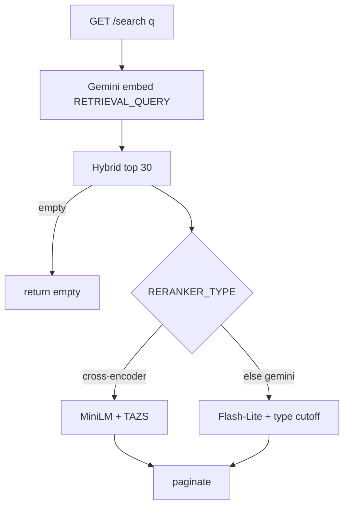
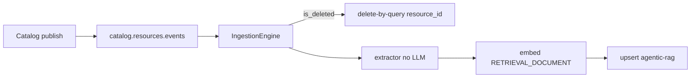

# Ask AI Search

> [!abstract]
> - `resume:ask-ai`
> - Separate FastAPI + Kafka worker on branch `ask-ai`
> - Hybrid retrieve (kNN + BM25) then rerank
> - **"TAZS" is our nickname**, not a paper
> - Resume says **character-count routing**; this branch switches on **`RERANKER_TYPE`**
> - Reconcile before you say the PDF word
> - Doc: [[09-ask-ai-search]]
> - Catalog emit: [[02 - Catalog and Gateway]]

## Resume line

- Hybrid tool-search: character-count routing, kNN, Cross-Encoder, adaptive tail thresholding, ~70% less noise, zero relevant-result dropout.

> [!warning] Do **not** say "if the query is short we use MiniLM, if long we use Gemini" unless you can point at **that** revision. On `ask-ai` the switch is **config**. Sibling branches (`ask-ai-dev`, `askai-vertex-migration`) are where query-length / budget routing *may* live — don't mix them in your mouth.

---

## Overview

- Need: keyword search on 600 OpenAPI tools is either empty or a dump
- An agent / builder needs "which tools / agents / MCP servers / transformers match this sentence?"
- What we built (not inside Catalog, not inside Gateway)
    + **Ask AI API** — FastAPI `main_api` ("BreakPoint Ask AI"). Query-time only. Embed → hybrid → rerank → page
    + **Ingest worker** — `main_worker`. Kafka `catalog.resources.events`, group `rag-ingestion-worker-v1`. Extract chunks **without an LLM**, embed, upsert OpenSearch
    + **Clean architecture** — `core/` engines (`SearchEngine`, `IngestionEngine`, `RagEngine`) sit on interfaces (`BaseEmbeddingModel`, `BaseVectorStore`, `BaseExtractor`, `BaseEventStream`). Adapters in `infrastructure/`: OpenSearch, Gemini embed, Kafka
    + **Index `agentic-rag`** — one OpenSearch index over registry kinds. Not Mongo. Catalog stays SoR for **specs**; this index is SoR for **search**
    + **Two rerankers** (`RERANKER_TYPE`)
        - `cross-encoder` — local MiniLM (etc.) + **TAZS** cutoff. The noise-reduction path
        - else (`gemini`, default on this branch) — Flash-Lite scores 0–10 + **per-type cutoff**. Fail-open to hybrid
    + **Document RAG** (`/api/v1/rag/ask`) — sibling. Team-scoped docs, **other** index (`document-rag`). Same embed + Cross-Encoder. **Not** the resume headline
- Catalog **never searches**
- It emits Kafka on publish
- Gateway **never searches** — it already has linked tool ids
- This is discovery for the UI / ecosystem

---

## Timeline

- **Jan–Jun** — not this bullet. MCP, Catalog, agents.
- **July** — canvas. Not this.
- **Aug–Sep 2026** — locked calendar parks Ask AI in **fixes**. No dedicated quarter. Do not steal April from Catalog to invent an "I rebuilt search for 1.5 months" story.
- Branch is `ask-ai` (also `ask-ai-dev`, `askai-vertex-migration`, `agentic-rag`, `managed-rag`). Default Catalog branch does **not** have this app.

---

## Schema

### OpenSearch index `agentic-rag` (`ES_INDEX`)

- Not a Mongo collection
- Mapping that matters

| Field                                                               | Role                                                                     |
| ------------------------------------------------------------------- | ------------------------------------------------------------------------ |
| `embedding`                                                         | `knn_vector`, **3072-d**, HNSW, `space_type=cosinesimil`, `engine=faiss` |
| `chunk_id`                                                          | document `_id`                                                           |
| `resource_id` / `resource_type`                                     | tool / agent / `mcp_server` / `data_transformer`                         |
| `status` / `team` / `domain` / `tags` / `has_pii`                   | keyword filters                                                          |
| `version_number` / `lifecycle_rank`                                 | live=3, published=2, draft/active=1                                      |
| `name` / `semantic_summary` / `semantic_text`                       | BM25 (`name^3`, `semantic_summary^2`, `semantic_text`)                   |
| `endpoint`, `endpoint_description`, `example_questions`, `raw_spec` | stored, **`index: False`** — reranker / response only                    |

- Index setting `knn: true`
- Auth: IAM or basic; SSL when `ES_PORT==443`
- Mapping decode (`embedding`)
    + `knn_vector` — float list; enables kNN. A `text` field cannot
    + **3072-d** — Gemini `gemini-embedding-2` width. Query + chunk must match
    + `space_type=cosinesimil` — near = angle, not L2. Same meaning, different length still close
    + HNSW / Faiss — Flow 2

### Kafka envelope (Catalog → worker)

- Topic `catalog.resources.events`
- Catalog `_emit_tool_rag_event` / `_emit_rag_event`
    + `resource_type` `tool` | `mcp_server`
    + payload from `rag_extractors`
    + `is_deleted`
    + key = resource id
- Worker
    + soft-delete → `handle_deletion(resource_id, resource_type)`
    + else extractor by type → embed (`RETRIEVAL_DOCUMENT`) → `save_document`
    + Unsupported types ignored

### Extractors (deterministic — no LLM)

| Extractor | Versioned? | `chunk_id` |
|---|---|---|
| `BreakPointToolExtractor` | yes | `tool_{rid}_v{n}_chunk_0` — name/team/summary + per-endpoint `METHOD /path` + `x-example-questions` |
| `BreakPointAgentExtractor` | yes | name/team/description |
| `BreakPointMcpExtractor` | **no** | `mcp_server_{rid}_chunk_0` — overwrite |
| `BreakPointDataTransformerExtractor` | **no** | overwrite |

- **Ghost-chunk cleanup** only for **non-versioned** kinds (delete index chunks this payload no longer produces)
- **Skipped for tools/agents** — versions coexist on purpose

### Sibling index `document-rag`

- Team-scoped file RAG
- `CHUNK_TARGET_CHARS=3500`, page-aware
- Not the 600-tool engine

---

## Endpoints

- **Ask AI API** (`src/main_api.py`)
    + `GET /api/v1/search?q=&resource_type=&page=&limit=` — the resume path. Default filter `get_active_only_filter()` = `status ∈ {live, published, draft, active}` + optional `resource_type` term
    + `GET /api/v1/rag/ask?query=&team_id=&doc_id=&mode=` — document RAG. `mode=search` or `generate` (default). **Sibling**
- **Worker** — no query HTTP. `RUN_MODE=worker` → `main_worker`
- **Catalog (emit only)** — publish / rollback / MCP-server bind/toggle → Kafka. Not a search API. [[02 - Catalog and Gateway]]
- `entrypoint.py` picks API vs worker via `RUN_MODE`

---

## Architecture

### Flow 1 — query (`SearchEngine.execute_search`)

1. Embed query — `gemini-embedding-2`, 3072-d, `task_type=RETRIEVAL_QUERY`.
2. Hybrid `db.search(..., limit=30)`. Empty → **`[]`**. No TAZS, no Gemini. This is **not** "zero dropout."
3. Rerank by `RERANKER_TYPE`.
4. Page `final_results[offset:offset+limit]`.
5. Timers logged: `embedding`, `hybrid`, `llm`, `total`.
6. Average you say (CE path, **estimate**, not a pulled p99) — API **~800 ms** (embed-dominated). MiniLM **~50 ms** after warmup.

### Flow 2 — hybrid (`ElasticsearchStore.search`)

- Two OpenSearch calls. Same `status` / `resource_type` filters. Different rankers
- Why both
    + ids / exact names like BM25
    + "track this shipment" likes cosine

- **kNN** — `size=20`, `k=20` on `embedding`
    + **ANN** (Approximate Nearest Neighbour) — do not cosine-scan every chunk (`O(n × d)`). Walk a structure. Can miss a true neighbour. Fine — we rerank the 20
    + **HNSW** — Hierarchical Navigable Small World. Graph of vectors, not a B-tree
    + Small world — short local edges + a few long hops (airports, then last mile)
    + Hierarchical — sparse top layer for long jumps, layer 0 holds every vector
    + Search — greedy closer-neighbour at the top, drop a layer when stuck, finish on layer 0
    + Brings query to ~`O(log n)` vs linear scan. Graph lives in RAM — don't shard HNSW for 50 RPM
    + `ef_construction` / `ef_search` — wider walk at build / query = better recall, more cost
    + **Faiss** — Facebook AI Similarity Search (Meta C++). `engine=faiss` = OpenSearch calls Faiss to build/search that HNSW. We did not write Faiss. Other engines: `nmslib`, `lucene`

- **BM25** — `size=20`, sparse / keyword
    + `multi_match` — one query string scored on **several fields**. Not three queries
    + Fields it actually searches — only `name`, `semantic_summary`, `semantic_text`
    + `endpoint`, `endpoint_description`, `example_questions`, `raw_spec` — `index: False`. Reranker / response only
    + Boosts — `name^3`, `semantic_summary^2`, `semantic_text` (^1). Name beats buried tokens
    + `best_fields` — per doc, take the **best one field** (then boost). Not `most_fields` (sum — long body can beat a perfect name). Not `cross_fields` (one blob)
    + `minimum_should_match=1` — at least **one query token** in those fields. Not "1 of 3 fields"

- **Merge**
    + Concat `knn_hits + bm25_hits` (dense first)
    + Dedup `resource_id`, **first wins** — same tool in both → keep the kNN row
    + `resource_id` not `chunk_id` — one tool, many chunks. UI / rerank want tools
    + Then `results[:30]`. **30 is a cap, not a floor**
    + Same 20 tools in both lists → 20. kNN 20 chunks = 3 tools → often < 30. Filter / tiny index → fewer. Empty → `[]`
    + Max unique from 20+20 is 40, then cut to 30. Pagination slices whatever rerank got — does not invent 30

### Flow 3 — Cross-Encoder + TAZS

- Model: lazy singleton `CrossEncoder`
- Default `ms-marco-MiniLM-L-6-v2`
- Also `mxbai-rerank-xsmall-v1`, `ms-marco-TinyBERT-L-2-v2`
- `warmup()` on API startup — cold load is seconds; do not quote that as API latency
- Warmed MiniLM, one `predict` on ≤30 pairs — **~50 ms** average
- **Shared** with document-RAG reranker

1. Doc text: `Name | Team | Summary | Description[:300] | Examples`.
2. One `model.predict(pairs)` batch.
3. Sort desc.
4. **TAZS** on **this** query's scores. Keep `score >= threshold`, cap 20.
5. If that set is **empty** → **top 20**. That line is "zero relevant-result dropout" **in code**.
6. Attach `llm_score` (name is leftover — it's the CE score).

- **TAZS** — Tail-Anchored Z-Score. **Nickname, not a paper.** Say that first
- Under the hood
    + MiniLM scores are **not** a percent. `0.5` on an easy query ≠ `0.5` on a hard one
    + Sort high→low. **Bottom 10 = tail** = this query's junk pile
    + \(\mu_T\) = junk average. \(\sigma_T\) = junk spread (std). Floor spread at `0.5`
    + Cutoff = junk-average + **2.5 × floored spread** — must sit clearly above noise
    + Z-score view — \(z(s)=(s-\mu_T)/\tilde\sigma_T\); keep if \(z \ge 2.5\), but anchored on the **tail**, not the full list (good scores would pull the mean up)
    + \(n < 10\) → don't estimate; \(\tau = -8.5\)
    + Clamp \(\tau\) to `[-8.5, 0.0]` — never reject a positive CE score; never go insane low
    + Keep `score >= τ`, cap 20. Empty keep-set → **top 20 of hybrid**. That is "zero dropout" **in code**
- Why not `keep score > 0.5`
    + Uncalibrated. Fixed cutoff is too strict or too loose
    + Tail = "what noise looks like **this** time"
- Formula (`tazs_threshold`)
    + \(T\) = last 10 of \(s_{(1)}\ge\cdots\ge s_{(n)}\)
    + \(\tilde\sigma_T=\max(\sigma_T,0.5)\)
    + \(\tau_{\text{raw}}=\mu_T+2.5\cdot\tilde\sigma_T\)
    + \(\tau=\operatorname{clamp}(\tau_{\text{raw}},-8.5,0)\)
- Safety
    + `min_sigma=0.5` — flat tail cannot become a razor
    + `safety_cap=0.0` — never reject a genuinely positive score
    + `absolute_floor=-8.5` — also the `< 10` return

> [!example] \(\mu_T=-3.0\), \(\sigma_T=0.4\to 0.5\) → \(\tau=-1.75\). `7.9 / 6.2 / 5.8` stay; the `-3` pile drops. Vague top `-1.9` keeps almost nothing — then top-20 fallback if hybrid had hits.

### Flow 4 — Gemini judge (default on this branch)

- `gemini-2.5-flash-lite`, temperature 0, max 256 tokens
- One `generate_content` → comma-separated scores
- Prompts **per type**: tool / agent / `mcp_server` / `data_transformer`
- Cutoffs (`config.py`, env-overridable)
    + tool **2**
    + agent **2**
    + MCP **5** (stricter)
    + transformer **2**
- Type taken from `results[0]`
- Keep `score >= cutoff`
- **Any exception → return unfiltered hybrid**
- Search never hard-fails
- Say fail-open

### Flow 5 — ingest (how the index stays honest)

- Lag = Kafka + index refresh
- Unpublish / delete = delete-by-query on `resource_id` (optional type)
- Republish **re-emits** so rollback is not a stale live chunk forever

### Flow 6 — document RAG (one sentence if they wander)

- Same embed + TAZS
- Scoped `team_id`
- `mode=generate` takes top `RAG_MAX_CONTEXT_CHUNKS=8` → `gemini-2.5-flash`
- Generation fail → search results
- **Don't sell this as the ~70% bullet**

---

## One-minute pitch

- Keyword search on 600 tools is empty or a dump
- I embed the query, take dense + sparse hits, then either a cross-encoder that *sees query and document together* or a Gemini judge
- I do not use a global score cutoff on the MiniLM path
- I estimate noise from the bottom of **this** query's list and keep outliers
- If that heuristic keeps nothing, I still return top-20 so the UI never goes blank when OpenSearch had hits
- ~70% less noise is **vs hybrid top-30**, not vs a "bad" first design — Metrics
- Catalog writes the spec
- Kafka fills the index
- I did not put search inside Catalog

---

## Metrics

- **~70% less noise** — resume number. **Keep it.** Baseline is not a mistake
    + **Before** = hybrid top-30 (kNN + BM25, merged). Recall on purpose. Cousins stay in the 30
    + **After** = Cross-Encoder + TAZS on **that same 30**
    + Queries = semantic paraphrases of **real catalog tools** (same set before/after)
    + Noise = tool in the **shown** list a builder would not pick for that sentence
    + \[
      \dfrac{\#\text{irrelevant in hybrid-30} - \#\text{irrelevant after TAZS}}{\#\text{irrelevant in hybrid-30}} \approx 0.7
      \]
    + Not "70% fewer rows" if you also dropped good tools. Zero-dropout defends that
    + Why the baseline is noisy — BM25 hits a token, kNN hits a neighbourhood, cap 30 ≠ relevant. Showing all 30 is a valid retrieve stage. Precision is the second stage
    + **Do not lead with** "LLM rerank was bad." That sounds like you shipped a bad design
    + If they know the Gemini judge exists — two precision heads on the **same** 30. Gemini stays (`RERANKER_TYPE`, fail-open). CE+TAZS was the workhorse on this set. Not "I regretted Gemini"
    + **Do not say** you swept \(z=2.5\) until the slide said 70%. Constants first, then measure
    + Sheet is not in this vault. N = don't invent. "Tens of queries, I don't have the sheet here"
    + Not MSMARCO. Not a paper
- **Zero dropout** — **code**: TAZS empty → top-20 **if hybrid returned candidates**. Empty hybrid → `[]`. Not an offline recall study unless you ran one.
- **3072-d** — Gemini embedding size. Cost/latency tradeoff vs a smaller model. Don't invent a cheaper dim you didn't ship.
- **k=20 + BM25 20 → 30** — retrieval **cap** before rerank. Not "we retrieve 600." Not a floor — overlap / multi-chunk / tiny index → fewer. Empty hybrid → `[]`
- **Latency (CE path, average, estimate — no dashboard in these notes)**
    + MiniLM warmed, ≤30 pairs — **~50 ms**
    + `GET /search` end-to-end — **~800 ms** (embed is the fat part; OS + MiniLM are tens)
    + Gemini judge path is **not** these numbers

---

## HLD grill (new for this pointer)

- Redis, Mongo vs PG, Catalog vs Gateway, Kafka 202 — **02**
- This grill is **search**
- If the round is **backend**: 1–7

1. How long?
    + Aug–Sep / fixes
    + Not a quarter
    + Catalog already existed so we had something to index
2. Draw query
    + Embed → hybrid 30 → rerank → page
    + Averages you say — MiniLM **~50 ms** warmed; API **~800 ms**. Not a logged p99
3. Draw ingest
    + Catalog Kafka → extract → embed → upsert
4. Why OpenSearch not Mongo? / Why not search Mongo?
    + kNN + BM25
    + Catalog is spec SoR
    + Catalog is SoR for specs, not a BM25/HNSW engine
    + OpenSearch is the search SoR
5. Why Kafka not Catalog HTTP?
    + Decouple publish from index
    + Worker can lag/retry
6. Dual write Catalog + OS
    + Mongo first (02), then Kafka
    + Index is eventually consistent
7. Worker crash mid-batch
    + Per-chunk skip
    + at-least-once Kafka
    + Dup upsert is idempotent on `chunk_id`
8. Delete lag / Stale after unpublish?
    + delete-by-query
    + Don't claim instant
    + Lag = Kafka + refresh
    + Republish re-emits
9. Hot query stampede
    + Same embed+OS every time
    + Don't invent a query cache unless you built one
10. Why 3072 / 3072 dims / cost?
    + Model dim
    + Don't shard HNSW for 50 RPM of search
    + That's the Gemini model
    + Tradeoff vs e5-small etc.
    + We used what Vertex gave us
11. Multi-tenant
    + `team` field exists
    + Default search filter is status, not "only my team" unless you pass it
    + Don't over-claim isolation
12. Fail-open Gemini
    + Hybrid still returns
    + Noisy, not down
13. CAP
    + Catalog publish is the write you trust
    + Search can lag
    + Prefer stale-miss over blocking register
14. Why two apps / Why a second FastAPI?
    + API vs worker `RUN_MODE`
    + Same image idea as Gateway trigger
    + Scale/deploy search + worker without putting HNSW in Catalog
    + Catalog still never executes APIs
15. Sibling RAG vs this
    + Other index
    + Don't mix eval numbers
16. Ghost chunks?
    + Cleaned for MCP/transformer
    + **Not** for versioned tools/agents
17. Why draft in the default filter?
    + Docs: `live, published, draft, active`
    + Builder may need drafts
    + If they hate it: "I'd tighten prod to live/published" — don't claim you already did

---

## Agentic grill (this bullet)

- If the round is **IR/ML**: 2–6

1. Why search at all?
    + Don't dump 600 tools in the prompt
    + Discover a subset
2. Why hybrid IR? / Why hybrid?
    + Sparse + dense
    + Classic
    + Names/ids like BM25 (`name^3`, summary^2, text; `best_fields`; msm=1)
    + Paraphrase likes kNN (HNSW ~`O(log n)`, Faiss, cosine, 3072)
    + Concat kNN+BM25, first `resource_id` wins, cap 30 (not a floor)
3. Why Cross-Encoder after bi-encoder?
    + Embed is query-only
    + CE sees (query, doc)
4. Why not a fixed 0.5 cutoff?
    + Scores uncalibrated
    + Per-query noise floor
5. TAZS vs paper rerankers / TAZS paper?
    + Heuristic
    + Don't cite MSMARCO as if you fine-tuned
    + No paper
    + Tail-anchored z-score
    + Mean/σ of the bottom 10 + 2.5σ
    + Nickname from the coding session
    + Standard stats, bespoke recipe
6. Zero dropout vs eval / Dropout vs empty index?
    + Code fallback ≠ recall@k study
    + Fallback only if hybrid had hits
    + Empty retrieve → empty page
7. Hallucinated tool after search?
    + Search ranks
    + `tool_resolver` still drops unknown ids
    + 02 / SOP
8. Embed PII? / PII in the index?
    + `has_pii` is a **field**
    + What you **filter at query time** — fill
    + Don't claim "we never index PII" if the extractor still embeds the spec text
    + Field + extractor text
    + Be honest
9. Character-count?
    + PDF word
    + **This branch = `RERANKER_TYPE`**
    + Config on this branch
    + Sibling branches may have length/budget routing
    + If you didn't write that `if`, don't say it
10. Agent uses this live?
    + Discovery / UI
    + Runtime already has **linked** ids
    + Don't say every `v2/chat` hits `/search` unless you grep'd it
11. ~70%
    + Vs **hybrid-30**, not vs a failed v1
    + Formula — (irr_hybrid − irr_TAZS) / irr_hybrid ≈ 0.7
    + Same semantic queries from real tools
    + Don't open with "LLM was bad"
    + Gemini path = alternate / fail-open if they press
    + No sheet in the room — don't invent N
12. Why not INTEGRATION_MCP loader? / Ask AI vs INTEGRATION_MCP?
    + Closed 18 APIs vs open 600
    + Closed curated corpus + loader vs open registry search
    + Different problem
    + [[01 - MCP Servers]]
13. Why not only LLM rerank?
    + Cost/latency
    + Gemini path exists and **fail-opens**
    + Cross-encoder is the cheap workhorse
14. Why MCP cutoff 5?
    + Server names are generic
    + A loose cutoff dumps every bundle
    + Don't invent a paper

---

## Related Notes

- [[00 - Ownership and How to Talk]]
- [[01 - MCP Servers]]
- [[02 - Catalog and Gateway]]
- [[06 - Supporting Modules]]
- [[09-ask-ai-search]]
- [[02-tool-registry]]
