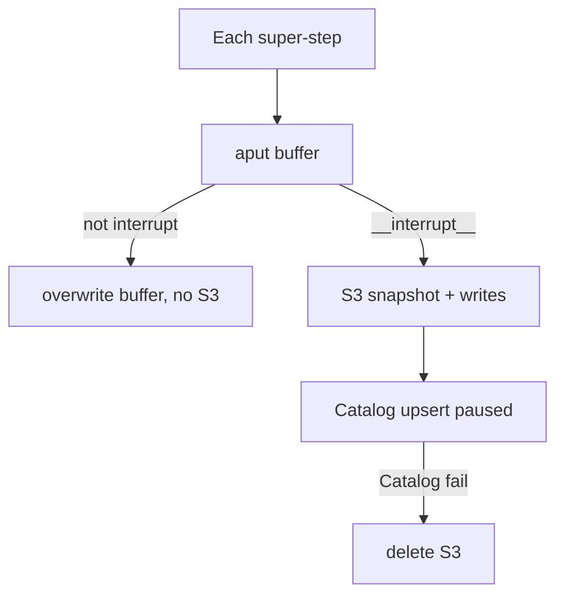
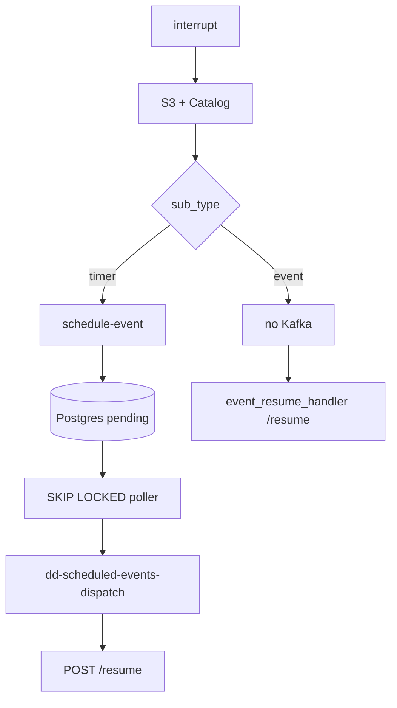

# Pause Resume

> [!abstract] The **durable wait** half of `resume:workflows`. Not the canvas compiler — that is [[04 - Workflows]]. Graph hits `interrupt()`, bytes go to S3, pointer in Catalog, timer via Postgres + Kafka, wake is **`POST .../resume`**. Docs: [[05-pause-resume]].

## Resume line

The PDF clause **"durable, resumable execution"** is this note. July shipped compile/run. **This** is what you hardened Aug–Sep. Don't say you built S3 + scheduler + validator as a finished platform in 30 days.

## Overview

A workflow (or a long wait) cannot hold a Gateway pod for hours. Pause = **hang up, keep the state, come back**.

Four planes — say them in this order:

| Plane | Owns | Where |
|---|---|---|
| LangGraph | `interrupt()`, `Command(resume=...)`, `thread_id` | Gateway `workflow/` |
| S3 | `snapshot.bin` + `writes.json` | `WorkflowCheckpointSaver` |
| Catalog | pointer, status, TTL ~6 days | Mongo `workflow_checkpoints` — **not the bytes** |
| Event Scheduler | timer fire | Postgres `scheduled_events` + Kafka `dd-scheduled-events-dispatch` → **`POST /resume`** |

Catalog is SoR for **checkpoint metadata**. Gateway owns the checkpointer. Grep `interrupt` in Catalog = nothing.

**Not** `/trigger` and **not** `dd-gateway-triggers`. Intake is 02/04. Wake is this path.

Agent **hibernation** (`POST /v2/resume`) is the same *idea*, different module. Don't mix code paths. [[03 - Agents and Orion]].

## Timeline

- **July** — first cut may have had a pause *node* that was not this durability story. Don't invent what July lacked; say Aug–Sep **hardened** persist + scheduler + resume.
- **Aug–Sep 2026** — this architecture.

## Schema (what is stored)

### DSL — `pause-resume` node

`sub_type`:

- **`timer`** — delay: constant `resume_after_seconds` or variable selector (minutes, resolved at pause). Delay floored at 0, default 3600s if unset, clamped to `MAX_PAUSE_DURATION` (retention).
- **`event`** — wait on the world. **No scheduler row.** Needs `output_variables` or `json_schema`. Something later POSTs resume.

Unreachable pause = compile error (BFS from start).

### S3

`CHECKPOINT_S3_PREFIX/{workflow_slug}/{date}/{run_id}/{checkpoint_id}/` → `snapshot.bin` + `writes.json`. Reads follow stored `s3_key`, never rebuild the path.

### Catalog `workflow_checkpoints`

Composite `_id` = `thread_id::ns::checkpoint_id`. `s3_key`, `pending_writes_s3_key`, `status` paused/completed, `expires_at` (BSON datetime, TTL index ~6 days). Stubs **without** `s3_key` ignored on `get_latest`.

`thread_id` = `run_id` from the invoke `configurable`.

## Endpoints

- Gateway `POST /{team}/workflows/{slug}/resume` — scheduler consumer (timer) or `event_resume_handler` (event). Body `{thread_id}`. Timer resume input is `__resume__` — no extra payload.
- Catalog internal `PUT/GET .../workflow-checkpoints/...`, `POST .../complete`.
- Scheduler `POST /api/schedule-event` — Gateway calls this on **timer** pause only.

`/run` returning `status: paused` is the **start** of this story (04). This note is what happens after.

## Architecture

### Persist only on interrupt

LangGraph calls `aput` **every** super-step. We **buffer**. `aput_writes` **flushes iff** a write hits `__interrupt__`.

S3 **first**, then Catalog. Catalog fail → delete both S3 objects (no orphan bytes). Intermediate steps never hit S3.

### Timer vs event

### Resume (`handle_workflow_resume`)

1. Auth first. No snapshot without a bearer.
2. `thread_id` required.
3. **`get_status` already `completed`** → `{status: already_resumed}` — Kafka redelivery, don't run twice.
4. `aget_tuple` — Catalog pointer → S3. Missing → 404; expired → 410; deserialize fail → 500 (bytes untouched).
5. Recover `version_id`, `session_id`, **`trace_id`** — rebuild Langfuse handler so resume is the **same trace**.
6. `convert_dsl` that **exact** version — same graph as the pause (04 determinism).
7. **`refresh_state_auth_token`** — rewrite snapshot `system.auth_token` **and** Authorization in `client_headers` (tools read headers first). Not `Command(update=)` — that fights the pause node.
8. `ainvoke(Command(resume=RESUME_CONSTANT), thread_id=same)`.
9. Outcomes (HTTP 200): `failed` + `mark_completed` (so consumer **commits**, no resume hammer); re-pause → schedule again if timer; success → `mark_completed` + outputs. Recompile fail **before** invoke → 500, consumer retries.

### Why this scheduler

Docs: Postgres + `SKIP LOCKED` over APScheduler / Celery / delayed Kafka — ACID, crash recovery, no double-dispatch across poller replicas. Stale `processing` → retry or dead-letter. Token refresh on dispatch if `origin == gateway-workflow-pause-resume`. Kafka key = `event_id`.

### Conversation

`memory_session_id` (UUID4) threads turns across run/resume. Write is off the hot path (BackgroundTask on success). Not a substitute for the S3 snapshot.

## One-minute pitch

If we need to wait six hours, we do not hold a pod. `interrupt()`, snapshot to S3, pointer in Catalog, timer or event hits `/resume` on **any** replica. Same `version_id`, same `trace_id`, fresh auth. That is Aug–Sep, not a fairy-tale July.

## Metrics

No Temple number on **this** half. **124k** is the canvas / run platform ([[04 - Workflows]]). Don't park 124k on S3 puts. TTL ~6 days is retention, not QPS.

## Ugly questions

**How long?** Harden after July. 04 is compile/run.

**Why not Celery / sleep?** Sleep dies with the pod. Celery is another platform. Scheduler is what we already operate.

**Why not put resume on `dd-gateway-triggers`?** That **starts** a run. Resume continues `thread_id`. Wrong topic, wrong handler.

**Two resumes?** `already_resumed` if completed. `event_id` unique on the scheduler.

**Clock / delay 0?** Floor 0, cap `MAX_PAUSE_DURATION`.

**Persist every step?** No. Buffer. Flush on `__interrupt__` only.

**S3 vs Catalog fail order?** S3 then Catalog; Catalog fail deletes S3.

**Hibernate vs this?** Same idea. Agents = `hibernation/` + `/v2/resume`. Workflows = this. Don't merge.

**Catalog execute?** Never. Pointers only.

**Token expired after 6 hours?** Refresh in the snapshot before tools run.

**Event pause + no one ever resumes?** TTL ~6 days, checkpoint expires, 410.

## HLD grill (this pointer)

Compile/run, `/trigger` 202 — **04 / 02**. This table is **durable wait**.

| # | They ask | In this note? | One-line |
|---|---|---|---|
| 1 | Draw four planes | Overview | LangGraph / S3 / Catalog meta / scheduler. |
| 2 | Why not bytes in Mongo? | Schema | Catalog is control plane. Snapshots are fat. S3. |
| 3 | Pod dies while paused | Overview | State not on the pod. Any replica `/resume`. |
| 4 | Exactly-once resume? | Resume | At-least-once Kafka + `already_resumed`. |
| 5 | Why SKIP LOCKED? | Scheduler | Two pollers, one row. |
| 6 | CAP on checkpoint | Persist | S3 then Catalog; Catalog fail deletes S3. Prefer no orphan bytes. |
| 7 | vs Temporal | New | We didn't run Temporal. Checkpointer + scheduler is the claim. Don't invent a cluster. |
| 8 | Why not `dd-gateway-triggers`? | Ugly | That **starts** a run. Resume continues `thread_id`. |
| 9 | Persist every step? | Persist | Buffer. Flush on `__interrupt__` only. |
| 10 | Token after 6 hours | Resume | Rewrite snapshot auth before tools run. |

## Agentic grill

| # | They ask | In this note? | One-line |
|---|---|---|---|
| 1 | HITL? | Ugly | Event pause *can* be a human/system POST. Don't invent an approval UI you didn't ship. |
| 2 | Agent waiting vs workflow pause | Overview | Hibernate vs this. Same product sentence, two modules. |
| 3 | Trace after resume | Resume | Same `trace_id`. [[07 - Langfuse]]. |
| 4 | Re-pause | Resume | New checkpoint + another schedule if timer. |
| 5 | Why not sleep in the graph? | Ugly | Sleep dies with the pod. |
| 6 | Event never arrives | Ugly | TTL ~6 days → 410. |

## Related Notes

- [[04 - Workflows]]
- [[02 - Catalog and Gateway]]
- [[03 - Agents and Orion]]
- [[07 - Langfuse]]
- [[05-pause-resume]]
