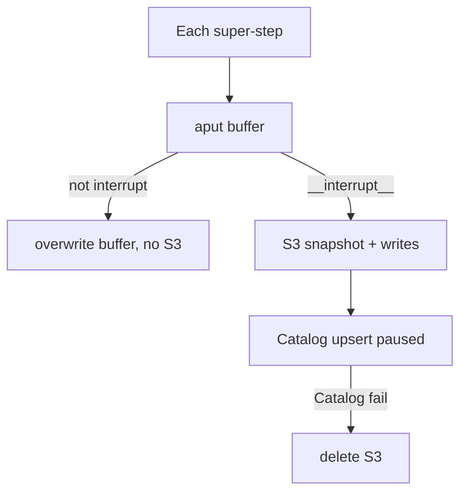
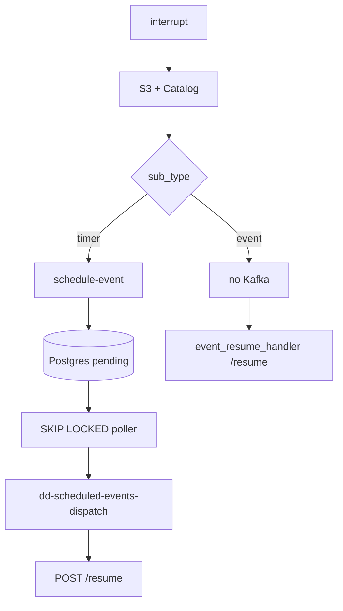

# Pause Resume

> [!abstract]
> - Durable-wait half of `resume:workflows`
> - Not the canvas compiler — that is [[04 - Workflows]]
> - Graph hits `interrupt()`, bytes → S3, pointer in Catalog, timer via Postgres + Kafka
> - Wake is **`POST .../resume`**
> - Doc: [[05-pause-resume]]

## Resume line

- PDF **"durable, resumable execution"** is this note
- July shipped compile / run
- **This** is what you hardened Aug–Sep
- Don't say you built S3 + scheduler + validator as a finished platform in 30 days

---

## Overview

- A workflow (or a long wait) cannot hold a Gateway pod for hours
- Pause = **hang up, keep the state, come back**
- Four planes — say them in this order

| Plane | Owns | Where |
|---|---|---|
| LangGraph | `interrupt()`, `Command(resume=...)`, `thread_id` | Gateway `workflow/` |
| S3 | `snapshot.bin` + `writes.json` | `WorkflowCheckpointSaver` |
| Catalog | pointer, status, TTL ~6 days | Mongo `workflow_checkpoints` — **not the bytes** |
| Event Scheduler | timer fire | Postgres `scheduled_events` + Kafka `dd-scheduled-events-dispatch` → **`POST /resume`** |

- Catalog is SoR for **checkpoint metadata**
- Gateway owns the checkpointer
- Grep `interrupt` in Catalog = nothing
- **Not** `/trigger` and **not** `dd-gateway-triggers`
    + Intake is 02 (Kafka → `gateway_runs` → execute)
    + Wake is this path
    + Paused run stays `paused` until `/resume`
    + Finish → **DELETE** the row
- Agent **hibernation** (`POST /v2/resume`) is the same *idea*, different module
    + Don't mix code paths
    + [[03 - Agents and Orion]]

---

## Timeline

- **July** — first cut may have had a pause *node* that was not this durability story
    + Don't invent what July lacked
    + Say Aug–Sep **hardened** persist + scheduler + resume
- **Aug–Sep 2026** — this architecture

---

## Schema

### DSL — `pause-resume` node

- `sub_type`
    + **`timer`** — delay: constant `resume_after_seconds` or variable selector (minutes, resolved at pause)
    + Delay floored at 0, default 3600s if unset, clamped to `MAX_PAUSE_DURATION` (retention)
    + **`event`** — wait on the world. **No scheduler row**
    + Needs `output_variables` or `json_schema`
    + Something later POSTs resume
- Unreachable pause = compile error (BFS from start)

### S3

- `CHECKPOINT_S3_PREFIX/{workflow_slug}/{date}/{run_id}/{checkpoint_id}/`
    + `snapshot.bin` + `writes.json`
- Reads follow stored `s3_key`
- Never rebuild the path

### Catalog `workflow_checkpoints`

- Composite `_id` = `thread_id::ns::checkpoint_id`
- `s3_key`, `pending_writes_s3_key`
- `status` paused / completed
- `expires_at` — BSON datetime, TTL index ~6 days
- Stubs **without** `s3_key` ignored on `get_latest`
- `thread_id` = `run_id` from the invoke `configurable`

---

## Endpoints

- Gateway `POST /{team}/workflows/{slug}/resume`
    + Scheduler consumer (timer) or `event_resume_handler` (event)
    + Body `{thread_id}`
    + Timer resume input is `__resume__` — no extra payload
- Catalog internal `PUT/GET .../workflow-checkpoints/...`, `POST .../complete`
- Scheduler `POST /api/schedule-event` — Gateway calls this on **timer** pause only
- `/run` returning `status: paused` is the **start** of this story (04)
- This note is what happens after

---

## Architecture

### Flow 1 — persist only on interrupt

- LangGraph calls `aput` **every** super-step
- We **buffer**
- `aput_writes` **flushes iff** a write hits `__interrupt__`

- S3 **first**, then Catalog
- Catalog fail → delete both S3 objects (no orphan bytes)
- Intermediate steps never hit S3

### Flow 2 — timer vs event

### Flow 3 — resume (`handle_workflow_resume`)

1. Auth first. No snapshot without a bearer.
2. `thread_id` required.
3. **`get_status` already `completed`** → `{status: already_resumed}` — Kafka redelivery, don't run twice.
4. `aget_tuple` — Catalog pointer → S3. Missing → 404; expired → 410; deserialize fail → 500 (bytes untouched).
5. Recover `version_id`, `session_id`, **`trace_id`** — rebuild Langfuse handler so resume is the **same trace**.
6. `convert_dsl` that **exact** version — same graph as the pause (04 determinism).
7. **`refresh_state_auth_token`** — rewrite snapshot `system.auth_token` **and** Authorization in `client_headers` (tools read headers first). Not `Command(update=)` — that fights the pause node.
8. `ainvoke(Command(resume=RESUME_CONSTANT), thread_id=same)`.
9. Outcomes (HTTP 200)
    + `failed` → **DELETE** `gateway_runs` (scheduler consumer still commits its dispatch, no resume hammer)
    + re-pause → `gateway_runs.status = paused`, schedule again if timer
    + success → **DELETE** row + outputs
    + Recompile fail **before** invoke → 500, consumer retries
    + Row was `paused`; resume claims it to `running` first

### Why this scheduler

- Postgres + `SKIP LOCKED` over APScheduler / Celery / delayed Kafka
    + ACID
    + crash recovery
    + no double-dispatch across poller replicas
- Stale `processing` → retry or dead-letter
- Token refresh on dispatch if `origin == gateway-workflow-pause-resume`
- Kafka key = `event_id`

### Poller cycle (`EventSchedulerPoller`)

- Standalone process. Not a thread inside the Gateway
- One cycle, in order
    1. `_recover_stale_events` — `processing` past `STALE_THRESHOLD` → `pending` if attempts left, else dead-letter `failed`
    2. `_fetch_due_batch` — `SELECT … WHERE status='pending' AND scheduled_at<=now ORDER BY scheduled_at LIMIT BATCH_SIZE FOR UPDATE SKIP LOCKED` → flip to `processing`
    3. `_dispatch_batch` — Kafka `dd-scheduled-events-dispatch`, key = `event_id`. Pause origin → fresh Gateway token or leave in `processing` (no stale Authorization)
    4. Sleep `max(0, POLL_INTERVAL - elapsed)` — cadence stays ~`POLL_INTERVAL` even if dispatch was slow
- **`POLL_INTERVAL` = 30s or 60s** (env). Don't invent a third number
- **The cycle does not run `/resume`**
    + Poller = claim row + produce Kafka
    + Gateway consumer = `POST /resume` + `ainvoke`
    + Graph can take minutes. Poller does not wait. 60s is not "finish every wake"
- How the lock actually works
    + `BEGIN` → `SELECT … FOR UPDATE SKIP LOCKED LIMIT BATCH_SIZE`
    + Those rows are locked **in this txn only**. Another poller **skips** them (does not wait)
    + Same txn: `status=processing`, `attempts++`, `locked_at=now` → `COMMIT`
    + Row lock is **gone**. Fence after that is the **status**, not a held lock
    + Then Kafka produce **outside** the lock (same idea as 02: claim, commit, work)
    + Produce ok → `success`. Token miss → leave `processing` (stale recover retries). Never dispatch a dead token
- What if dispatch of this batch takes **> 60s**
    + Sleep is `max(0, POLL_INTERVAL - elapsed)` → **sleep 0**, next cycle immediately. No overlap with yourself — one loop, sequential
    + Claimed rows are already `processing`. Next `WHERE pending` will not pick them. No double produce
    + Due rows **beyond `BATCH_SIZE`** stay `pending`. Next cycle (or the other replica) takes the next batch. Backlog **drains across cycles**, not in one tick
    + Other replica was never blocked: `SKIP LOCKED` + `pending` filter. It keeps claiming **other** due rows while you produce
    + 60s is a **pace**, not a deadline. Overrun ≠ crash, ≠ drop, ≠ unlock-and-steal
- What if the poller **dies** mid-produce
    + Rows already `processing`, Kafka maybe not sent
    + `_recover_stale_events` after `STALE_THRESHOLD` → `pending` again (if attempts left) or `failed`
    + At-least-once. Downstream `already_resumed` if the produce actually landed and `/resume` finished
- Token hang
    + Docs: bounded timeout / short-circuit per cycle so one bad token service cannot hold the loop forever
- Why this is the right tool for **this** problem
    + The wait is **minutes to hours** (default delay 3600s). You need "wake after T," not "hold a pod until T"
    + Row is the timer. Due = `scheduled_at <= now`. Poller only looks at **due** rows
    + Kafka is a bad timer (02). Celery / APScheduler is another platform. Sleep dies with the pod
    + Postgres is already there. `SKIP LOCKED` is the same claim machine as `gateway_runs`
- Why **SKIP LOCKED**
    + Two poller replicas, same cycle, same due row — one claims, the other **skips**
    + No double produce. No advisory-lock service. No "leader poller"
    + Slow produce + next tick do not double-fire: status is already `processing`
- Why **30s / 60s**, not 1s and not 10 min
    + Pause is a human / SLA wait. ±30–60s after a 6-hour timer is noise
    + 1s loop = Postgres load, no user-visible win
    + 5–10 min loop = user sits after the timer is already due
    + 30 / 60 is the band: cheap to poll, wake is "soon after due," not "exact millisecond"
- Why not exact-second wake
    + You didn't buy Temporal. This is due-row + cycle
    + `already_resumed` still saves Kafka redelivery after the produce

### Target produce path (10k RPM)

- Same tables, same topic, same **one Kafka record per `event_id`**
- Change how the cycle **runs**. Do not claim this is already in `poller.py` unless you grepped it
- Today is ~10k/**day**. 10k **RPM** = ~167 produces/sec. That is the aim for **dispatch**, not `/resume`
- What does **not** change
    + Row is still the timer (`scheduled_at`)
    + Claim `SKIP LOCKED` → `processing` → **COMMIT**. No lock across Kafka or `/resume`
    + One message per event, key = `event_id`
    + Poller does not run the graph
    + Failures stay `processing` → stale recover or `failed`. Downstream `already_resumed`
    + Do not put many resumes in one payload
    + Do not add Debezium or Temporal for this path
- What we change
    1. **Sleep** — full `BATCH_SIZE` → `sleep 0`, next cycle. Sleep 30s / 60s **only** when the claim is empty
    2. **`BATCH_SIZE` 100–500** — one claim txn, then that set
    3. **Kafka** — `produce` every claimed row with a per-record callback → **one** `flush()` → `UPDATE … WHERE event_id IN (successes)`. No `flush()` per message
    4. **Token** — cache Gateway token **per `workflow_slug`** for the cycle (TTL shorter than expiry). Not one HTTP per row
    5. **Pods** — 1–2 poller replicas after 1–4 (maybe 4 on a burst). Not 10 pods to fix serial flush + per-row token
- Order
    1. Sleep only when idle + larger `BATCH_SIZE`
    2. Produce-all, flush-once, batch `UPDATE`
    3. Token cache by slug
    4. Extra poller replica only if claim / produce still lags
- 10k RPM of **`/resume` + `ainvoke`** is Gateway cap N (02). Separate bill

---

### Conversation

- `memory_session_id` (UUID4) threads turns across run / resume
- Write is off the hot path (BackgroundTask on success)
- Not a substitute for the S3 snapshot

---

## One-minute pitch

- If we need to wait six hours, we do not hold a pod
- `interrupt()`, snapshot to S3, pointer in Catalog, timer or event hits `/resume` on **any** replica
- Same `version_id`, same `trace_id`, fresh auth
- That is Aug–Sep, not a fairy-tale July

---

## Metrics

- No Temple number on **this** half
- **124k** is the canvas / run platform ([[04 - Workflows]])
- Don't park 124k on S3 puts
- TTL ~6 days is retention, not QPS
- Poller aim **10k RPM** of produces — Target produce path. Not 10k `/resume`/min unless Gateway N is sized for it

---

## HLD grill (this pointer)

- Compile / run, `/trigger` 202 — **04 / 02**
- This grill is **durable wait**

1. Draw four planes
    + LangGraph / S3 / Catalog meta / scheduler
2. Why not bytes in Mongo?
    + Catalog is control plane
    + Snapshots are fat
    + S3
3. Pod dies while paused
    + State not on the pod
    + Any replica `/resume`
4. Exactly-once resume?
    + At-least-once Kafka + `already_resumed`
    + `event_id` unique on the scheduler
5. Why SKIP LOCKED? / Poller cycle? / Work > 60s?
    + Two pollers, one row
    + Lock only for claim txn → `processing` → COMMIT. Kafka **after**
    + Poller does **not** wait for `/resume`
    + Overrun → `sleep 0`, next `BATCH_SIZE`. Already-claimed stay `processing`
    + Crash mid-produce → stale recover
    + **30s or 60s** — pace when **idle**, not a deadline. Same claim idea as `gateway_runs` (02)
    + Scale produce: sleep 0 on full batch, `BATCH_SIZE` 100–500, produce + one flush, token by slug — Target produce path
6. CAP on checkpoint
    + S3 then Catalog
    + Catalog fail deletes S3
    + Prefer no orphan bytes
7. vs Temporal
    + We didn't run Temporal
    + Checkpointer + scheduler is the claim
    + Don't invent a cluster
8. Why not `dd-gateway-triggers`?
    + That **starts** a run
    + Resume continues `thread_id`
    + Wrong topic, wrong handler
9. Persist every step?
    + No
    + Buffer
    + Flush on `__interrupt__` only
10. Token after 6 hours
    + Rewrite snapshot auth before tools run
11. Why not Celery / sleep?
    + Sleep dies with the pod
    + Celery is another platform
    + Scheduler is what we already operate
12. Clock / delay 0?
    + Floor 0
    + Cap `MAX_PAUSE_DURATION`
13. Catalog execute?
    + Never
    + Pointers only
14. How long?
    + Harden after July
    + 04 is compile / run

---

## Agentic grill

1. HITL?
    + Event pause *can* be a human / system POST
    + Don't invent an approval UI you didn't ship
2. Agent waiting vs workflow pause
    + Hibernate vs this
    + Same product sentence, two modules
3. Trace after resume
    + Same `trace_id`
    + [[07 - Langfuse]]
4. Re-pause
    + New checkpoint + another schedule if timer
5. Why not sleep in the graph?
    + Sleep dies with the pod
6. Event never arrives
    + TTL ~6 days → 410

---

## Related Notes

- [[04 - Workflows]]
- [[02 - Catalog and Gateway]]
- [[03 - Agents and Orion]]
- [[07 - Langfuse]]
- [[05-pause-resume]]
