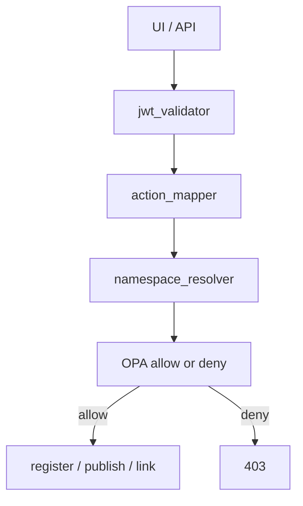
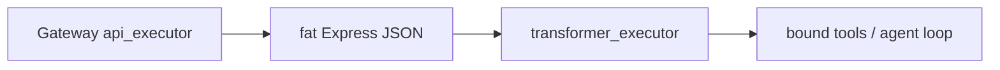
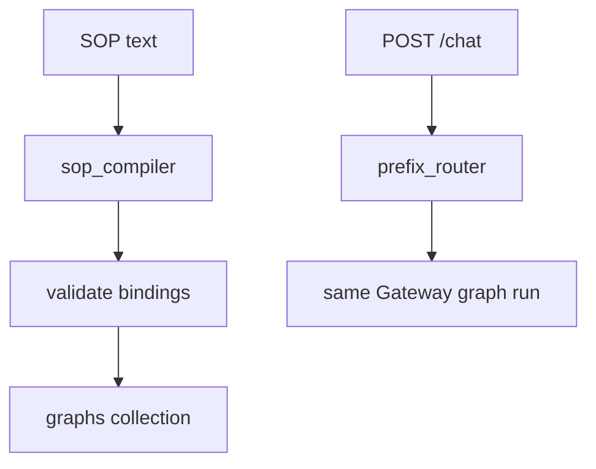

# Supporting Modules

> [!abstract] **Not** their own resume bullets. They **will** follow up here if the hole is Catalog/Gateway. Doc: [[08-supporting-modules]]. Auth and transformers rode with Catalog (Apr–mid-May). Guardrail-as-node / SOP polish can sit in Jul–Sep. Observability talk: [[07 - Langfuse]].

## Resume line

None. If they ask "how is 600 tools not a free-for-all / how do you shrink a fat Express body / what is an SOP" — this note.

## Overview

Catalog/Gateway is the product. These are the **bolted-on planes** the same services already have:

- **RBAC** — JWT → action → namespace → **OPA** `(subject, action, resource, namespace)`. UMS for identity. Who can register / publish / link / run in which namespace.
- **Guardrails** — versioned like tools. Catalog stores them. Gateway runs input/output chain (secrets, URLs, grounding). Workflow can have a `guardrail` node. External eval at `GUARDRAIL_EVALUATION_SERVICE_URL`.
- **Data transformers** — versioned **code** that shrinks/redacts a tool response **before** the LLM. Security scan on register. Other half of "token-optimised" besides [[01 - MCP Servers]].
- **SOP compiler** — second authoring dialect. Prose → LLM compile → **same graph contract** as canvas (`graph_schema.py` must stay byte-identical Catalog ↔ Gateway). Prefix router on `POST /chat`. Compile failure is **non-fatal** (docs).
- **Versioning / cache** — same `draft → published → live` machine for tools, workflows, agents, guardrails, transformers, SOPs. `refresh_upstream_cache` on publish. **Catalog never reads Redis.**
- **Kafka RAG** — publish emits `tool` / `mcp_server` → [[05 - Ask AI Search]]. Not a fourth product.

Don't invent a "I built RBAC for two months" story.

## Timeline

- **Apr – mid-May** — RBAC, transformers, generic versioning/cache. Same window as [[02 - Catalog and Gateway]].
- **Mid-May – Jun** — guardrails on the **agent** chain. [[03 - Agents and Orion]].
- **Jul – Sep** — SOP compiler polish, workflow `guardrail` node. [[04 - Workflows]].
- Langfuse wiring rides the Gateway. You did **not** build Langfuse. [[07 - Langfuse]].

## Schema

### RBAC

Not a Mongo "roles" collection you walk. Tuple sent to OPA:

- **subject** — from JWT / UMS
- **action** — `action_mapper` (route + verb)
- **resource** — what they touched
- **namespace** — `namespace_resolver` (tenant)

Policy bundle: `self_api_registration/opa/`. Sidecar setup in `auth-sidecar-opa-setup.md`. Role matrix in `RBAC.txt`.

### Guardrails (Mongo)

Same version machinery as tools: `guardrails` + `guardrail_versions`. Payload builder + `EvaluationServiceClient`. Gateway: `mcp-gateway/guardrails/` (`chain.py`, `registry.py`, scanners).

### Transformers (Mongo)

`data_transformers` + `data_transformer_versions` + `tool_response_transformers` (which transformer is bound to which tool). `code_security` on register. Executor: Catalog `transformer_executor` / standalone `data_transformer_executor/` / Gateway `clients/transformer_executor.py` + `transformer_cache.py`.

### SOP

Postgres: `sop_repository`, `sop_draft_repository`, `sop_prefix_routing_repository`. Mongo: `sops_v2`, `sop_versions`, `graphs` (compiled). Prefix table → Gateway `resolution/prefix_router.py`.

Marker `__sop_gen_uuid4__` — Catalog compiler and Gateway `run_graph` both expand it to a fresh uuid4 at call time. Must stay in sync.

### Versioning (generic)

`services/versioning.py` + `storage/versions.py`. `utils/diff.py` for diffs. Invalidation: `invalidate_resource_cache` / `refresh_upstream_cache`. Redis client under `database/redis/` — **Gateway's cache**, written on mutation.

## Endpoints

These are **Catalog/Gateway routes**, not a new public product.

- Catalog: guardrail CRUD + versions; transformer CRUD + bind-to-tool; SOP upload/draft/compile/QnA; prefix routing admin.
- Catalog internal: checkpoint / conversation routers under `/api/v1` (pause owns the **meaning** — [[05 - Pause Resume]]).
- Gateway: inbound JWT checked before `v2/chat` / `/run` / `/trigger`; transformer run after tool HTTP; guardrail chain pre/post agent; `POST /chat` prefix → SOP graph.
- OPA: sidecar HTTP — `(subject, action, resource, namespace)` → allow/deny.

Don't invent paths you haven't grepped. Walk the **tuple** and the **chain**.

## Architecture

### Flow 1 — a Catalog write (RBAC)

UMS answers "who is this." OPA answers "may they do this **here**." 600 tools is not a flat ACL in application if-statements.

### Flow 2 — tool HTTP then shrink (transformer)

Register: code + `code_security` scan → version. Bind: `tool_response_transformers`. Run: sandboxed executor, not `eval` in the Gateway process (don't claim eval). Cache of compiled transformer on the Gateway (`transformer_cache`).

This is how a 200-key tracking payload does not eat the context window.

### Flow 3 — guardrail chain

Agent: input chain before the model, output chain after (secrets, URLs, grounding). Workflow: `guardrail` **node** checks a variable — [[04 - Workflows]]. Eval service URL is **external**. Don't say "I wrote the judge model" unless you did.

### Flow 4 — SOP (not the canvas headline)

Retrieve → enrich → draft → validate bindings → bake inputs from **validated edges**, not raw LLM strings. `graph_status` compiling/ready. Failure does **not** kill the SOP — it can still run another path. Canvas is what you walk on the workflows bullet. This is the follow-up.

Contract: `catalog/engine/graph_contract/graph_schema.py` ↔ `mcp-gateway/sop/graph_contract/graph_schema.py`. Drift = runtime surprises. Say "byte-identical on purpose."

## One-minute pitch

The 600-tool registry is useless if everyone can publish everything and every Express body hits Gemini. I talk RBAC as JWT + OPA on a namespace. Transformers are versioned code that shrink/redact **after** HTTP, **before** the model. Guardrails are the same version machine, evaluated on the Gateway (and as a workflow node). SOP is a second way to get a graph — compile can fail and the SOP still lives. None of this is its own resume line; it rode with Catalog, agents, and canvas.

## Metrics

No Temple number on this file. Don't borrow 72k / 124k / 70%. Token savings from transformers are **real as a mechanism** — don't invent a % unless you measured.

## Ugly questions

**How long?** No extra quarter. Auth/transformers = April Catalog. Guardrail node / SOP = with agents or Jul–Sep.

**OPA down?** Fill **fail-closed vs fail-open**. Safer interview: "I will not claim we stayed open." Sidecar vs library — say sidecar if that's what `auth-sidecar-opa-setup.md` is.

**Why OPA not if-else?** Policy changes without a Catalog deploy. Namespace-scoped.

**Transformer infinite loop / exfil?** `code_security` + executor sandbox. What you **actually** enforce — fill. Don't claim a full sec-comp story you didn't read.

**Transformer vs INTEGRATION_MCP tokens?** MCP trims **docs into the IDE**. Transformer trims **API responses into the agent**. Both "token-optimised." Don't mix.

**Guardrail vs prompt?** Prompt is a wish. Guardrail is a check on input/output / a DAG node. Don't claim you solved injection.

**SOP compile failed — prod down?** Docs: **non-fatal**. Other path still works. Prefix router only hits a ready graph.

**Why Postgres and Mongo for SOP?** Draft/prefix routing in PG; compiled `graphs` in Mongo with the rest of the JSON contracts. Don't invent `isActive`.

**Catalog read Redis?** Never. Write-through for Gateway only. Same speech as 02.

**Did you write Langfuse?** No. [[07 - Langfuse]].

## HLD grill (follow-up, not a pointer)

| # | They ask | In this note? | One-line |
|---|---|---|---|
| 1 | Multi-tenant 600 tools | Flow 1 | Namespace + OPA. Don't serve team B's publish. |
| 2 | Auth inbound vs outbound | 02 + here | Inbound UMS/JWT. Outbound OS1 / headers. |
| 3 | Policy change without deploy | Ugly | OPA bundle. |
| 4 | OPA latency on every write | New | Sidecar, local. Don't invent a 50 ms SLA you didn't measure. |
| 5 | Transformer as a service | Flow 2 | Separate executor. Gateway is not `exec()`. |
| 6 | Cache transformer | Schema | `transformer_cache`. Invalidate on publish like tools. |
| 7 | Guardrail SPOF | Flow 3 | Eval URL down — don't invent fail-open. Safer: "I will check the chain." |
| 8 | SOP contract drift | Flow 4 | Two copies of `graph_schema.py`. CI / review, not magic. |
| 9 | Version rollback | 02 | Same pointer machine. |
| 10 | Kafka on publish | 05 | RAG index, not RBAC. |

## Agentic grill (follow-up)

| # | They ask | In this note? | One-line |
|---|---|---|---|
| 1 | Don't dump 600 tools | 02 + 05 | Links + search + domain. Transformer is the **response** side. |
| 2 | PII to the model | Flow 2 | `has_pii` + redact transformer. Don't claim solved. |
| 3 | Prompt injection | Flow 3 | Input/output scanners. Honest: layered, not solved. |
| 4 | Hallucinated SOP tool | 02 `tool_resolver` | Unknown `operationId` dropped. Fail-open on parser errors — say it. |
| 5 | SOP vs canvas | Flow 4 + 04 | Two dialects. Canvas is the resume DAG. |
| 6 | Guardrail node vs chain | Flow 3 | Chain = every agent turn. Node = one DAG step. |
| 7 | Cost | 03 / 07 | Transformers cut tokens. ₹/indent is still business. |
| 8 | Observability | 07 | NR/CubeAPM = process. Langfuse = the turn. |

## Related Notes

- [[00 - Ownership and How to Talk]]
- [[02 - Catalog and Gateway]]
- [[03 - Agents and Orion]]
- [[04 - Workflows]]
- [[05 - Pause Resume]]
- [[05 - Ask AI Search]]
- [[07 - Langfuse]]
- [[08-supporting-modules]]
- [[12-observability-langfuse]]
