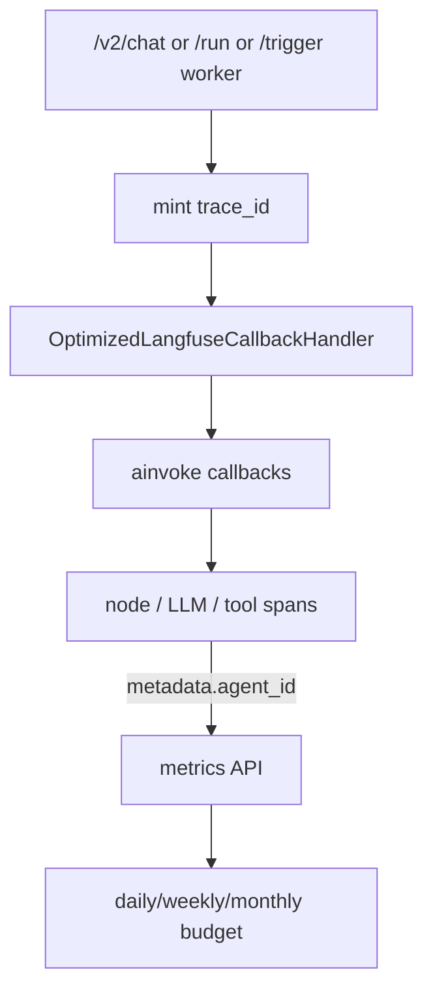
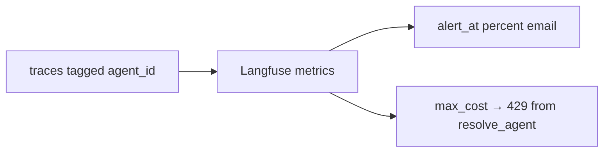

# Langfuse

> [!abstract] **Not** a resume bullet. **Not** something you claim you built. You **wired it and read the UI**. When they ask "how do you debug a turn / why no runs table / where does ₹ come from," this is the sentence. Code: [[12-observability-langfuse]]. Cost hook: [[11-v2-agent-orchestration]].

## Resume line

None. New Relic / CubeAPM stay on the PDF skill line if at all. Langfuse is the **execution SoR**.

## Overview

Langfuse is an **open-source LLM observability product** (self-host or cloud). Someone on the platform put it on the Gateway. You used traces, budgets, and the UI.

Do **not** say "I built Langfuse." Do say: we did not invent a `runs` table because this already is the SoR for "what happened on this call."

Think Jaeger, but the span is "this LLM call" or "this tool," not "this servlet."

- **Catalog** — SoR for **specs**.
- **Langfuse** — SoR for **executions** (`/v2/chat`, `/trigger` worker, workflow `/run` / `/resume`).
- **New Relic / CubeAPM** — **process** (CPU, HTTP, pods). Different question.

Two wirings in the repo — don't mix them unless they ask:

- **What you talk (v2 agents + workflows):** `OptimizedLangfuseCallbackHandler` on `ainvoke(..., config={callbacks})`. LangGraph emits a span per node / generation / tool.
- **v1 `chat_runner` / `o11y-main`:** manual SDK v3 — `@observe(as_type="agent")`, `start_as_current_observation` per generation. Same product. You don't walk v1.

## Timeline

Rides **mid-May → Sep** with agents, canvas, pause. No "I spent a month on Langfuse." `o11y-main` is the manual SDK branch; LangGraph callback is the v2/workflow branches. Don't invent which week you merged the handler.

## Schema

Not Mongo. Langfuse's own store.

| Concept | Meaning |
|---|---|
| **Trace** | One chat / trigger worker run / workflow run. Named by the question / `run_name`. |
| **Observation** | Node, generation, or tool. Nested. Parent → children. |
| **usage** | input / output / `cache_read` / `thinking_tokens` + latency |
| **metadata.agent_id** | Slug. **The budget filter.** Every child inherits via `propagate_attributes`. |
| **trace_id** | Minted **up front**. Pause / hibernate **rebuilds the handler with the same id**. |

Tags you stamp: user, session, `request_id`, team, version. Then "all runs of this slug today" is a UI filter, not a SQL table.

## Endpoints

- Gateway does **not** expose "get my traces." You open the Langfuse UI.
- **Cost:** `GET {LANGFUSE_BASE_URL}/api/public/metrics` — `sum(totalCost)` where `metadata.agent_id == slug` for the IST day/week/month. Basic auth = public:secret keys. Code: `v2/cost_handling.py`.
- Keys: `LANGFUSE_SECRET_KEY` + `LANGFUSE_PUBLIC_KEY`. Both missing → **no-op**. `LANGFUSE_ENABLED = bool(both)`. Tracing must never break the agent.
- `LANGFUSE_BASE_URL` default `https://cloud.langfuse.com` — also the metrics host.
- `AGENT_THINKING_BUDGET` — Gemini thinking cap (0 = unset / off). Not a Langfuse setting; we **log** thinking tokens so cost isn't a lie.

No `GET /jobs`. [[02 - Catalog and Gateway]].

## Architecture

### Flow 1 — attach on a run

`trace_metadata`: `langfuse_user_id`, `langfuse_session_id`, `langfuse_trace_name`, `agent_id`, `teamname`, `request_id`, `version`. `run_name` like `Agent:{slug}`.

**"Optimized":** strip Gemini thought-signature blobs (~6 KB base64), dup `function_call`s, fat tool schemas in `invocation_params`, huge/sensitive state keys. Docs: ~**60%** smaller (~5 MB → ~1.5 MB typical). Say "we drop bloat so Langfuse stays cheap." Don't pretend you bench'd it unless you did.

### Flow 2 — resume is the same timeline

Pause / hibernate persists `trace_id` with the snapshot. Resume handler **rebuilds** `OptimizedLangfuseCallbackHandler(trace_context={trace_id})`. One timeline in the UI, not a second trace that looks like a new job. [[05 - Pause Resume]].

### Flow 3 — v1 manual (only if they saw `chat_runner`)

`@observe(as_type="agent")` on `handle_agent_chat`. Per iteration `llm-call-iter-N`. Retries are **their own** generation (`metadata.retry=True`). Import guarded — missing SDK → no-op decorator. Same UI, different wiring.

### Flow 4 — cost is not pretty UI

- Cross `alert_at` % → **one email per period** (Redis dedupe).
- Hit `max_cost` → run **blocked**, HTTP **429**, from `resolve_agent`.
- Gemini extras: `thinking_tokens`, `cache_read` (cached input is cheaper). `_extract_usage` / `gemini_direct` usage_metadata.

`cost_handling` is tokens/USD. Resume ₹/indent is still a **business** number. Split them. [[03 - Agents and Orion]].

### Why not Mongo runs

The UI they already open for `/chat`, `/run`, and `/trigger` is Langfuse. A `runs` collection is a second, worse Langfuse. Pause bytes are **resume state**, not a history product.

## One-minute pitch

We don't have a job table. Every agent/workflow invoke opens a Langfuse trace; the callback handler nests nodes, generations, and tools; we stamp `agent_id`. I open that UI to see why a turn did three tool calls. Budgets read the same traces. If keys are missing, the Gateway still serves — observability is best-effort. I did not write Langfuse; I depended on it.

## Metrics

- **60% smaller traces** — docs / typical after the optimized handler. Not your benchmark unless you measured.
- **₹28 → ₹4 → ₹1.5** — **not** this file. Business. This file is `sum(totalCost)` on traces.
- **72k / 124k** — trigger / workflow **intake**. Langfuse is how you **look** at them, not the counter.

## Ugly questions

**Did you build this?** No. Product + SDK. We wired the handler and read traces.

**Langfuse down?** Run continues (no-op / best-effort). Budget check that *calls* the metrics API — don't invent fail-open vs fail-closed. Safer: "if the metrics call fails I will not claim we still 429."

**PII in the prompt sitting in Langfuse?** Real. Transformers/guardrails may have redacted; still assume traces hold user text. Access control on the Langfuse **project**. Don't claim you solved this.

**Why not Datadog LLM / Phoenix / homegrown?** We needed a generation+tool tree **and** a metrics API the budget code could query. Langfuse was already the choice. Don't start a vendor bake-off.

**Why New Relic *and* Langfuse?** NR = pod/HTTP. Langfuse = tokens/tools.

**v1 vs v2 tracing?** v2 = callback on the graph. v1 = decorate the chat loop. Same UI.

**60% — you measured?** Docs say typical. Don't pretend.

**Why stamp `agent_id` and not slug in the name only?** Metrics filter is `metadata.agent_id`. Inheritance via `propagate_attributes` so children don't forget.

**Trace after 6-hour pause?** Same `trace_id`. If we minted a new one, the UI would look like two jobs.

**Keys in the image?** Env. Both required. Empty → disabled.

## HLD grill (follow-up)

| # | They ask | In this note? | One-line |
|---|---|---|---|
| 1 | Why no GET /jobs? | Overview | Langfuse is the run SoR. |
| 2 | Draw attach | Flow 1 | Mint id → callback → nested spans. |
| 3 | Worker vs chat | 02 + here | Same handler. Worker has no socket; body lives on the trace. |
| 4 | Resume stitch | Flow 2 | Reuse `trace_id`. |
| 5 | Langfuse down | Ugly | Agent still runs. Budget may not. |
| 6 | Cost SPOF | Flow 4 | Metrics API down → don't invent 429. |
| 7 | Volume 72k traces/day | New | That's the product. Don't invent a sampling story you didn't ship. |
| 8 | Why not Mongo traces? | Overview | You'd be writing Langfuse. |
| 9 | PII store | Ugly | Project ACL. Redact before if you did. |
| 10 | NR vs this | Ugly | Process vs model. |

## Agentic grill (follow-up)

| # | They ask | In this note? | One-line |
|---|---|---|---|
| 1 | Debug a bad tool loop | Pitch | Open the trace. Node / generation / tool interleaved. |
| 2 | Thinking tokens | Endpoints | Gemini `thoughts_token_count`. Cost lies without it. |
| 3 | Budget 429 | Flow 4 | `resolve_agent` after metrics sum. |
| 4 | Child agent traces | 03 | Same `trace_id`. Nested observations. New `session_id`. |
| 5 | Optimized handler | Flow 1 | Drop thought-signatures and fat schemas. |
| 6 | Eval set | 03 | Don't invent. Langfuse is logs, not an eval harness unless you used datasets. |
| 7 | ₹ vs tokens | Metrics | Split. |

## Related Notes

- [[00 - Ownership and How to Talk]]
- [[02 - Catalog and Gateway]]
- [[03 - Agents and Orion]]
- [[04 - Workflows]]
- [[05 - Pause Resume]]
- [[06 - Supporting Modules]]
- [[11-v2-agent-orchestration]]
- [[12-observability-langfuse]]
