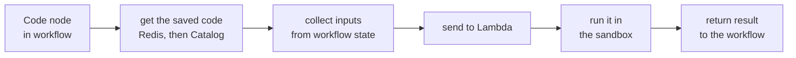

# 13 — The Code Node Lambda and How It Sandboxes User Code

When someone writes code in a Code node on the canvas, that code does not
run inside the gateway. It is sent to a separate AWS Lambda and run there.

This doc covers how that works and what actually keeps the code contained.

---

## 1. Where the pieces live

| Part | File |
|---|---|
| The Code node itself | `mcp-gateway/workflow/nodes/code_node.py` |
| Fetches the saved code | `mcp-gateway/resolution/code_resolver.py` |
| The Lambda entry point | `self_api_registration/data_transformer_executor/handler.py` |
| **The sandbox** | `self_api_registration/data_transformer_executor/executor.py` |
| Lambda deployment config | `self_api_registration/data_transformer_executor/serverless.yml` |

The Lambda is named `data-transformer-executor-{stage}-execute`.

---

## 2. What happens on each run



Step by step:

1. **Get the code.** The node stores only a `resource_id`. The real code is
   fetched by that ID — first from Redis, and from the Catalog API if Redis
   does not have it.
2. **Collect the inputs.** Each declared input is read out of the workflow
   state.
3. **Send it to the Lambda.** By ARN using boto3 in real environments, or by
   HTTP POST when running locally.
4. **Run it.** Covered in section 4.
5. **Return the result.** The node writes it into its own slot in the
   workflow state.

### What gets sent

```json
{
  "spec": {
    "code": "def main(inputs): ...",
    "entrypoint": "main",
    "sandbox": { "timeout_sec": 2, "memory_limit_mb": 128 }
  },
  "input_data": { "...": "the resolved inputs" },
  "mode": "workflow"
}
```

### What comes back

```json
{ "success": true, "data": {}, "msg": "", "execution_time_ms": 12.3 }
```

If `success` is false, the node fails and the error message is passed up.

---

## 3. How the code is actually called

The Lambda does not import the code as a file. It runs the code text to
define whatever is inside it, then looks up the function by name and calls
it:

```python
namespace = {"__builtins__": _SAFE_BUILTINS}
exec(code, namespace)            # defines the user's functions
func = namespace[func_name]      # finds the entrypoint by name
result = func(**input_data)      # calls it
```

In workflow mode the input dictionary is unpacked into named arguments. So
if the inputs are `{"wbn": "123", "city": "Delhi"}`, the function is called
as `main(wbn="123", city="Delhi")`.

The `entrypoint` value can be dotted (like `handler.transform`), but only
the last part is used as the function name.

---

## 4. The four things that contain the code

### Layer 1 — it runs somewhere else entirely

This is the one that matters most.

The code runs in its own Lambda, on Python 3.12, with 512 MB of memory and
a **30 second hard timeout**. It cannot see the gateway's memory, its
credentials, or its running process.

Its AWS permissions are almost nothing. The role can write logs, and that
is it:

```yaml
Action:
  - logs:CreateLogGroup
  - logs:CreateLogStream
  - logs:PutLogEvents
```

No S3, no database, no secrets access.

### Layer 2 — only some imports are allowed

The normal import mechanism is replaced with a checked version. Anything
not on the allowlist is refused.

**Allowed** — roughly 40 modules, including:

- data handling: `json`, `re`, `math`, `datetime`, `collections`, `decimal`
- HTTP: `requests`, `httpx`, `urllib`, `http`, `ssl`, `socket`
- dates: `time`, `calendar`, `zoneinfo`, `dateutil`
- parsing: `csv`, `struct`, `io`, `bs4`, `html.parser`

**Not allowed** — notably `os`, `sys`, `subprocess`, `pathlib`, `shutil`,
`importlib`, `pickle`, `ctypes`, `threading`, `multiprocessing`.

### Layer 3 — some builtins are removed

These are taken out before the code runs:

```
exec, eval, compile, open, __import__, globals, breakpoint
```

So the code cannot open files, build new code at runtime, or reach around
the import check.

### Layer 4 — time and memory caps

- **Memory** — a limit is applied before the run and lifted afterwards.
- **Time** — an alarm is set for `timeout_sec`. When it fires, the run stops
  with a timeout error.

### An extra guard for HTML parsing

`BeautifulSoup` is pre-wrapped so it always uses Python's own HTML parser,
and any parser choice passed by the user is dropped. The faster `lxml`
parser is also deliberately kept out of the deployment package, because it
can be tricked into reading local files or making network requests through
crafted HTML.

---

## 5. What this does not protect against

Worth being clear about, so nobody assumes more than is there.

**The Python restrictions can be worked around.** Removing builtins and
filtering imports is a well known incomplete way to sandbox Python. Helpers
like `getattr`, `type` and `vars` are still available, and from those it is
possible to walk through object internals and reach blocked modules without
importing them. Blocking `exec`, `eval` and `globals` makes this much
harder, but does not close it.

**This is fine, because Layer 1 is the real boundary.** Even if someone gets
past the Python restrictions, they are in a throwaway container whose only
permission is writing logs. Treat Layers 2 to 4 as protection against
mistakes and casual misuse, and Layer 1 as the actual security.

**The timeout cannot always stop a call mid-flight.** The alarm only
interrupts Python code. A network call that hangs with no timeout of its own
can run past `timeout_sec`. The Lambda's own 30 second limit is the backstop.

**Outgoing network calls are allowed on purpose.** `requests`, `httpx`,
`socket` and `ssl` are all permitted, and the Lambda runs inside a VPC. So
code in a Code node can reach anything the VPC's security group allows,
including internal services. That is intended for calling APIs, but it does
mean a Code node is not network isolated.

---

## 6. One inconsistency worth fixing

The timeout default is different in three places:

| Where | Default |
|---|---|
| Code node, when the spec has no sandbox block | 2 seconds |
| `execute_code()` function signature | 2 seconds |
| `handler.py`, when the payload has no sandbox block | **120 seconds** |
| The Lambda itself | 30 seconds |

The 120 is both inconsistent with the others and higher than the Lambda's
own limit, so it could never take effect. It is harmless today because the
Code node always sends a sandbox block, but the number is misleading and
should be brought in line.

---

## 7. Summary

- Code node code runs in a separate Lambda, never in the gateway.
- The node stores only an ID; the real code is fetched from Redis or the
  Catalog at run time.
- Four layers contain it: a separate Lambda with almost no permissions, an
  import allowlist, removed builtins, and time and memory caps.
- The Lambda's isolation and empty permissions are what actually provide
  security. The Python level restrictions are guardrails, not a wall.
- Outgoing network access is allowed by design, so the VPC security group
  is worth keeping tight.
