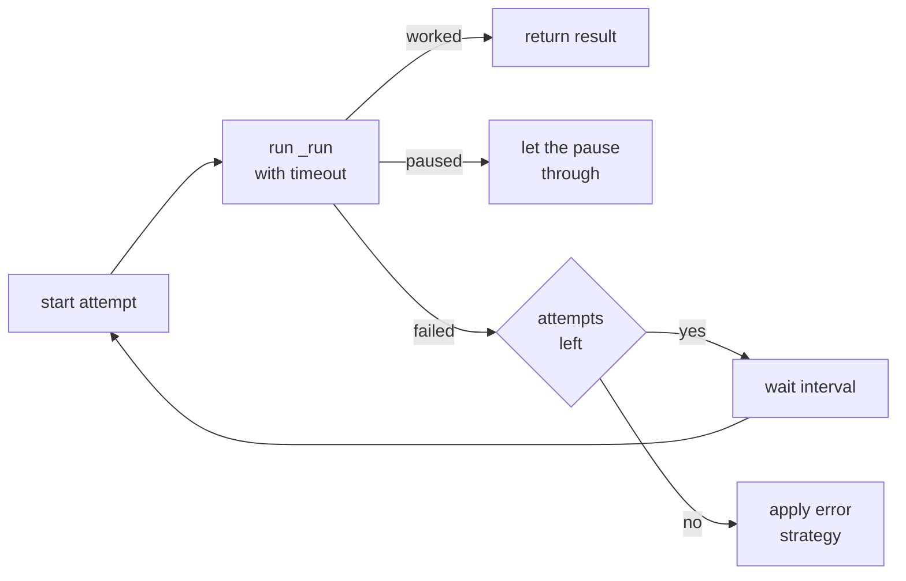

# 14 — Timeouts, Retries and Error Strategy in Workflow Nodes

Every workflow node shares the same three execution settings: a timeout, a
retry policy, and an error strategy. All three are handled in one place, so
individual node types do not implement them.

This doc explains how they work and the exact state of the code today,
including a few gaps worth knowing about.

---

## 1. Where it is handled

One method: `BaseNode.run()` in
`mcp-gateway/workflow/nodes/base.py`.

Node types never override `run()`. They implement `_run()` with their own
logic, and `run()` wraps it with the timeout, retry and error handling.

```
run()                         ← timeout, retries, error strategy
  └── _run()                  ← the node's actual work
```

Related files:

| Part | File |
|---|---|
| The shared logic | `mcp-gateway/workflow/nodes/base.py` |
| Reads settings from the saved workflow | `mcp-gateway/workflow/converter/parser.py` |
| The editing UI | `mcp-ui/.../panels/shared/common-settings-section.tsx` |
| UI limits | `mcp-ui/.../_components/validations.ts` |
| UI defaults | `mcp-ui/.../_components/node-defaults.ts` |

---

## 2. The three settings

```python
error_strategy: ErrorStrategy = ErrorStrategy.NONE
timeout: int = 60                                    # seconds
retry_config: RetryConfig = RetryConfig(
    max_retries=0, retry_interval=0, retry_enabled=False
)
```

All three are read from the saved workflow per node, so each node can have
its own values.

---

## 3. What happens when a node runs



In order:

1. **Work out how many attempts are allowed.** One attempt, plus
   `max_retries` more — but only if `retry_enabled` is on. If it is off,
   there is exactly one attempt regardless of what `max_retries` says.
2. **Run the node with a timeout.** If it takes longer than `timeout`
   seconds, that counts as a failure.
3. **A pause is not a failure.** If the node is a pause node, the pause
   signal is passed straight through, skipping retries and error handling
   entirely. This is deliberate and correct.
4. **On failure, retry if attempts remain**, waiting `retry_interval`
   first.
5. **When attempts run out**, write an error into the node's own state slot
   and apply the error strategy.

The error written to state looks like this:

```json
{ "__error": true, "message": "...", "error_type": "...", "attempts": 2 }
```

---

## 4. The three error strategies

| Strategy | What the code does |
|---|---|
| `none` (default) | Re-raises the original error |
| `abort` | Raises a wrapped error that also carries the state |
| `skip` | Returns the state with the error written in, and carries on |

---

## 5. The current state of the code

This is the part worth reading carefully. The mechanism works, but several
pieces are inconsistent or unreachable.

### 5.1 `retry_interval` is in different units on each side

The UI collects **seconds**. The gateway reads **milliseconds**.

- UI label: `Interval (max 10s)`, and the validation message says
  `Retry interval must be ≤ 10s`
- Gateway: `retry_interval_seconds = self.retry_config.retry_interval / 1000.0`

So if someone sets the interval to `10` expecting 10 seconds, the gateway
waits `10 / 1000` = **0.01 seconds**. The maximum the UI allows is 10, which
the gateway treats as 10 milliseconds.

In effect, retries are always near-instant, whatever the user picks. This is
a straightforward unit bug and worth fixing on one side or the other.

### 5.2 `skip` cannot be selected in the UI

The gateway supports three strategies. The UI dropdown offers two:

```
None (fail run)
Abort workflow
```

`skip` is implemented and would work, but there is no way to choose it from
the canvas. It is only reachable by posting a workflow spec directly.

### 5.3 `none` and `abort` behave the same in practice

The UI presents these as different choices, but the outcome is identical:
the run fails.

- `none` re-raises the original error
- `abort` raises a wrapped error instead

Nothing in the gateway catches the wrapped error, so both end up at the same
place — the run handler's general exception path, which returns
`status: "failed"`. The only real differences are the exception type in the
logs and that `abort` attaches the state to the exception for anything that
might read it later. Nothing reads it today.

### 5.4 Nothing reads the `__error` marker

When `skip` is used, the node writes `{"__error": true, ...}` into its state
slot and the workflow continues. But no node checks for `__error` before
using an upstream value.

So a downstream node reading that slot receives the error dictionary as if
it were normal data. If `skip` is ever exposed in the UI, this needs
handling first.

### 5.5 Timeout cannot be edited in the UI

The settings panel only shows retry and error handling. Timeout is not
there, so it stays at whatever default the node was created with — and those
defaults disagree:

| Where a node is created | Timeout |
|---|---|
| Normal node creation (`node-defaults.ts`) | 30s |
| Child node inside iteration or loop | 60s |
| Output node in the starter graph | 5s |
| Gateway default, if absent from the spec | 60s |

### 5.6 The server does not validate any of these

The Catalog's workflow validator checks node types, edges, cycles,
reachability, models, tool IDs and more — but it does not look at `timeout`,
`retry_config` or `error_strategy` at all.

The only limits are in the UI's own validation: max 3 retries, max interval
of 10. Anything posted directly to the API bypasses those.

### 5.7 Workflow-level execution settings are unused

The Catalog stores an execution config per workflow version:

```python
max_execution_time = 300
max_execution_steps = 50
retry_on_failure = False
```

None of these three appear anywhere in the gateway's workflow code. They are
saved and ignored. Timeouts and retries are entirely per-node today.

---

## 6. Things to be aware of when using these settings

**A timeout does not always stop the work.** The timeout cancels at points
where the node is waiting. If a node hands work to a background thread — the
Code node does this when calling the Lambda by ARN — the timeout fires and
the node gives up, but the thread keeps running until it finishes on its own.
The Lambda's own 30 second limit is the real stop there.

**Retries have no backoff.** The interval is a fixed wait, the same every
time. There is no doubling or jitter. And because the default interval is 0,
default retries happen immediately with no gap at all.

**A retry repeats the whole node, not just the failed part.** `_run()` starts
again from the beginning. For a Code node that means re-fetching the code
spec from Redis or the Catalog; for a Tool node, re-resolving the tool and
re-mapping inputs. Anything the node did before failing is done again.

**Retries are not safe for actions that change things.** Since the whole node
re-runs, a Tool node that already sent its request before failing will send
it again. Only turn retries on for nodes that are safe to repeat.

**Every node is retried the same way.** There is no distinction between a
network blip and a bad input. A validation error retries just as many times
as a timeout, wasting the attempts.

---

## 7. Summary

- One method handles timeout, retries and error strategy for every node
  type: `BaseNode.run()`.
- Defaults are: 60 second timeout in the gateway, retries **off**, error
  strategy `none`. So out of the box, a node runs once and any failure fails
  the run.
- Pause nodes are correctly excluded from this handling.
- **Known gaps:** retry interval units disagree between UI and gateway
  (seconds vs milliseconds, so waits are 1000× shorter than intended);
  `skip` is not selectable in the UI; `none` and `abort` produce the same
  outcome; the `__error` marker is written but never read; timeout is not
  editable; none of these fields are validated server-side; and the
  workflow-level execution config is stored but unused.
- Retries repeat the entire node, so they are only safe on nodes that can be
  run twice without side effects.
